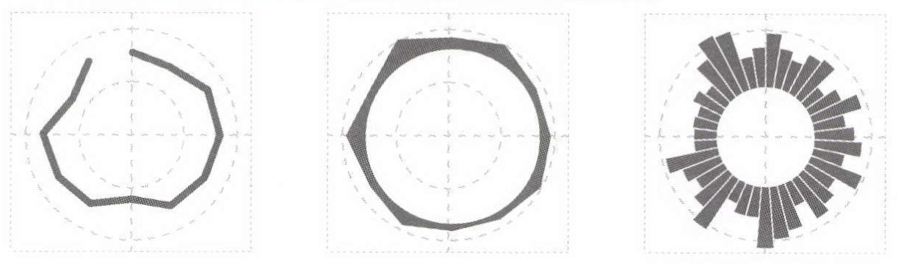

+++
author = "Yuichi Yazaki"
title = "サーキュラー・チャート（Circular Chart）"
slug = "circular-chart"
date = "2025-10-11"
categories = [
    "chart"
]
tags = [
    "",
]
image = "images/thumb_ph_vizjp.png"
+++

サーキュラー・チャート（Circular Chart）は、データを円形のレイアウト上に配置して表現する可視化手法の総称です。典型的な例として、円グラフ（Pie Chart）やドーナツチャート（Donut Chart）、レーダーチャート（Radar Chart）、ポーラープロット（Polar Plot）などが挙げられます。これらは、中心点を基準として角度や半径方向にデータをマッピングする点が共通しています。サーキュラー・チャートは、人間の視覚が円や放射状パターンを自然に認識できる特性を利用しており、データの構造的な関係性や周期性を強調する際に適しています。

線・面・棒などの形式をとり、時間的データの「周期的なパターン」や「季節変動」「日内変化」などを可視化するのに適しています。

極座標系を利用するため、1日の24時間、1年の12か月といった「周期的に繰り返すデータ」を自然に表現できるのが特徴です。

<!--more-->

## 歴史的経緯

円形グラフの起源は、18世紀末のスコットランドの経済学者ウィリアム・プレイフェア（William Playfair）によって考案された「円グラフ（Pie Chart）」にさかのぼります。その後、統計学や情報可視化の発展に伴い、円をベースにしたさまざまな派生形が登場しました。20世紀後半には、気象データや方位データの表現に「ポーラープロット（Polar Plot）」が用いられ、21世紀に入ると、情報デザインやインフォグラフィックスの分野で「レーダーチャート」や「サーキュラー・バー・チャート」などが広く利用されるようになりました。

## データ構造

サーキュラー・チャートは基本的に以下の2軸構造を持ちます：
- **角度（angle）**：カテゴリや時系列、あるいは方向性を表す。
- **半径（radius）**：量的変数（数値）を表す。

データは極座標（polar coordinates）をもとに描かれるため、データ点は角度と半径によって決定されます。これにより、周期性や分布の偏りなどが直感的に把握できます。

## 目的

サーキュラー・チャートの目的は、**周期的なデータ構造の可視化**や**全体と部分の関係の強調**、**方向性や対称性の表現**などにあります。特に時間が1周する構造（例：1日の時間、1年の月など）を持つデータや、方位や角度が意味を持つデータに対して有効です。

## ユースケース
| 用途 | チャート例 | 説明 |
|------|-------------|------|
| 全体と部分の比率 | 円グラフ、ドーナツチャート | 各カテゴリの割合を直感的に比較する |
| 周期的データ | サーキュラー・バー・チャート、ポーラープロット | 時間・角度・方向データの傾向を示す |
| 多変量比較 | レーダーチャート | 複数指標を一度に比較・評価する |

## 特徴

- **直感的な形状**：円形という馴染みのある形が情報を親しみやすく見せる。
- **空間の連続性**：始点と終点が接続しており、周期的データに適する。
- **装飾的な印象**：インフォグラフィックスなどでデザイン的効果も期待できる。

一方で、角度や面積の比較は人間の視覚にとって誤差が生じやすいため、厳密な数値比較には向いていません。

## チャートの見方

サーキュラー・チャートを見る際は、以下の点に注意します：
- **中心からの距離**が大きいほど値が大きい（レーダー型や極座標型の場合）。
- **角度の広さ**や**扇形の大きさ**がカテゴリの比率を示す（円グラフ型の場合）。
- **回転方向**（時計回り・反時計回り）が時系列の流れを意味することもあります。

サーキュラー・チャートでは、アナログ時計のように円の外周を時間軸として使用します。たとえば12時の位置を起点とし、時計回りに時間が進行します。半径方向に値を示すことで、1周で1周期のデータを直感的に読み取れます。

図の左から順に、

- 折れ線で値をつなぐ「サーキュラー折れ線グラフ」
- 面の広がりで値を示す「サーキュラー面グラフ」
- 放射状に棒を配置する「サーキュラー棒グラフ」

と呼ばれます。いずれも中心からの距離（または棒の長さ）で量を表し、角度方向が時間スケールを意味します。

## デザイン上の注意点

- **角度・面積の正確さ**を重視するなら数値ラベルを併記する。
- **カテゴリ数は少なめ（3〜7程度）**に抑える。
- **カラースキーム**はコントラストを強調しすぎず、順序やグループを示す。
- **中心を空けたドーナツ型**にすることで中央に情報（総量・タイトルなど）を配置しやすくなる。

## 応用例

- 一日の時間帯別交通量を円形バーで表す「24時間サイクル・チャート」
- 風向・風速データをポーラープロットで示す「ウィンドローズ（Wind Rose）」
- ブランドイメージ評価をレーダーチャートで比較するマーケティング分析
- ソーシャルメディア投稿数の時間帯分布を円形ヒートマップで可視化

## 代替例
サーキュラー・チャートの代替としては以下が挙げられます：
| 代替チャート | 特徴 |
|---------------|------|
| 棒グラフ（Bar Chart） | 比率や比較をより正確に表現可能 |
| ラインチャート（Line Chart） | 時系列データの変化傾向を直線的に把握可能 |
| ヒートマップ（Heatmap） | 周期的データを格子状で正確に比較可能 |

## まとめ

サーキュラー・チャートは、円形構造を活かして周期性や比率、方向性を直感的に伝える強力な可視化手法です。デザイン的にも魅力があり、情報の印象を強める効果がありますが、正確な比較を重視する分析目的には他のチャートと使い分けることが重要です。

## 参考・出典

- [Data Visualization Catalogue – Radial Column Chart](https://datavizcatalogue.com/methods/radial_column_chart.html)
- [Data Visualization Catalogue – Radial Bar Chart](https://datavizcatalogue.com/methods/radial_bar_chart.html)
- [Data Viz Project – Circular Charts](https://datavizproject.com/data-type/circular/)
- [Data Viz Project – Radial Area Chart](https://datavizproject.com/data-type/radial-area-chart/)
- [Data Viz Project – Radial Line Graph](https://datavizproject.com/data-type/radical-line-graph/)
- [Wikipedia – Pie Chart](https://en.wikipedia.org/wiki/Pie_chart)
- [Wikipedia – Radar Chart](https://en.wikipedia.org/wiki/Radar_chart)
- [Flourish Help – How to use circular charts](https://help.flourish.studio/article/141-circular-bar-chart)
- [Matplotlib – Bar chart on polar axis](https://matplotlib.org/stable/gallery/pie_and_polar_charts/polar_bar.html)
- [Matplotlib – Polar plot](https://matplotlib.org/stable/gallery/pie_and_polar_charts/polar_demo.html)
- [D3 (d3-shape) – Radial lines](https://d3js.org/d3-shape/radial-line)
- [D3 (d3-shape) – Radial areas](https://d3js.org/d3-shape/radial-area)
- [Observable – d3.lineRadial](https://observablehq.com/@d3/d3-lineradial)