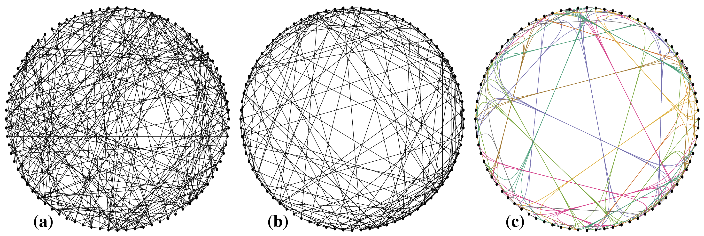

+++
author = "Yuichi Yazaki"
title = "Circular Layout"
slug = "circular-layout"
date = "2025-10-11"
categories = [
    "chart"
]
tags = [
    "",
]
image = "images/cover.png"
+++

A circular layout places network nodes at equal intervals around a circle. It is useful when node position has no inherent spatial meaning and the goal is to show the overall structure simply.

<!--more-->

## Use Cases

- Small network overviews
- Comparing connection patterns around a fixed ordering
- Teaching graph structure
- Layouts supported by tools such as NetworkX

## Design Notes

- Choose node order carefully; it strongly affects edge crossings.
- Avoid very dense networks.
- Use color or grouping to support interpretation.
- Consider chord diagrams when edge volume matters.

## Summary

Circular layouts are simple and orderly. They work best when the circular arrangement itself supports reading the network.
