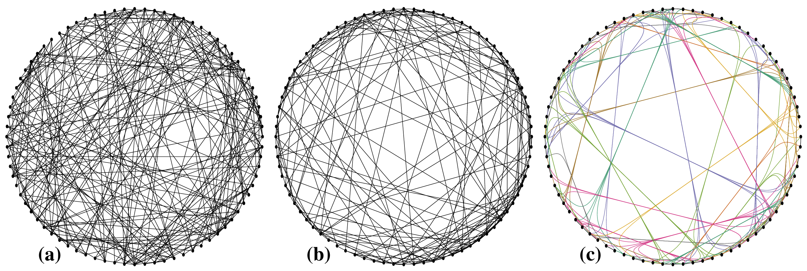

+++
author = "Yuichi Yazaki"
title = "サーキュラー・レイアウト（Circular Layout）"
slug = "circular-layout"
date = "2025-10-11"
categories = [
    "chart"
]
tags = [
    "",
]
image = "images/cover.png"
+++

サーキュラー・レイアウトは、ネットワーク構造を持つデータを円周上に均等に配置して表現する手法です。各ノード（点）は円の外周上に配置され、ノード間のリンク（線）が円の内側を通って描かれます。この配置により、ネットワーク全体の構造を俯瞰的に確認することができます。

<!--more-->

### 図解の見方

| 要素 | 説明 |
|------|------|
| ノード（点） | ネットワーク内の個々の要素を表す。円周上に均等に配置される。 |
| リンク（線） | ノード同士の関係や結びつきを示す。円の内側を通って結ばれる。 |
| 配置規則 | ノードの順序はデータ属性やカテゴリに基づいて決定される場合がある。 |
| 座標系 | 円周上の角度でノードを定義する極座標系を使用。 |

このレイアウトは、ノードの数が多くても均等配置により視覚的に整理しやすい特徴があります。ただし、リンクが多く交差すると「スパゲッティ状」になり、可読性が低下することがあります。

### コード・ダイアグラムとの違い

コード・ダイアグラム（Chord Diagram）は、サーキュラー・レイアウトと同様にノードを円周上に配置しますが、各ノード間の関係強度を「帯（コード）」の太さや形で表現します。すなわち：

| 比較項目 | サーキュラー・レイアウト | コード・ダイアグラム |
|-----------|----------------------|------------------|
| 主な目的 | ネットワークの接続関係の構造を示す | ノード間の関係量・相互作用を強調する |
| 表現要素 | ノード（点）とリンク（線） | ノード（扇形）とコード（帯状の線） |
| 線の意味 | 接続の有無や関係の存在を示す | 関係の強度や量を面積・太さで表す |
| 使用例 | ソーシャルネットワーク、通信経路など | 国間の貿易量、移動フロー、カテゴリ間の相関など |

このように、サーキュラー・レイアウトは構造を見せるのに適しており、コード・ダイアグラムは「関係の量」を可視化するのに適しています。

## まとめ

サーキュラー・レイアウトは、ノードを円環上に並べ、ネットワーク全体を俯瞰するのに適したレイアウトです。データ間のリンク構造を視覚的に把握できるため、関係性の全体像を捉えるのに有効です。一方で、関係の強さや方向性を表現するにはコード・ダイアグラムなど他の拡張形式を用いると効果的です。

## 参考・出典

- [NetworkX Documentation — circular_layout](https://networkx.org/documentation/stable/reference/generated/networkx.drawing.layout.circular_layout.html)
- [Wikipedia — Circular layout](https://en.wikipedia.org/wiki/Circular_layout)
- [Graphviz Paper — Improved Circular Layouts (GK06)](https://graphviz.org/documentation/GK06.pdf)
- [ObservableHQ — Circular Graph Layout](https://observablehq.com/@drom/circular-graph-layout)
- [NetworkX Documentation — draw_circular](https://networkx.org/documentation/stable/reference/generated/networkx.drawing.nx_pylab.draw_circular.html)