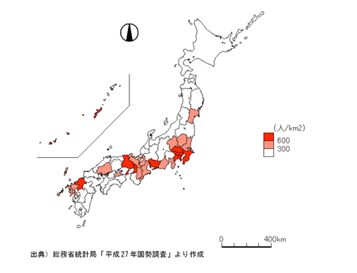
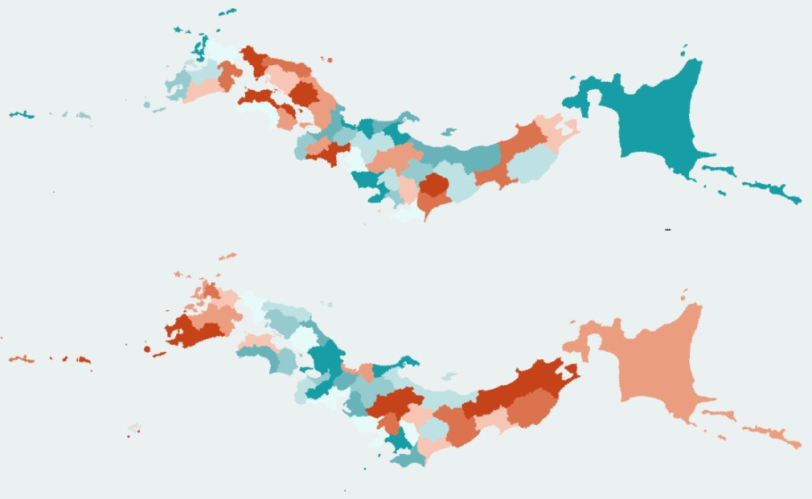

+++
author = "Yuichi Yazaki"
title = "階級区分図とコロプレス・マップ - データ処理と地図表現の違い"
slug = "classification-and-coloplethmap"
date = "2025-11-08"
categories = [
    "consume"
]
tags = [
    "",
]
image = "images/cover.png"
+++

地図上で地域ごとの数値を色分けして表す「統計地図」を見たとき、それが「階級区分図」と呼ばれている場合もあれば「コロプレス・マップ（choropleth map）」と説明されている場合もあります。

見た目だけを見れば、両者の違いはほとんど分かりません。どちらも都道府県や市区町村などの領域を色の濃淡で表しており、一般的には「同じもの」とみなされることが多いでしょう。

しかし、両者の概念を厳密にたどると、背景には「**データの扱い方**」と「**地図としての表現方法**」という異なる視点が存在します。

つまり、階級区分図は「データをどのように分類して表すか」という統計処理の考え方に由来し、コロプレス・マップは「地域をどのように色で表現するか」という地図表現の技法に由来するのです。

本記事では、なるべく公式な定義をもとに、この2つの用語がどのように違い、どのように関係しているのかを整理します。

<!--more-->

## 階級区分図とは何か

総務省統計局の「なるほど統計学園」では、階級区分図を次のように説明しています。

> 「統計地図の一つで、地域ごとに値をいくつかの階級に分け、色の濃淡や模様で表したものを階級区分図という。」 （出典：[総務省統計局｜統計地図（上級編）](https://www.stat.go.jp/naruhodo/9_graph/jyokyu/map.html)）

このように、「階級区分図」という名称には **階級に区分する（データを分類する）という処理手順** が明確に含まれています。つまり、これは地図の表現形式というよりも **統計値をどのように扱って可視化するかというデータ処理の考え方** を反映した言葉です。

階級区分には、等間隔区分・四分位区分・自然分類（Jenks法）などさまざまな手法があり、どの方法を採用するかによって地図の印象が大きく変わります。したがって、「階級区分図」とは、単に色分け地図を指すのではなく **階級化という統計的操作を経た結果としての主題図** なのです。

## コロプレス・マップとは何か

一方、英語圏で用いられる「コロプレス・マップ（choropleth map）」は、地図表現のカテゴリーを指す用語です。Esri GIS Dictionaryでは、次のように定義されています。

> *A map that uses differences in shading or coloring within predefined areas to indicate the average values of a property or quantity in those areas.*  
> （出典：[Esri GIS Dictionary – Choropleth map](https://support.esri.com/en-us/gis-dictionary/choropleth-map)）

つまり、コロプレス・マップは **地理的な領域（都道府県、市町村など）を、属性値の大きさに応じて色で示す地図表現** を指します。ここで重要なのは、「階級化の有無」は必須条件ではないという点です。実際、連続データを連続的なカラースケールで表すコロプレス・マップも存在します。

## 両者の違いを整理する

| 観点 | 階級区分図 | コロプレス・マップ |
|------|--------------|------------------|
| 起源・用法 | 日本の統計・地理教育の用語 | 国際的な地図学・GISの用語 |
| 強調点 | データの階級化（分類処理） | 色彩による地域的表現 |
| 定義主体 | 統計教育・行政文書 | 地図学・カートグラフィ |
| 必須条件 | 階級分けを行うこと | 地域ごとの数値属性を色で表すこと |
| 使用例 | 統計地図教材、行政レポート | GISソフトウェア、研究論文、報道可視化 |
| 関係性 | 「階級区分データ」を用いた主題図 | 階級化の有無を問わない表現技法 |

このように **階級区分図は「データの処理過程」に焦点を当て、コロプレス・マップは「地図表現の結果」に焦点を当てる** という違いがあります。

したがって、階級区分図は「階級化を前提としたコロプレス・マップの一種」と言えるでしょう。すべてのコロプレス・マップが階級区分図という訳ではありません。

## データと地図表現の関係

「階級区分」はデータの扱い方の問題であり、地図表現そのものとは独立しています。

階級区分データは他の主題地図にも用いることができますし、逆にコロプレス・マップは階級区分されていない連続値データを用いても成立します。両者は重なり合う部分を持ちながらも、本質的には **別の概念** なのです。

## 背景と用語の整理

国際的には「choropleth map」が地図学の正式用語であり、「階級区分図」はその翻訳的・教育的な位置づけとして用いられています。

国土地理院が策定する「地理情報標準プロファイル（JPGIS）」でも、「choropleth map」は「地域単位の量的データを色彩で表現する主題図」と定義されており、日本語訳として「階級区分図」を用いる場合があることが明記されています。

ただし、この訳語はあくまで便宜的であり、**階級区分という処理を強調する点でやや限定的な訳語**といえます。

近年の地理情報システム（GIS）やデータビジュアライゼーション分野では「コロプレス・マップ」という表現をそのまま使うケースが増えています。

## まとめ

- 「階級区分図」は、統計値を階級化して可視化する考え方に基づいた日本語の教育・行政用語。  
- 「コロプレス・マップ」は、地域ごとの量的データを色で示す地図表現を指す国際的な地図学用語。  
- 両者は密接に関連するが、階級区分図はあくまでコロプレス・マップの一部に位置づけられる。  
- データ処理（階級区分）と地図表現（コロプレス）は分けて考えることで、より柔軟で正確な可視化設計が可能になる。

## 参考・出典

- [総務省統計局｜統計地図（上級編）](https://www.stat.go.jp/naruhodo/9_graph/jyokyu/map.html)
- [Esri GIS Dictionary – Choropleth map](https://support.esri.com/en-us/gis-dictionary/choropleth-map)
- [国土地理院 地理情報標準プロファイル（JPGIS）](https://www.gsi.go.jp/kihonjohochousa/gisprofile.html)
- [ICA (International Cartographic Association) Multilingual Glossary](https://icaci.org/commissions/cartographic-terminology/)
