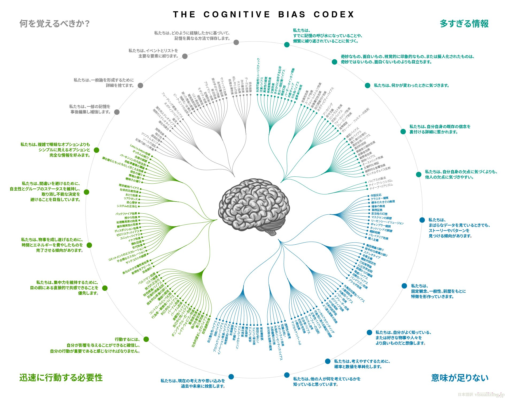

+++
author = "Yuichi Yazaki"
title = "「Cognitive Bias Codex」で眺める人間の思考のクセ"
slug = "cognitive-biases-blog"
date = "2025-09-19"
description = ""
categories = [
    "technology"
]
tags = [
    "",
]
image = "images/bias-blog.png"
+++

私たちの判断や意思決定は、合理的なようでいて、しばしば、予測可能な誤りを繰り返します。これが **認知バイアス** です。たとえば「宝くじの当選確率」を過大評価したり、「自分の信念を裏づける情報」だけを集めてしまうといった現象がそうです。

認知バイアスは膨大な種類があり、Wikipedia には170を超える項目が並んでいます。これをそのまま眺めてもとても覚えきれません。そこで Buster Benson が試みたのが、「人間の脳が直面する問題」に沿って再整理することでした。

その成果が、ここで紹介する **Cognitive Bias Codex（認知バイアス・コーデックス）** です。

<!--more-->

## 4つの大きな問題

Codex の特徴は、数多くのバイアスを 4つの基本問題 に分類している点です。

- 1. **情報が多すぎる（Too much information）** 世界は情報過多で溢れており、脳は重要そうなものを強調する。結果として「目立つもの」「最近の出来事」に過剰に注目してしまう。
- 2. **意味が足りない（Not enough meaning）** 私たちは断片的な情報をストーリーで埋め合わせ、パターンや因果関係を“見つけた気”になる。
- 3. **迅速に行動する必要性（Need to act fast）** 判断や行動を遅らせると不利になるため、単純化や思い込みを使って即断してしまう。
- 4. **何を記憶すべきか（What should we remember?）** 膨大な体験すべてを覚えることはできないため、「印象に残るもの」だけを記憶する。その過程で記憶は歪み、都合よく再構成される。

## Codex のインパクト

この放射状のマップは、認知バイアスの全体像を一望できる視覚的な地図です。
- 網羅性：100を超えるバイアスが一目で見渡せる。
- シンプルな構造：中心の脳から4方向に枝分かれし、人間の制約がどこに集中しているか直感的に分かる。
- 共有しやすさ：カラフルでわかりやすく、SNSやスライドで広まりやすい。

結果として、この図は「認知バイアスといえばこれ」と言われるほど有名になりました。

## まとめ
- Cognitive Bias Codex は Wikipedia の膨大なリストをもとに、Buster Benson が経験則で再分類した成果物。
- 分類軸は「人間の脳が直面する4つの問題」。
- わかりやすく、視覚的に美しいマップに仕上げたことで、SNSや書籍を通じて世界的に普及。
- 人間がどんな思考のクセを持ちやすいかを直感的に理解するための「入門の図」。

## 参考・出典

 - [Cognitive bias cheat sheet](https://buster.medium.com/cognitive-bias-cheat-sheet-55a472476b18)