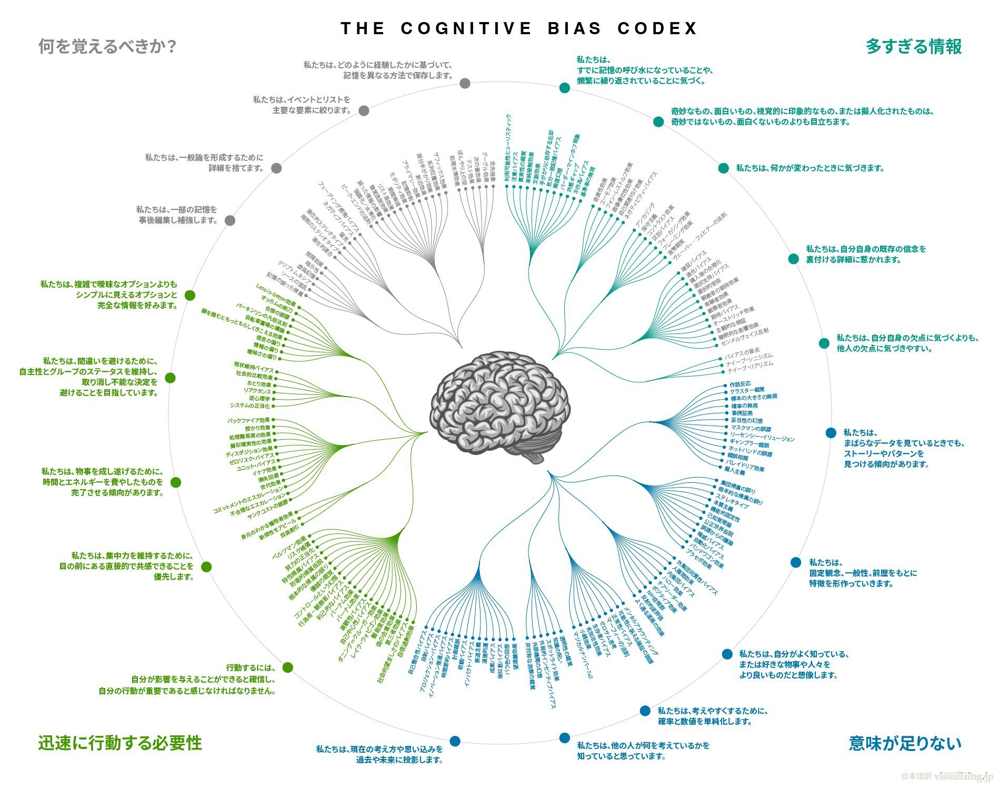

+++
author = "Yuichi Yazaki"
title = "認知バイアスの分類──なぜ「Cognitive Bias Codex」は有名で、研究論文は知られていないのか？"
slug = "cognitive-biases"
date = "2025-09-19"
description = ""
categories = [
    "consume"
]
tags = [
    "",
]
image = "images/bias-blog.png"
+++

私たちの判断や意思決定は、しばしば「合理的なはず」なのに予測可能な誤りを繰り返します。これが **認知バイアス** です。  
たとえば「宝くじが当たる確率」を過大評価したり、「都合のいい情報」だけを集めてしまうのもその一例です。  

<!--more-->

## 2つの整理法

| 項目 | ブログ記事「Cognitive Bias Cheat Sheet」（Buster Benson, 2016） | 論文「A Task-Based Taxonomy of Cognitive Biases for Information Visualization」（Dimara et al., 2020） |
|------|------------------------------------------------------------|------------------------------------------------------------------------------------------------|
| **データソース** | Wikipedia「List of Cognitive Biases」 | 同じく Wikipedia リスト（176件から154件を厳選） |
| **手法** | 個人の経験則・直感（ヒューリスティック）で整理 | 研究者数名が文献を精査し、実験研究を基準にカードソート法で分類 |
| **分類の軸** | 脳が直面する4つの問題（情報過多／意味不足／即時行動／記憶制約） | バイアスが観測された「実験タスク」（推定／意思決定／仮説評価／因果帰属／記憶／意見報告／その他） |
| **成果物** | わかりやすい解説と、後に有名になった「Cognitive Bias Codex」の放射状マップ図 | 可視化研究者が活用できる体系的な分類表と研究課題の提示 |

両者は同じ Wikipedia のリストを出発点にしていますが、目指す方向がまったく異なります。  
Benson のブログ記事での整理は「わかりやすさ」を重視しており、一般の人でもすぐに使えるフレームワークになりました。  
一方、Dimara らの研究は「科学的な再現性」と「可視化研究への応用」を目的としており、専門性が高く、一般には広まりにくかったのです。  

## どちらが有名になったか？

**一般に有名なのは前者の「Codex」** です。カラフルで壮大な放射状マップがSNSやスライドで拡散され、いまや「認知バイアスといえばこの図」と言われるほどです。

一方で、数年かけて精査した Dimara らの論文や分類表は、研究者の間でしか知られていません。  

## これは認知バイアスではないか

なぜ「経験則ベースの図」が広まり、「研究ベースの図」が広まらなかったのでしょうか？  
その理由自体が認知バイアスで説明できます。

- **処理流暢性バイアス（fluency bias）**  
  分かりやすく綺麗な図ほど信頼できると感じやすい。  
- **ハロー効果（halo effect）**  
  見栄えの良さが内容の信頼性まで引き上げてしまう。  
- **バンドワゴン効果（bandwagon effect）**  
  多くの人が使っていると「正しい」と思ってしまう。  
- **努力軽視（effort neglect）**  
  論文の精緻な労力は外から見えにくいため、評価に結びつかない。  

つまり、「Cognitive Bias Codex が有名で、論文の図が無名」という現象そのものが、人間がバイアスに支配される例になっているのです。  

## まとめ
- **共通点**：どちらも Wikipedia のリストを出発点にしている。  
- **違い**：  
  - Codex → 経験則・直感での整理、一般に広まる  
  - Dimara 論文 → 研究的・実証的な整理、専門的にとどまる  
- **教訓**：人は「わかりやすくて見栄えのする情報」を好み、手間暇をかけた科学的整理を見過ごしがち。  
- **皮肉**：この状況自体が「認知バイアス」の一例である。  

## 参考・出典

 - [A Task-Based Taxonomy of Cognitive Biases for Information Visualization](https://ieeexplore.ieee.org/document/8476234/)
 - [Cognitive bias cheat sheet](https://buster.medium.com/cognitive-bias-cheat-sheet-55a472476b18)