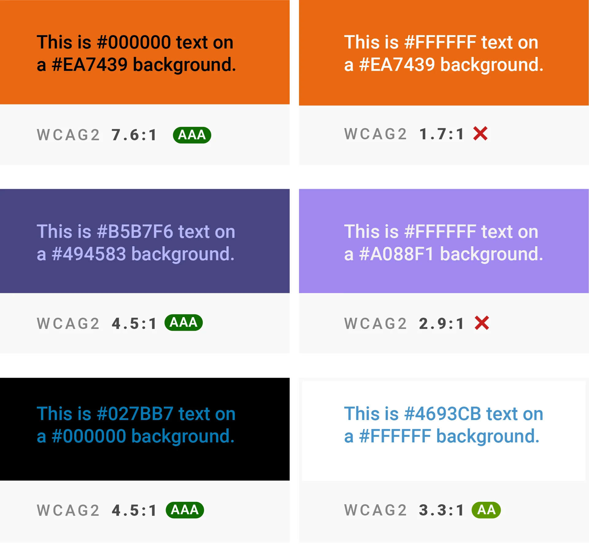

+++
author = "Yuichi Yazaki"
title = "色のコントラストを見直す：WCAG 2.x から APCA への流れ"
slug = "color-contrast-wcag-apca"
date = "2025-10-20"
categories = [
    "technology"
]
tags = [
    "",
]
image = "images/thumb_ph_vizjp.png"
+++

データビジュアライゼーションやウェブデザインで重要な「色のコントラスト」は、単なるデザイン上の美しさではなく、情報の読みやすさ・伝わりやすさに直結する要素です。

しかし、私たちが長年「正しい」と信じてきたコントラスト基準 - **WCAG 2.x （Web Content Accessibility Guidelines）** - は、実は人間の知覚に完全には一致していないことが近年明らかになっています。この記事では、その背景と改善の方向性について解説します。

<!--more-->

## WCAG 2.x のコントラスト定義

WCAG 2.x では、文字色と背景色の「相対輝度（relative luminance）」をもとに、次の式でコントラスト比を定義しています。

```
(L1 + 0.05) / (L2 + 0.05)
```

ここで、  

- L₁：明るい方の輝度（0〜1）  
- L₂：暗い方の輝度（0〜1）

結果として得られる比率（例：4.5:1 や 7:1）を基準に「読める／読めない」を判定します。  
この考え方は **物理的な光の強さ（luminance）** に基づくもので、人間が感じる **「明るさ（lightness）」** や **「読みやすさ」** とは異なります。


## なぜ「4.5:1」になるのか？

この式は、明るい色と暗い色の **相対的な明るさの比** を表します。結果は「暗い方を1としたとき、明るい方が何倍明るいか」を示す比率になります。

### 白と黒の場合

- 白（#FFFFFF）：L₁ = 1.0  
- 黒（#000000）：L₂ = 0.0  

```
(1.0 + 0.05) / (0.0 + 0.05) = 21
```

よって、白と黒のコントラスト比は **21:1**。これが理論上の最大値です。

### グレーの場合

背景が白（L₁ = 1.0）、文字が中間グレー（L₂ = 0.183）のとき：

```
(1.0 + 0.05) / (0.183 + 0.05) = 4.5
```

このときのコントラスト比が **4.5:1** です。  
つまり、白背景にやや暗いグレー文字を置いたときの明暗差が「4.5倍」という意味になります。

### 比率「:1」の意味

この「:1」は単位ではなく比率表現であり、暗い方を1とした相対比です。「4.5:1」なら「明るい方が暗い方の4.5倍明るい」という意味です。

### なぜ基準が4.5か？

WCAGでは以下のように定められています：

| 対象 | 最低コントラスト比 |
|------|----------------|
| 通常の本文テキスト | **4.5:1** |
| 大きな文字（18pt以上 or 太字14pt以上） | **3:1** |
| 装飾的テキスト・ロゴなど | 規定なし |

この「4.5:1」は、視力が低下した利用者でもおおむね読めるとされる実験データに基づいています。
ただし、人間の視覚は非線形で、明背景と暗背景では“読みやすさ”が同じ比率でも異なります。




## 「輝度」と「明度」は違う

混同されやすい用語ですが **輝度（luminance）** は物理量、 **明度（value/lightness）** は知覚量です。

| 概念 | 種類 | 定義 | 備考 |
|------|------|------|------|
| 輝度 (luminance) | 物理的尺度 | 光の強さ（cd/m² など） | WCAG 2.x が採用 |
| 明度 (value/lightness) | 知覚的尺度 | 人が感じる明るさ | マンセル表色系や CIELAB の L* が対応 |

つまり、WCAG 2.x が扱う「輝度比」は **物理的な光量の差** であり **知覚的な明るさの差** ではありません。  
そのため、人間の視覚が非線形であることや、暗背景／明背景での見え方の違いを反映できないという欠点があります。


## 知覚とのズレが生む問題

- **暗背景＋淡色文字**：数値上は合格でも、実際には読みにくい。  
- **明背景＋中間グレー文字**：数値上は不合格でも、実際には十分読みやすい。  
- **文字の太さやサイズ**：WCAG 2.x では一切考慮されていない。

このように、物理量ベースの単純なコントラスト比では、**「見える／読める」実感と数値評価が一致しません**。  
特にチャートやインフォグラフィックスでは、軸ラベルや注釈など「小さくて薄い文字」が多く、現行基準では適切な評価が難しいのです。


## APCA：知覚に基づく新しいコントラストモデル

こうした限界を克服しようと開発されたのが、**APCA (Advanced Perceptual Contrast Algorithm)** です。


- [APCA Contrast Calculator](https://apcacontrast.com/)

APCA は次の要素を考慮し、人間の視覚により近いコントラスト評価を行います。

- 背景の明暗（明るさの非対称性）
- 文字のサイズや太さ（ウェイト）
- 色相や彩度の影響
- 人間の視覚感度の非線形性

APCA では、同じ色の組み合わせでも背景が白か黒かによって評価が変わります。たとえば、暗背景に置いたグレー文字は、従来の WCAG 2.x よりも**高コントラストが必要**とされます。


## WCAG 3.0 へ：知覚的尺度への移行

現在策定中の **WCAG 3.0 （W3C Accessibility Guidelines）** では、APCA のような知覚的モデルを正式に取り入れる方向で検討が進められています。  
まだ Working Draft （草案）段階ですが、次のような特徴が示されています。

- WCAG 2.x の「A／AA／AAA」基準から、柔軟な評価モデル（Bronze／Silver／Gold など）へ移行  
- 成果（outcomes）と方法（methods）を明確化し、実際の利用者体験に即した評価へ  
- Web ページだけでなく、アプリケーション・出版物・XR なども対象範囲に拡大  

現時点では WCAG 2.x と 3.0 が併存する期間が続く見込みですが、将来的には**知覚ベースのコントラスト評価**が標準となるでしょう。


## データ可視化への示唆

データ可視化では、次のような意識が求められます。

- **「薄い文字」や「背景色に溶ける色」を意図的に使う場合でも、知覚的な読みやすさを検証する。**  
- **暗背景（ダークモード）のチャートでは、従来以上にコントラストを確保する。**  
- **APCA 対応ツール**を使って、単なる比率ではなく「読める／読めない」を実感に即して評価する。


## まとめ

- WCAG 2.x のコントラスト比は **相対輝度という物理的尺度** に基づくため **人間の知覚と一致しない**。
- その限界を克服するために **知覚モデル（APCA）** が開発され **WCAG 3.0** で導入が検討されている。
- デザインの目的は「基準に合格すること」ではなく、「誰にでも読みやすく見えること」。そのために **知覚的コントラスト評価** への理解と応用がこれからのデータ可視化に求められているといえます。


## 参考・出典

- [“It’s time for a more sophisticated color contrast check for data visualizations.” *Datawrapper Blog*, 12 Jan 2022.](https://www.datawrapper.de/blog/color-contrast-check-data-vis-wcag-apca)
- [“APCA™ for W3C & WCAG3.” Myndex.](https://apcaw3.myndex.com/)
- [Accurate ContrastUsing the APCA | Myndex](https://git.myndex.com/)
- [“The Easy Intro to the APCA Contrast Method.” Myndex/S-Luv.](https://git.apcacontrast.com/documentation/APCAeasyIntro.html)  
- [“Visual Contrast of Text Subgroup.” W3C Silver Task Force](https://www.w3.org/WAI/GL/task-forces/silver/wiki/Visual_Contrast_of_Text_Subgroup)
- [“Colour contrast — data.europa.eu.” European Union.](https://data.europa.eu/apps/data-visualisation-guide/colour-contrast)  
- [“WCAG 3.0 introduces a new contrast method.” DesignSystemet.no. 10 Apr 2023.](https://designsystemet.no/en/best-practices/accessibility/contrast/)