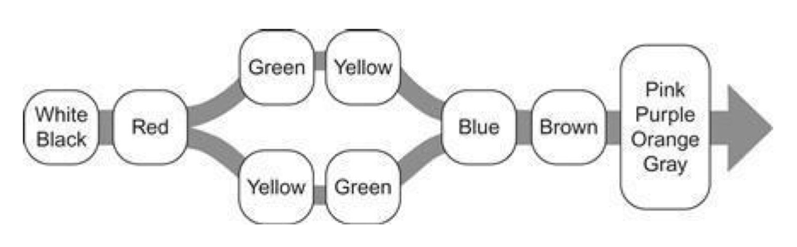
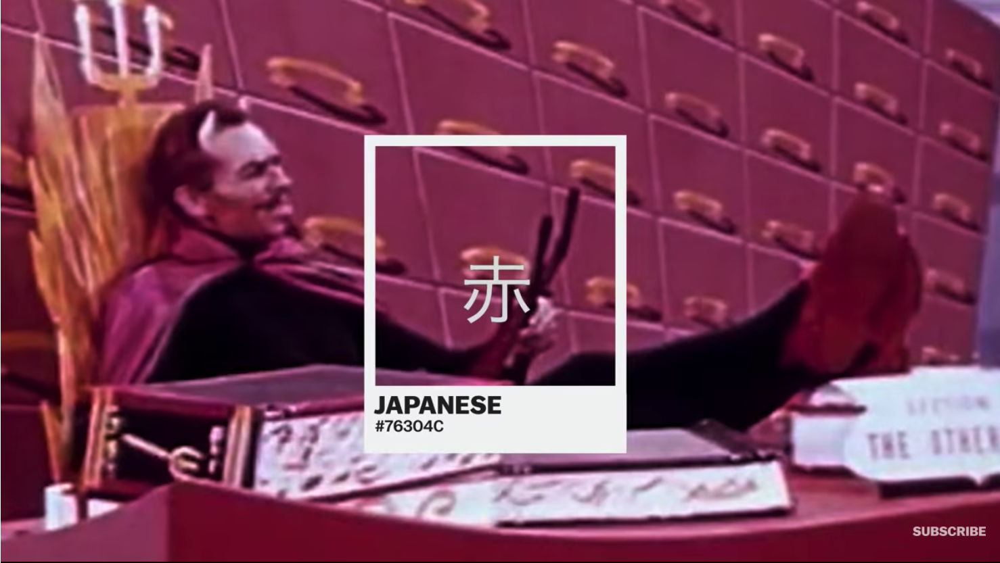

+++
author = "Yuichi Yazaki"
title = "多様な文化を持つ世界100以上の言語において、色名の発明順序がほぼ一緒"
slug = "color-name-appearance"
date = "2020-07-23"
categories = [
    "technology"
]
tags = [
    "",
]
image = "images/c736840e7ae1809abbe9ed7a2915627e.png"
+++

人類学者のBrent BerlinとPaul Kayさんの研究成果 ([Basic Color Terms: Their Universality and Evolution. 1969](https://dl.ndl.go.jp/info:ndljp/pid/11073854)) として、

**「多様な文化を持つ世界の100以上の言語において、色の名称の発明順序がほぼ一緒」**

であったとしています。

- 1, 2番め：白と黒
- 3番め：赤
- 4, 5番め：緑と黄、もしくは、黄と緑
- 6番め：青
- 7番め：茶
- 8-11番め：ピンク、紫、オレンジ、グレイ

原語では以下のとおりです。

- Stage I: Dark-cool and light-warm (this covers a larger set of colors than English "black" and "white".)
- Stage II: Red
- Stage III: Either green or yellow
- Stage IV: Both green and yellow
- Stage V: Blue
- Stage VI: Brown
- Stage VII: Purple, pink, orange, or gray

これはデータ可視化の世界でも意味がある研究成果で、**Colin Ware**さんが、**"Information Visualization - Perception For Design"**の中で、データ可視化のコンテクストとして参照しています。そしてこのうち、1〜6番目の色（白、黒、赤、緑、黄、青）が、様々なカラーモデルの主要な軸を定義しているのは、**これらの色が人間の生得的な性質によるもの**ではないか、としています。

<figure>

<figcaption>

**Colin Ware** **"Information Visualization - Perception For Design"** の挿入図

</figcaption>

</figure>

**Vox**がBerlinとKayさんの研究成果を6分ほどの映像にまとめていますので、そちらもぜひご覧ください。

<figure>

<figcaption>

[The surprising pattern behind color names around the world | Vox](https://www.vox.com/videos/2017/5/16/15646500/color-pattern-language)

</figcaption>

</figure>
