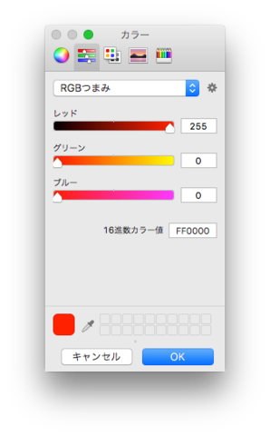
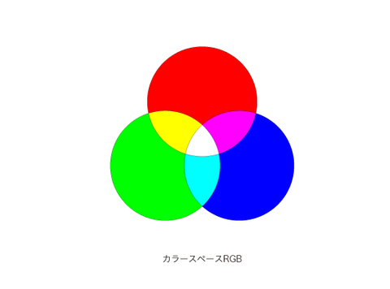
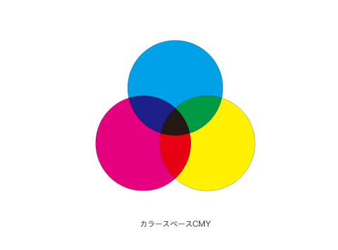
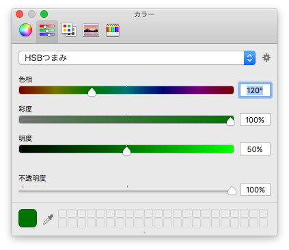
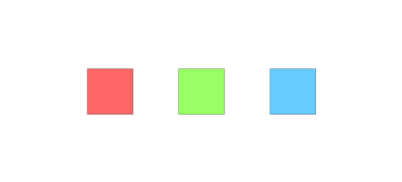
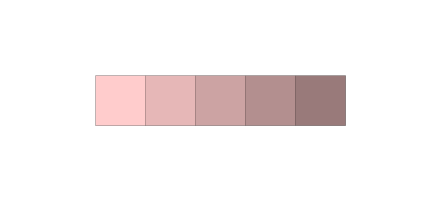
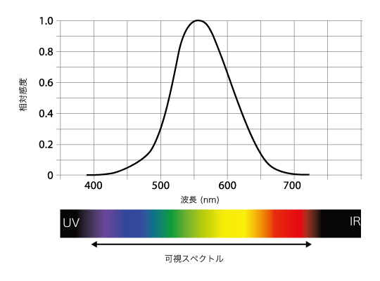
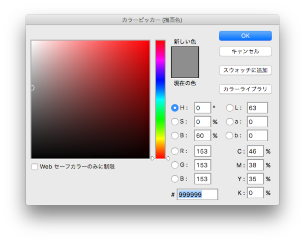

+++
author = "Yuichi Yazaki"
title = "データ可視化にとって最適なカラースペースは？"
slug = "color-space"
date = "2018-06-23"
categories = [
    "technology"
]
tags = [
    "色",
]
image = "images/fi_ColorSpace.png"
+++

データ可視化において、色はデータの性質を過不足なく表現するために利用されるべきでしょう。そのための考え方の入り口をご紹介します。

## カラースペースとは？

事務のお仕事でWordを使っている人や、デザインのお仕事でPhotoshopを使っている人は、色を指定する際に、RGBやCMYKという文字をみかけていると思います。これはカラースペースとよばれる、一つの色を指定するための、色をつくる方法です。

#### RGBとは

Red（赤）、Green（緑）、Blue（青）を混ぜることによって、一色の色をつくる方法です。液晶ディスプレーにおいて色を発色する仕組みとして採用されています。出力の強さが3つともゼロであれば真っ黒、出力が最大になると真っ白になるような、色の作られ方です。  

#### CMYKとは

Cyan（シアン）、Magenta（マゼンダ）、Yellow（黄）Black（黒）を混ぜることによって、一色の色をつくる方法です。印刷物において色を発色する仕組みとして採用されています。インクの量がゼロであれば真っ白（白い紙の色のまま）、4つのインク量が最大になると真っ黒になるような、色の作られ方です。  

#### RGBやCMYKは実はデザインやカラーパレット生成には向いていない？

光の三原色がRGBであること、その補色でCMY（+K）があり、色を人工的に再現する方法として、ディスプレイや印刷物において色を表現する仕組みとして採用されています。最終的にディスプレイや印刷物で色を表現するためには、これらを用いて指定することになります。

ところが、たとえば複数の色の組み合わせ（カラーパレット、カラースキームなどと呼ばれます）をどう選択すべきか、特に、あるデータ・セットの特性にあわせて選択する際に、RGBやCMYによってカラーパレットを生成するのは非常に困難です。なぜならRGBにしてもCMYにしても、すべてが色相（色の区別そのもの）を表す軸だからです。頭の中でこれらの複数の色の組み合わせによる新たな一色の創出は困難ですし、覚えたり慣れたりしたとしてもデータの特性に合わせて生成するのは困難だといえます。ではどのような指定が最適なのでしょうか?

## そこで登場するHSB

#### HSBとは？

Hue（色相）、Saturation（彩度）、Blightness（明度）の3つの要素から一つの色をつくることができるカラースペースです。色相は色の区別そのもの、彩度は飽和度や純度ともよばれるのですが色の鮮やかさのこと、明度は明暗を表します。この3つの数値変化によって、一つの色を表します（HSBと似たカラースペースにHSVというのもあります）。

#### データ構造と一致させやすいHSB

ある文字データを色で表す際に、どういうふうに色でどう表せばよいでしょうか。具体的には、名義スケールや順序スケールとよばれる、たとえばAとBは異なるんだよ、ということを表します。そのためには区別する必要がありながら、存在感の強弱は揃っていてほしいです、と。この場合には、彩度と明度は揃えておきながら、色相のみを変化させることによって複数の色を生み出せばよさそうです。

  
ある数値データが0〜10000の幅で存在するときに、この変化を色でどう表せばよいでしょうか。具体的には間隔スケールや比例スケールと呼ばれる数字のデータで、存在自体を区別する必要はなく、ただ数値の大きさや差が区別できればよいので、この場合は色相は固定で、明度の変化によって、数値を表現すればよいということになります。この場合は彩度も固定にしておきます。

そしてHSBなら、主なOSで標準的に利用でき、代表的なグラフィックアプリでも利用可能です。

#### 主なOSやアプリにおける利用可能なカラースペース

- アドビ社Photoshop...RGB、CMYK、HSB、Lab
- アドビ社Illustrator...RGB、CMYK、HSB
- Sketch...RGB、HSB
- Mac OSX標準...RGB、CMYK、HSB
- Windows OS標準...RGB、HSB

## しかしファイナルアンサーではないHSB

合理的なHSBですが、実はこれがファイナルアンサーではありません。なぜなら、色によって人間の眼の感度が異なるからです。  
  

  
“Photopic Spectral Sensitivity Function”（Kaiser、96）  
  
"Visualization Analysis and Design. Tamara Munzner, with illustrations by Eamonn Maguire. A K Peters Visualization Series, CRC Press, 2014."  
  

つまり、彩度や明度を揃えて複数の色を生成したとしても、波長によっては（緑や黄など）、人間は数値指定されて生成された色を、値よりも高感度に認識（明るく感じられる）してしまいます。

ウェブデザイナーがカラーパレットをつくる際は、OSやグラフィックアプリのレベルでは、RGBかCMYKかHSBしか選択肢がないので、この辺り、おそらく目分量で調整しているのではないかと思います。私はそうやっていました。もちろん、文字色なのか広い面のベタ塗りなのか、色が使用される面積によって受ける印象や可読性は異なりますが。

## 人の眼の色認知能力に近いカラースペース L\*A\*B\*

今度は、人の眼の色認識能力をみてみましょう。人の眼の網膜にある二種類の受容体のうちひとつ、錐体には3つのタイプがあり、それぞれが異なる感度をもっています。輝度チャンネル、赤緑チャンネル、青黄チャンネルの3つです。この性質にあわせたカラースペースがL\*a\*b\*です。Lが明度で、aが赤緑、bが青黄の色相です。赤緑色盲の方は赤緑チャンネル(a)の錐体の感度が生まれつき低いということになります。

  
Photoshopの色選択ウインドウ

L\*a\*b\*は上記にあげた中ではPhotoshopでしか利用できないですし、明度に加えて色相が2軸ですので、直感的に色は選びづらいことには、かわりありません。

## では実際にどうするか?

では、「HSBに代表されるような、データの性質と一致させやすい合理的な色選択システム」と「人の眼の網膜の性質」のギャップをどう埋めるのか、そしてデータの特性にあったカラースキームをどのように作ったらいいのか。後者については、いわゆるプレゼンテーション用以外にも、データを探索的・分析的にみるためのカラースキームの作り方、という考え方もあります。  
  
ここから先はぜひ「データビジュアライゼーション講習」を受講し、学んでください。
