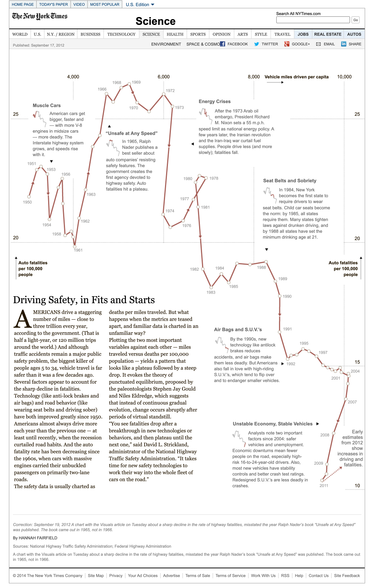

+++
author = "Yuichi Yazaki"
title = "Connected Scatterplot"
slug = "connected-scatterplot"
date = "2025-09-30"
categories = [
    "chart"
]
tags = [
    "",
]
image = "images/cover-connected-scatterplot.png"
+++

A **connected scatterplot** connects the points of a scatterplot in sequence, usually over time. A normal scatterplot shows the relationship between two variables as a cloud of points; a connected scatterplot emphasizes the path through those points.

It is especially useful for showing how the relationship between two variables changes over time.

<!--more-->

## Background

The connected scatterplot builds on the scatterplot tradition and became especially visible in journalism and data storytelling after the 2010s. Media organizations such as *The New York Times* and *The Economist* used it to show the changing relationship between economic and social indicators.

Haroz, Kosara, and Franconeri describe the form as a way to present paired time series.

[Driving Safety, in Fits and Starts — NYTimes.com](https://archive.nytimes.com/www.nytimes.com/interactive/2012/09/17/science/driving-safety-in-fits-and-starts.html)

## Data Structure

| Variable | Type | Description |
|---|---|---|
| x | numeric | Horizontal variable |
| y | numeric | Vertical variable |
| t | time or order | Sequence variable |

Points are ordered by `t` and connected with lines.

## Purpose

The chart shows direction, cycles, loops, and changing relationships rather than static correlation alone. It is often used for economic, environmental, health, and social indicators.

## Strengths

- Shows both relationship and movement.
- Creates a narrative path through data.
- Can reveal loops or lagged relationships.
- Works well when annotated with dates or arrows.

## How to Read It

Each point is one time period. The line shows how the data moved from one period to the next. A line moving up and right means both variables increased; a line moving down and right means the x variable increased while the y variable decreased.

## Design Notes

- Use arrows or year labels to make direction clear.
- Avoid too many series in one chart.
- Keep axes and units clear.
- Consider smoothing only when it does not distort the story.

## Alternatives

- Scatterplot for static correlation
- Line chart for one variable over time
- Animated scatterplot for time-based motion
- Vector plot when direction should be emphasized

## Summary

Connected scatterplots turn a two-variable relationship into a path. They are powerful for storytelling, but need careful labeling because loops and crossings can be difficult to read.

## References

- [Datawrapper Academy: Connected Scatterplots](https://academy.datawrapper.de/article/180-connected-scatterplots)
- [The Connected Scatterplot for Presenting Paired Time Series](https://www.researchgate.net/publication/284273966_The_Connected_Scatterplot_for_Presenting_Paired_Time_Series)
- [Data to Viz: Connected Scatterplot](https://www.data-to-viz.com/graph/connectedscatter.html)
- [Nightingale: Connected Scatterplots Make Me Feel Dumb](https://nightingaledvs.com/connected-scatterplots-make-me-feel-dumb/)
