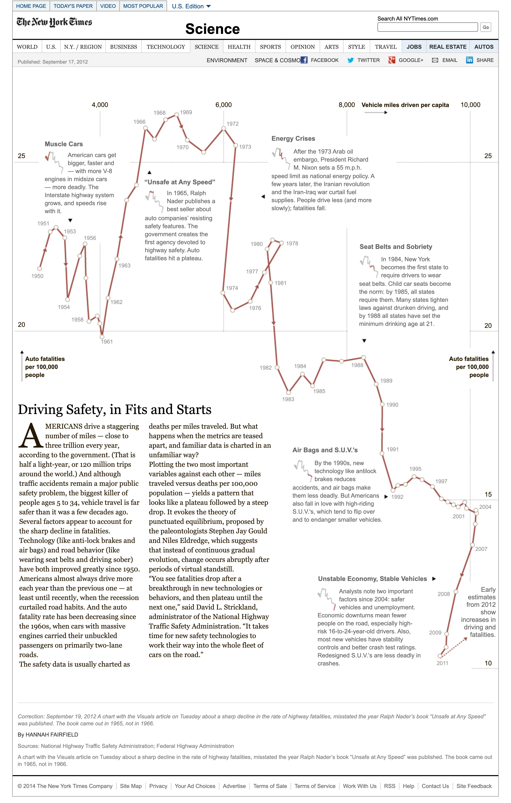

+++
author = "Yuichi Yazaki"
title = "連結散布図"
slug = "connected-scatterplot"
date = "2025-09-30"
categories = [
    "chart"
]
tags = [
    "",
]
image = "images/cover-connected-scatterplot.png"
+++

連結散布図（Connected Scatterplot）は、散布図の各点を順序（多くは時間）に従って線で結んだグラフです。
従来の散布図が「2つの変数の関係」を示すのに対し、連結散布図はさらに「その関係がどのように変化してきたか」を視覚的に伝えることができます。

<!--more-->

Haroz, Kosara, Franconeri の論文 “The Connected Scatterplot for Presenting Paired Time Series” では、2本の時系列の関係性を伝える手法として位置づけられています。たとえば「失業率」と「インフレ率」をプロットし、年ごとの推移を線で結ぶことで、2変数間の関係とその変化の軌跡が同時に理解できるのです。

[Driving Safety, in Fits and Starts - Graphic - NYTimes.com](https://archive.nytimes.com/www.nytimes.com/interactive/2012/09/17/science/driving-safety-in-fits-and-starts.html)

## 特徴とメリット

連結散布図の長所を整理すると次のようになります。

- **関係性と変化の両方を示せる** ...単なる散布図は「点の関係」を示すにとどまりますが、線で結ぶことで「どう動いたか（方向性・速さ）」も伝わります。
- **ストーリー性を持たせやすい** ...「最初はここにあり、時間が経つとこう変わった」という流れを、1枚の図で示すことができます。
- **複数変数の比較が容易** ...異なる単位やスケールを持つ変数でも、同じ平面上にプロットして推移を可視化できます。
- **動的変化の発見** ...経路がループすることで、循環的な変化や因果の先行関係を読み取れる場合があります。

## 注意点と限界

一方で、注意すべき点も存在します。

- **経路の解釈が難しい** ...線がループしたり交差したりすると、時間の前後関係がわかりにくくなります。
- **誤解のリスク** ...線の傾きや形状をそのままトレンドと誤読する可能性があります。研究でも「複雑な図は誤解を招きやすい」と指摘されています。
- **過度な複雑化** ...データ点が多い場合、線と点が重なってしまい、可読性が大きく損なわれます。
- **順序のないデータには不向き** ...カテゴリに順序がない場合、点を結ぶこと自体が意味を持たなくなります。

## 活用例

連結散布図は、以下のような場面で効果を発揮します。

- **1.経済データの可視化** ...例：インフレ率と失業率（フィリップス曲線的な関係）、その推移を可視化。
- **2.ビジネスデータの分析** ...例：売上と利益の関係が、四半期ごとにどう動いたかを把握する。
- **3.循環や遅れの検出** ...時計回り・反時計回りの経路を読み取ることで、「どちらの変数が先に動くか」を推測できることがあります。

## デザインの工夫

よりわかりやすい連結散布図にするために、次の工夫が推奨されます。

- 点（マーカー）と線の両方を表示する
- 起点と終点を強調する（色やラベルを加える）
- 線や点の透明度・サイズを調整し、重なりを避ける
- ラベルや色で時系列の進行を補助する
- インタラクティブ要素（マウスオーバーで年表示など）を取り入れるとさらに理解しやすい

## まとめ

連結散布図は、2変数の関係性と時間的な変化の軌跡を同時に示すことができる強力な可視化手法です。
ただし、経路が複雑になると逆に読みにくくなるため、データ量や表現方法には工夫が必要です。
うまく設計された連結散布図は、読み手に「物語性のあるデータの動き」を伝えることができる点で、情報デザインにおいて特に有用です。

## 参考・出典

- [The Connected Scatterplot for Presenting Paired Time Series (Haroz, Kosara, Franconeri, 2016, ResearchGate)](https://www.researchgate.net/publication/284273966_The_Connected_Scatterplot_for_Presenting_Paired_Time_Series)
- [Data to Viz: Connected Scatterplot](https://www.data-to-viz.com/graph/connectedscatter.html)
- [Nightingale: Connected Scatterplots Make Me Feel Dumb](https://nightingaledvs.com/connected-scatterplots-make-me-feel-dumb/)

