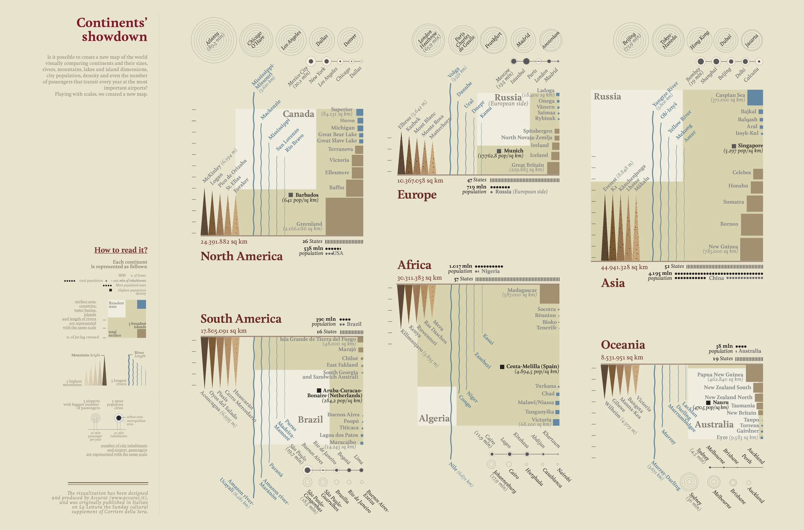
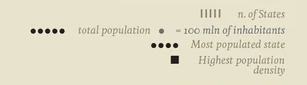
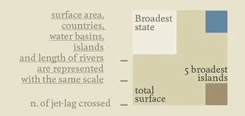
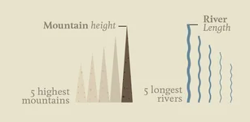
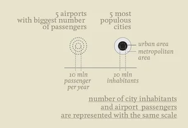

+++
author = "Yuichi Yazaki"
title = "What If the World's Continents Were Drawn on the Same Scale?"
slug = "continents-showdown"
date = "2025-10-09"
categories = [
    "consume"
]
tags = [
    "オリジナルのビジュアル変換",
]
image = "images/cover.png"
+++

**Continents' Showdown**, created by the Italian data visualization studio **Accurat**, compares the world's continents through a shared visual scale. A conventional map preserves geographic position and projection rules; this work intentionally reorganizes the world around comparison.

<!--more-->

## Continents' Showdown

The piece was created for the *Visual Data* series in *La Lettura*, the cultural supplement of *Corriere della Sera*. It can also be read as an early example of Giorgia Lupi's later idea of "Data Humanism": data is treated not as a set of isolated numbers, but as a cultural material for understanding the world.

## How to Read the Legend

The "How to read it?" section at the bottom defines the common visual grammar used across all continents.

### Basic Continental Structure

- **Vertical strokes** indicate the number of states.
- **Black dots** indicate total population, with one dot representing 100 million inhabitants.
- **Large dot** indicates the most populated state.
- **Black square** indicates the highest population density.

### Area and Physical Geography

The following geographic elements are compared on the same scale:

- total surface area
- country area
- water basins and lakes
- islands
- river length

The legend also identifies the broadest state and the five broadest islands for each continent.

### Movement and Distance

The number of time zones crossed gives a human-scale sense of a continent's east-west span.

### Natural Features

- **Mountain height** is represented by triangular forms for the five highest mountains.
- **River length** is represented by wavy lines for the five longest rivers.

### Cities and Airports

The lower portion compares human concentration and movement:

- the five airports with the largest number of passengers
- the five most populous cities

The graphic uses the same scale for city inhabitants and airport passengers, treating urban population and travel flow as related expressions of human movement.

## Concept

Accurat prioritizes cognitive comparison over geographic literalness. The visualization is not a replacement for a map; it is a device for asking new questions. What does it mean for a continent to be "large"? Is scale measured by area, population, rivers, mountains, airports, or cities?

## Summary

"Continents' Showdown" turns continents into comparable data portraits. By placing geography, population, nature, and mobility into a unified system, it helps readers feel the world through multiple scales at once.

## References

- [Continents' Showdown (Flickr)](https://www.flickr.com/photos/accurat/8250027430/in/album-72157632185046466/)
- [Giorgia Lupi — Visual Data series on La Lettura](https://giorgialupi.com/lalettura)
