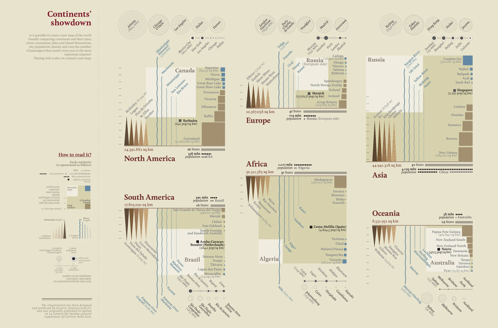
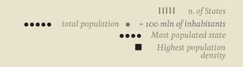
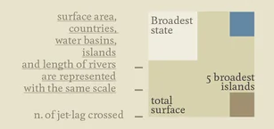
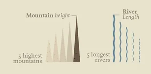
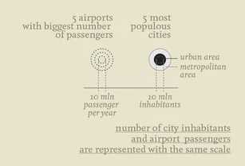

+++
author = "Yuichi Yazaki"
title = "もし世界の大陸を同じスケールで描いたら？"
slug = "continents-showdown"
date = "2025-10-09"
categories = [
    "consume"
]
tags = [
    "オリジナルのビジュアル変換",
]
image = "images/cover.png"
+++

イタリアのデータビジュアライゼーション・スタジオ **Accurat** による作品「Continents’ Showdown」は、世界の大陸を一つの共通スケール上で比較する試みです。  
通常の地図は一定の縮尺で地理的な正確さを保ちますが、本作はあえてそれを崩し **「比較」という視点で世界を再構築** しています。

<!--more-->

## Continents’ Showdown（大陸対決）

この作品は「La Lettura（コリエーレ・デッラ・セーラ紙の文化付録）」に連載された *Visual Data* シリーズの一部として制作されたもので、創設者 Giorgia Lupi による“Data Humanism”の初期的実践とも位置づけられます。

## 図解の見方（凡例の詳細）

作品下部に配置された「How to read it?（この図の読み方）」は、データの意味とスケールの関係を理解するための凡例です。この凡例全体は、単なる説明図ではなく **データと世界観を結ぶメタ構造** として機能しています。

各大陸がどのようなデータで構成され、どのように比較されているのかを読み解くための **共通言語（ビジュアル・グラマー）** を定義しています。地理・人口・交通という異なる次元のデータを「共通の尺度で比較する」ことこそが、この作品の核心的な発想です。

### 各大陸の基本構成

- **棒線（｜）**：  
  各大陸に含まれる国家の数（number of States）を示します。
- **黒い点（●）**：  
  総人口（total population）。点の数が人口規模を表し、  
  1点＝1億人（100 million inhabitants）を意味します。
- **大きな点（●）**：  
  最も人口の多い国（Most populated state）。
- **黒い四角（■）**：  
  最高人口密度（Highest population density）を示します。

### 面積・地形に関するスケール

**凡例の左側に掲出している要素**

次の地理的要素は **同一スケール** で比較されています：

- **surface area（大陸総面積）**  
- **countries（国の面積）**  
- **water basins（水域・湖）**  
- **islands（島）**  
- **length of rivers（河川の長さ）**

**凡例の右側に掲出している要素**

- 「Broadest state（最も広い国）」
- 「5 broadest islands（5つの最大の島）」

は、それぞれ面積の比較対象を示しています。

### 移動・距離の指標

- **n. of jet-lag crossed（時差線の数）**：
  大陸を横断する際の「時差の数」を表現し、地理的広がりの実感を与えます。

### 自然要素の比較

- **Mountain height（山の高さ）**：
  各大陸で最も高い5つの山（5 highest mountains）を三角形で表します。  
  高さは相対的なスケールで描かれています。
- **River length（河川の長さ）**：
  各大陸の5つの主要河川（5 longest rivers）を波線で示し、  
  長さの比較が可能です。

### 都市と空港のスケール

下段では「人の移動と集中」を示す2種類の円が登場します。

- **5 airports with biggest number of passengers**  
  → 年間旅客数が最も多い5つの空港。  
  円の面積は年間旅客数を表し、  
  小さな補助線により「10 million passengers per year」が基準スケールとして明記されています。

- **5 most populous cities**  
  → 人口が最多の5都市。  
  内側の黒円が都市の「中心（urban area）」、  
  外側のグレー円が「都市圏（metropolitan area）」を示し、  
  人口密度の差を可視化します。  
  こちらも「10 million inhabitants」が基準。

最後に記された文章：

> “number of city inhabitants and airport passengers are represented with the same scale”

は **都市人口と空港旅客数が同じ尺度で比較可能** であることを強調しています。  
すなわち、「都市に住む人の数」と「空港を通る人の数」を一続きのヒューマンフローとして捉える設計思想です。

## 背景と制作意図

Accurat は、情報デザインを通じて複雑な現実を理解可能な形に再構築することを使命とするスタジオです。

この作品においては **地理的正確さではなく認知的比較の明瞭さ** が優先され、視覚化そのものが「問いを立てる装置」として機能しています。

Giorgia Lupi が後に提唱する “Data Humanism” は、データを単なる数量ではなく、文脈・関係性・人間的解釈を含む「文化的素材」として扱う思想です。

「Continents’ Showdown」はその初期の具体例であり、定量情報を通じて世界を新たに感じ取る可能性を提示しています。

## 参考・出典

- [Continents’ Showdown (Flickr)](https://www.flickr.com/photos/accurat/8250027430/in/album-72157632185046466/)
- [Giorgia Lupi – Visual Data series on La Lettura](https://giorgialupi.com/lalettura)