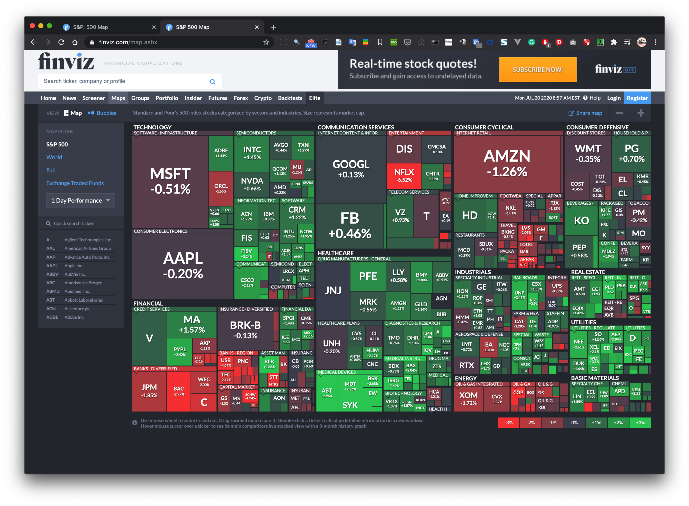
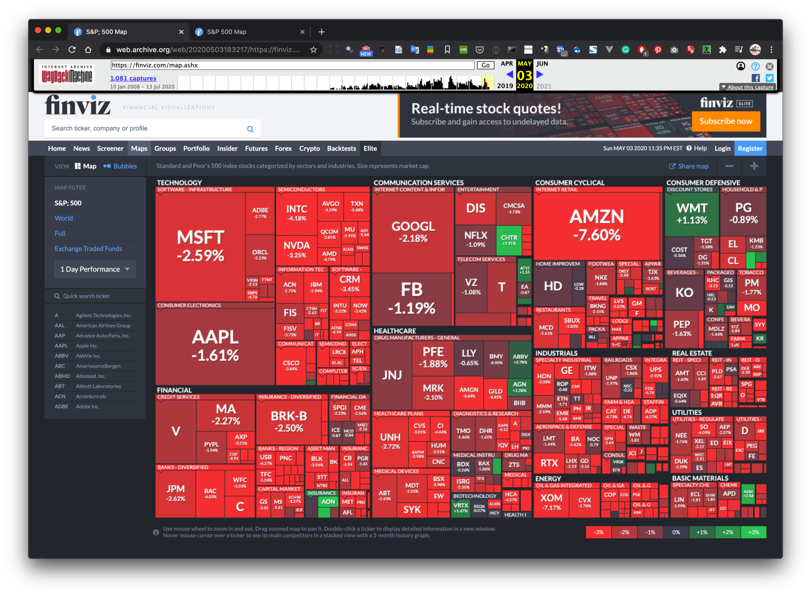

+++
author = "Yuichi Yazaki"
title = "コロナ禍による凡例の破綻"
slug = "corona-finviz-map"
date = "2020-07-20"
description = ""
categories = [
    "consume"
]
tags = [
    "covid19","地図"
]
image = "images/finviz_red-2048x1507.png"
+++

<!--more-->

コロナ禍は経済に大きなダメージを与え、それは日本だけでなく、他の諸国でも同様です。

日本でいうところの日経平均にあたる、アメリカS&P500の時価総額の増減をツリーマップ形式で提供しているFinVizというサイトがあります。

これが本日（2020年7月20日）時点での市場の様子です。

[Finviz Maps](https://finviz.com/map.ashx)

右下に凡例があり、増減幅が、最大プラスマイナス3%で定義されています。これは、このサイトを運営していくにあたって、時価総額の増減が最大でも3%程度であろう、というところから来ています。

ところが、コロナ禍において、この凡例が破綻している時期がありました。

[https://web.archive.org/web/20200503183217/https://finviz.com/map.ashx](https://web.archive.org/web/20200503183217/https://finviz.com/map.ashx)

上記は、5月3日時点のものです。全体的に真っ赤になっており、業種を選ばず時価総額が全体的に下がっていることがわかります。

このうち、AMZN（Amazon）が-7.6%の下げを記録していますが、凡例として-3%までしか想定されていないため、-3%（たとえばNVDA…Nvidia）と-7%の視覚的区別がつかない状態になってしまっています。

凡例は、平常時における増減幅の想定であり、コロナ禍がその想定を軽く超えるくらい経済に影響があったことが、こんなところからもみてとれます。