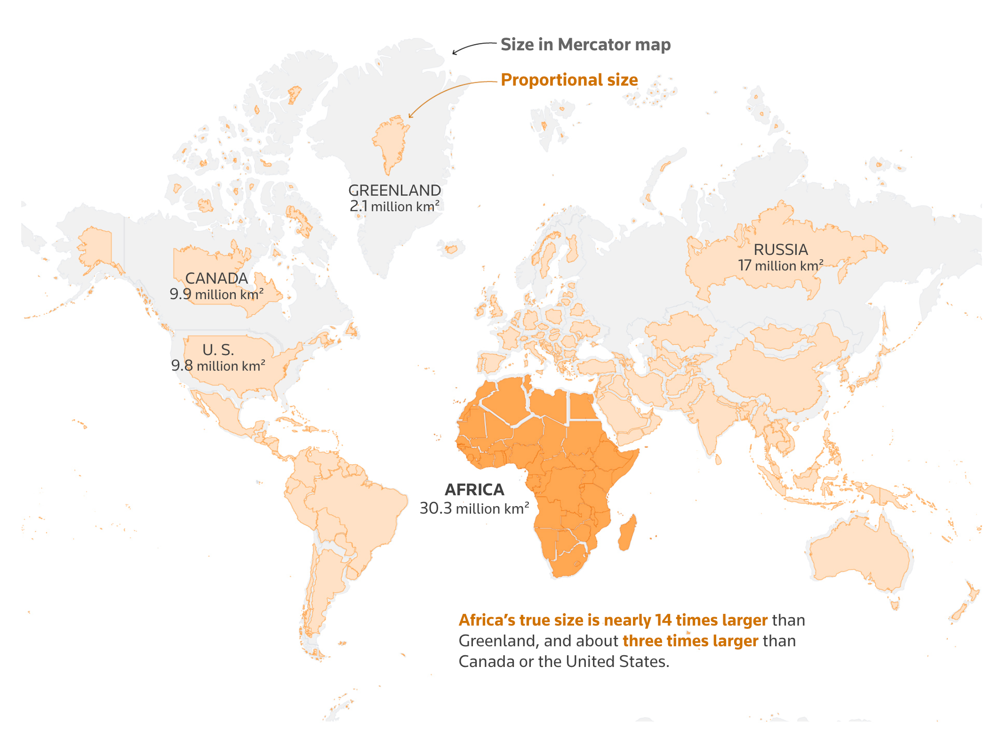

+++
author = "Yuichi Yazaki"
title = "アフリカ連合が「メルカトル図法をやめよう」と呼びかけた理由"
slug = "correct-the-map"
date = "2025-11-08"
categories = [
    "consume"
]
tags = [
    "",
]
image = "images/cover.png"
+++

2025年8月、アフリカ連合（African Union, AU）は、世界で広く用いられてきたメルカトル図法を廃し、アフリカ大陸の実際の大きさを正確に示す「イコールアース図法（Equal Earth Projection）」を採用するよう国際社会に呼びかけました。この声明は、アフリカのイメージを再構築し、教育・メディア・政策の場における偏見を是正することを目的としています。

<!--more-->

## チャートの見方：メルカトルとイコールアースの違い

メルカトル図法は、16世紀に航海用として作られた地図投影法で、経線と緯線を直角に交差させ、方向（方位）を正確に保つ特徴があります。

しかしこの方式では、緯度が高くなるほど面積が拡大されるため、北半球の国々（特にヨーロッパや北アメリカ）が大きく、赤道付近の国々（アフリカや南米など）が実際より小さく描かれます。

一方、イコールアース図法は2018年にBojan Šavrič（Esri）、Tom Patterson（U.S. National Park Service）、Bernhard Jenny（Monash University）によって開発されました。

この図法は **等面積投影（equal-area projection）** の一種で、世界全体の形を自然に保ちながら、各地域の面積比を正確に表現します。

特にアフリカ大陸は、北アメリカやヨーロッパよりはるかに大きいことが一目でわかります。

## 背景：地図が作る「世界観」

アフリカ連合の副議長Selma Malika Haddadi氏は、Reutersの取材に対し次のように述べています。

> 「これは単なる地図の問題ではありません。アフリカを“周縁的”に見せる誤った認識が、教育や政策に影響を与えてきたのです。」

メルカトル図法は植民地時代のヨーロッパによって広められ、その後も多くの教育機関・出版社・国際機関で標準地図として使用されてきました。

その結果、アフリカや南半球の国々は「小さく」「遠く」に見える視覚的バイアスの中で描かれ続けてきたのです。

## 「Correct The Map」キャンペーンとは

今回のAUの呼びかけは、「Correct The Map」という国際キャンペーンに端を発しています。

このキャンペーンはアフリカ系団体 **Africa No Filter** と **Speak Up Africa** が共同で主導し、各国政府、教育機関、メディア、国際機関に対し、面積を正しく保つ地図の採用を求めています。

キャンペーンサイトでは、次のような声明が掲げられています。

> “For over 450 years, we have based our understanding of Africa, and the world, on a map that is wrong.” （450年以上にわたり、私たちは誤った地図をもとに世界を理解してきたのです。）

サイト内では、メルカトル図法とイコールアース図法を並べた比較画像や、署名・賛同を呼びかけるフォームも掲載されています。

## イコールアース図法の特徴と意義

| 項目 | メルカトル図法 | イコールアース図法 |
|------|----------------|------------------|
| 主な用途 | 航海、ナビゲーション | 教育、世界地図展示 |
| 特徴 | 角度・方位を正確に保つ | 面積を正確に保つ |
| 問題点 | 高緯度地域が拡大され、赤道付近が過小表示される | 見た目の歪みがややあるが、面積比が正しい |
| 開発年 | 1569年 | 2018年 |
| 主な開発者 | Gerardus Mercator | Bojan Šavrič、Tom Patterson、Bernhard Jenny |

イコールアース図法は、既存のロビンソン図法に似た自然な地球の形を保ちながら、各国の面積を実際の比率に近づけることに成功しました。

特に教育現場において「アフリカが本当はどれほど大きいのか」を直感的に理解できる点が高く評価されています。

## AUのアクションと今後の展望

AUはこのキャンペーンへの支持を公式に表明し、加盟国および国連地理統計機関（UN-GGIM）に対して、地図の標準投影法を見直すよう要請しています。

この動きは、単なる地図の更新ではなく、世界におけるアフリカの認識を是正しようとする文化的・教育的な取り組みとして注目されています。

## まとめ

アフリカ連合による「地図を正そう」という呼びかけは、単なる地図学上の問題を超えて、世界の構造的な偏りを問い直すアクションです。

地図は世界をどう見るかを形づくる「ビジュアル言語」であり、その更新は、認知の再構築に直結します。

今後、教育・メディア・国際政策の現場でイコールアース図法がどこまで普及するかが、グローバルな視覚的公平性の試金石となるでしょう。

## 参考・出典

- [African Union urges adoption of world map showing continent’s true size (Reuters, 2025)](https://www.reuters.com/world/africa/african-union-urges-adoption-world-map-showing-continents-true-size-2025-08-14/)
- [The true size of Africa – Reuters Graphics](https://www.reuters.com/graphics/AFRICA-MAP/lgpdaqrdyvo/)
- [Correct The Map – Official Campaign Site](https://correctthemap.org/)
- [Equal Earth Projection – Official Page](https://equal-earth.com/equal-earth-projection.html)
- [The Equal Earth map projection (PDF)](https://www.researchgate.net/publication/326879978_The_Equal_Earth_map_projection)