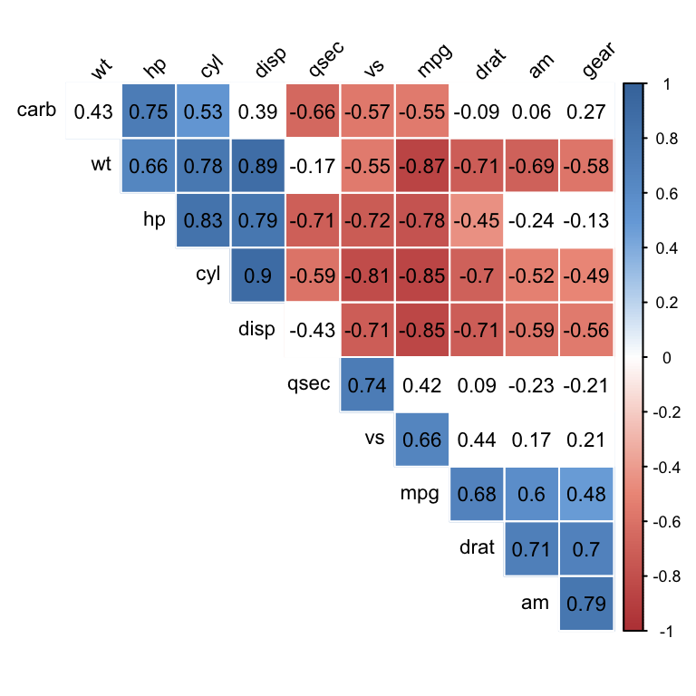
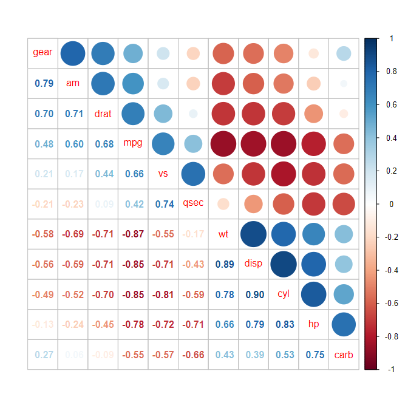
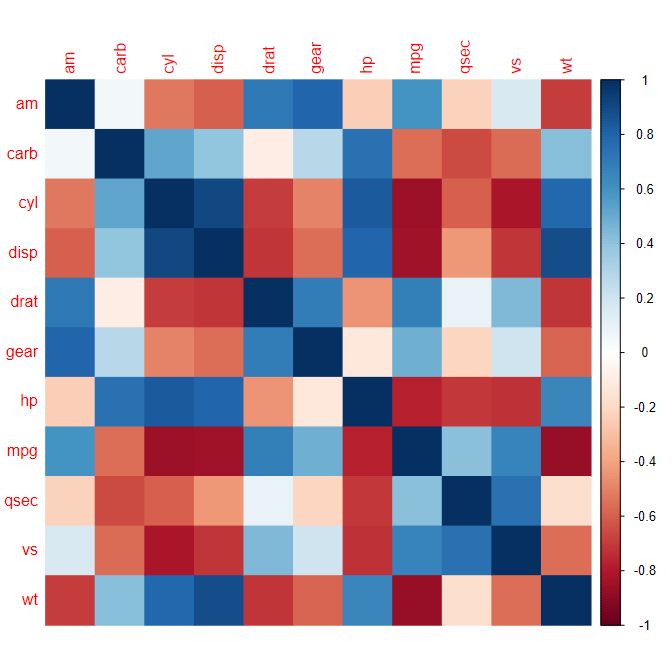

+++
author = "Yuichi Yazaki"
title = "Correlogram"
slug = "correlogram"
date = "2025-10-11"
categories = [
    "chart"
]
tags = [
    "",
]
image = "images/cover.png"
+++

A correlogram visualizes correlations among multiple variables in matrix form. Variables appear on both axes, and each cell encodes the correlation coefficient through color, size, shape, or numeric labels.

<!--more-->

## Purpose

The purpose is to give an overview of correlation structure: strong positive relationships, strong negative relationships, and weak or absent relationships.

## Design Notes

- Use a diverging color scale centered on zero.
- Keep the variable order meaningful.
- Show values when precision matters.
- Remember that correlation does not imply causation.

## Summary

Correlograms are compact summaries of relationships among many variables. They focus on strength and direction, while scatterplot matrices show the actual shape of relationships.
