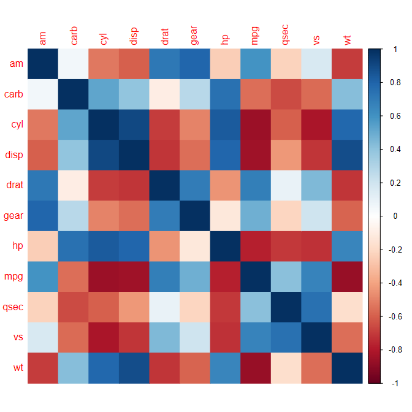

+++
author = "Yuichi Yazaki"
title = "コレログラム（Correlogram）"
slug = "correlogram"
date = "2025-10-11"
categories = [
    "chart"
]
tags = [
    "",
]
image = "images/cover.png"
+++

コレログラム（Correlogram）は **複数の変数間の相関関係を行列形式で可視化するチャート** です。縦軸・横軸に変数を配置し、それぞれの交点において **相関係数（correlation coefficient）** を色や形で表現します。データの相関構造を俯瞰的に把握でき **強い正の相関・負の相関・無相関** を一目で判別できます。散布図行列のように「関係の方向性」ではなく「関係の強さ」に焦点を当てる点が特徴です。

<!--more-->




## 歴史的経緯

コレログラムという用語自体は統計学で古くから存在し、もともとは**時系列データの自己相関（autocorrelation）をプロットする図**を指していました。しかし多変量解析や可視化の文脈では、**相関行列の視覚化手法**として再定義され、広く使われるようになりました。

R言語の可視化パッケージである **`corrplot`（Taiyun Wei, 2013）** が普及のきっかけとなり、Pythonでも **Seaborn** や **Matplotlib** を通じて類似表現が標準化しました。現在ではデータ分析の初期段階における **探索的データ分析（EDA）** の定番手法となっています。

## データ構造

コレログラムは **相関行列（correlation matrix）** を入力データとして用います。一般的には、数値データの各変数間のピアソン相関係数を計算して構成されます。

| フィールド | 内容 |
|-------------|------|
| 変数A | 行方向の変数 |
| 変数B | 列方向の変数 |
| 相関係数 r | -1.0〜+1.0 の実数値（正負の強度を示す） |

例（Pythonコード）：
```python
import seaborn as sns
corr = df.corr()
sns.heatmap(corr, annot=True, cmap='coolwarm', center=0)
```

## 目的

コレログラムの主な目的は、変数間の関係性を全体として把握することです。
どの変数が似た傾向を持つか、逆の動きをするかを視覚的に確認でき、多変量間の相関構造を一目で理解するための探索的ツールとして用いられます。

- **特徴量間の関係確認**：多重共線性（multicollinearity）の検出  
- **クラスタリング前の探索分析**：似た傾向を持つ変数のグルーピング  
- **データ前処理の判断**：変数削除・縮約の判断材料  
- **EDA (探索的データ解析)**：全体的な関係構造の理解  

## ユースケース
- 統計分析や機械学習の前処理における特徴量選定
- 経済指標・株価データなどの変動関係の分析
- 医療データや心理測定データの変数相関の評価
- 顧客行動データの特徴分析（マーケティング分析など）

## 特徴

| 観点 | 内容 |
|------|------|
| 表現形式 | 行列形式（変数×変数） |
| 視覚符号 | 色・形・大きさで相関係数を表現 |
| 値の範囲 | -1（完全負）〜 +1（完全正） |
| 主な使用変数 | 数値型変数 |
| 対称性 | 行列は対称（変数A–BとB–Aは同一） |
| 長所 | 多数の変数の関係を俯瞰できる／正負の関係が一目でわかる |
| 短所 | 非線形関係や外れ値の影響を表しにくい／変数が多いと判読性が低下する |
| 推奨カラーマップ | 中立点（0）を中心とした連続配色（例：`coolwarm`, `RdBu`） |
| 主な使用場面 | 探索的データ分析（EDA）／特徴量選定／データ相関の全体像把握 |

## チャートの見方

コレログラムの構造は以下のようになっています。

| 要素 | 内容 | 解釈のポイント |
|------|------|----------------|
| 行・列 | 変数の一覧 | それぞれの組み合わせごとに相関を示す |
| セルの色 | 相関係数の符号と強さ（例：青＝正、赤＝負） | 相関の方向と大きさを視覚的に判断 |
| 色の濃さ・円の大きさ | 相関の絶対値（強弱） | 強い関係ほど濃く・大きく表示される |
| 対角線上 | 各変数自身（相関=1） | 通常は空白、または1.0と表示される |
| 数値ラベル（任意） | 相関係数の実数値 | 精度を確認したい場合に併記される |

このように、コレログラムは **相関の方向（正負）と強さ** を瞬時に読み取れる設計になっています。視覚的なパターンから、似た傾向を持つ変数群を特定することが可能です。

左右対称な行列構造のため、上三角・下三角のどちらかのみを表示する簡略版も一般的です。

## デザイン上の注意点
- カラーマップは連続値の中立点（0）を中心に対称的に設定する（例：coolwarm）。
- 相関係数の大小を強調するために彩度コントラストを確保する。
- 変数数が多い場合は、相関が強いペアのみを抽出するなどの工夫が必要。
- 外れ値やスケーリングの影響を考慮し、**相関の算出方法（Pearson, Spearmanなど）**を明示する。

コレログラムは「線形相関」のみを対象とすることが多いため、非線形関係を見落とす可能性があります。  
また、カテゴリ変数を扱う場合には別途相関係数の選択（Cramér’s V など）が必要です。  
さらに、変数数が多いと視覚的に密集し、解釈が難しくなるため、主要変数のみを抽出して表示するのが望ましいです。

## 応用例
- Seaborn Heatmap：標準的な相関可視化手法。色で相関強度を表現。
- R corrplot：円の大きさ・色・向きで相関の符号と強度を表現。
- Pairplotとの併用：散布図行列と合わせることで相関の形状を補足。
- 時系列コレログラム：自己相関を時間遅れごとに示す応用例。

## 代替例

| 手法 | 特徴 | 適する状況 |
|------|------|-------------|
| 散布図行列（Pairplot） | 各変数ペアの関係を散布図で表示。相関の形（線形・非線形）も確認可能。 | 相関の方向や非線形性を視覚的に確認したい場合 |
| ヒートマップ（Heatmap） | 任意の数値行列を色で表現。相関行列以外の数値比較にも対応。 | 相関以外の値の強弱やパターンを可視化したい場合 |
| ネットワーク図（Correlation Network） | 強い相関を持つ変数同士をノードとエッジで結ぶ。構造的な関係を強調。 | 相関関係を構造として捉えたい場合／クラスター関係を強調したい場合 |
| バブルマトリクス（Bubble Matrix） | セルを円の大きさと色で表す。視覚的に柔らかく理解できる。 | ヒートマップをより装飾的・直感的に見せたい場合 |
| サンキーダイアグラム（Sankey Diagram） | 変数間のフローや関連性を線幅で表現。 | 相関を「流れ」や「結びつき」として説明したい場合 |

## まとめ

コレログラムは、多変量データの相関構造を一目で俯瞰できる強力な分析ツールです。特にデータ探索や前処理段階において有効であり、変数間の依存関係や冗長性を理解する助けになります。ただし、相関は因果関係を意味しないため、「関係の強さ」以上を読み取らない慎重さが求められます。

## 参考・出典

- [R package corrplot – Taiyun Wei (CRAN)](https://cran.r-project.org/web/packages/corrplot/)
- [Seaborn Heatmap Documentation](https://seaborn.pydata.org/generated/seaborn.heatmap.html)
- [Wikipedia: Correlogram](https://en.wikipedia.org/wiki/Correlogram)
- [Visualizing Correlation Matrices in Python – Seaborn Guide](https://seaborn.pydata.org/examples/many_pairwise_correlations.html)
- [R Documentation — corrplot](https://cran.r-project.org/web/packages/corrplot/vignettes/corrplot-intro.html)
- [Plotly Express — imshow](https://plotly.com/python/imshow/)
- [Vega-Lite: Heatmap](https://vega.github.io/vega-lite/examples/rect_heatmap.html)
