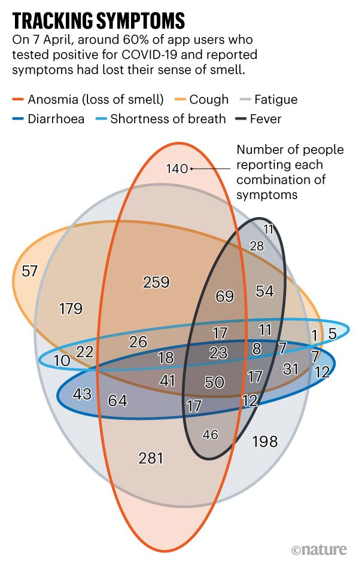
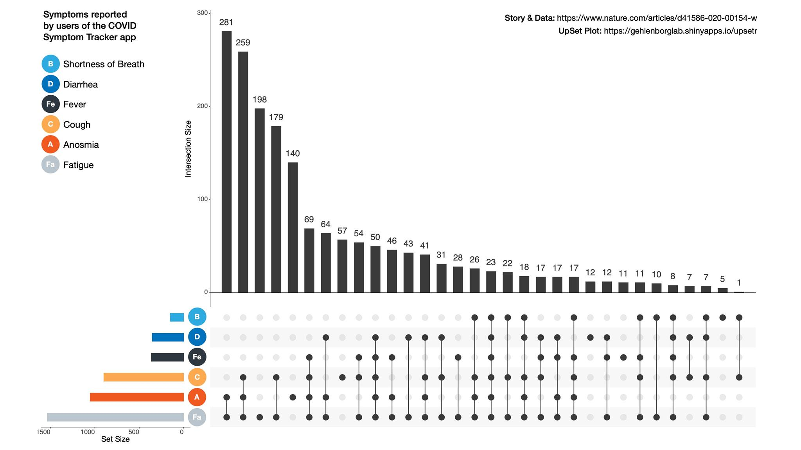
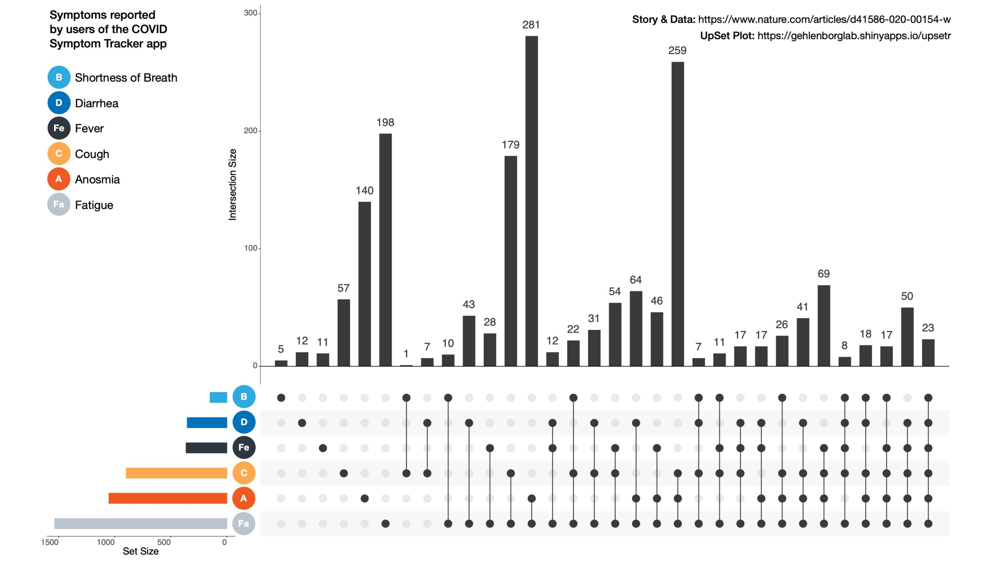

+++
author = "Yuichi Yazaki"
title = "三つ以上の項目の重なりはベン図では理解できない…COVID-19の場合"
slug = "covid-symptom-upset"
date = "2020-08-14"
categories = [
    "chart"
]
tags = [
    "covid-19",
]
image = "images/EVn7qUfVAAAF-uY-scaled.jpeg"
+++

U.K.で利用されている、民間企業ZOEによる [COVID Symptom Tracker](https://covid.joinzoe.com/) というアプリがあります。これは体温、疲れやコロナウイルス感染の可能性のある他の症状を含む健康状態を日常的に記録するアプリで、利用者（当時で150万人、2020年8月時点で400万人）がアプリを通じて報告してきた症状をデータとしてとりまとめた結果がNature誌に紹介されていました。

<figure>

<figcaption>

[Coronavirus: the first three months as it happened](https://www.nature.com/articles/d41586-020-00154-w)

</figcaption>

</figure>

> 「3月24日から29日の間に収集されたデータを分析したところ、COVID-19で陽性と判定されたユーザーは、ウイルスの症状はあるが陰性であったユーザーよりも、嗅覚と味覚の喪失を報告する可能性が三倍高かった。COVID-19の検査で陽性となった人々が経験するその他の一般的な症状は、発熱、持続的な咳、疲労、下痢、腹痛、食欲不振でした。」
> 
> [Coronavirus: the first three months as it happened](https://www.nature.com/articles/d41586-020-00154-w)

Nature誌に掲載されていたチャートがあまりに読みづらいのではないかと、Nilsさんという方が指摘しています。

<figure>

https://twitter.com/ngehlenborg/status/1250307095200555015

<figcaption>

https://twitter.com/ngehlenborg/status/1250307095200555015

</figcaption>

</figure>

「パターンを見つけることはおろか、読むこともほとんど不可能です。」

Nilsさんはオイラー図と書いていますが、ベン図かもしれません。両者の違いは、オイラー図は現実にあり得る組み合わせのみを検討したものになりますが、ベン図は数学的にすべての項目を総当りで示すことです。六つの項目（症状）を[総当りでベン図として示そうとすると、このように複雑にならざるを得ません](https://visualizing.jp/euler-venn-diagram/)。

Nilsさんが自分で別なチャートとして作り直してみたとのことです。

COVID-19による症状にはどのようなものがあるかということで、報告数が多い順に左から右へ並べられています。

<figure>

<figcaption>

[https://twitter.com/ngehlenborg/status/1250307072861720583](https://twitter.com/ngehlenborg/status/1250307072861720583)

</figcaption>

</figure>

同じデータを用いつつ、左からの並び順を、同時に報告された症例数が少ない順に並べたものです。一番左に症例が同時に一つのみのもの、その右が同時発症が二つの症例…、と続きます。こちらをみると、同時に発症することが少ない症状は何か、ということがわかりやすくなります。

<figure>

<figcaption>

[https://twitter.com/ngehlenborg/status/1250307087667572737](https://twitter.com/ngehlenborg/status/1250307087667572737)

</figcaption>

</figure>

このチャートはUpSetと呼ばれるチャートです。Nilsさんが利用したツールは[こちら](https://gehlenborglab.shinyapps.io/upsetr/)にあります。これらをみると、実際に発症している人数が多い症状はどういうものなのか、同時に発症する症状はどういう組み合わせがありえるのか、がグッとわかりやすくなっています。
