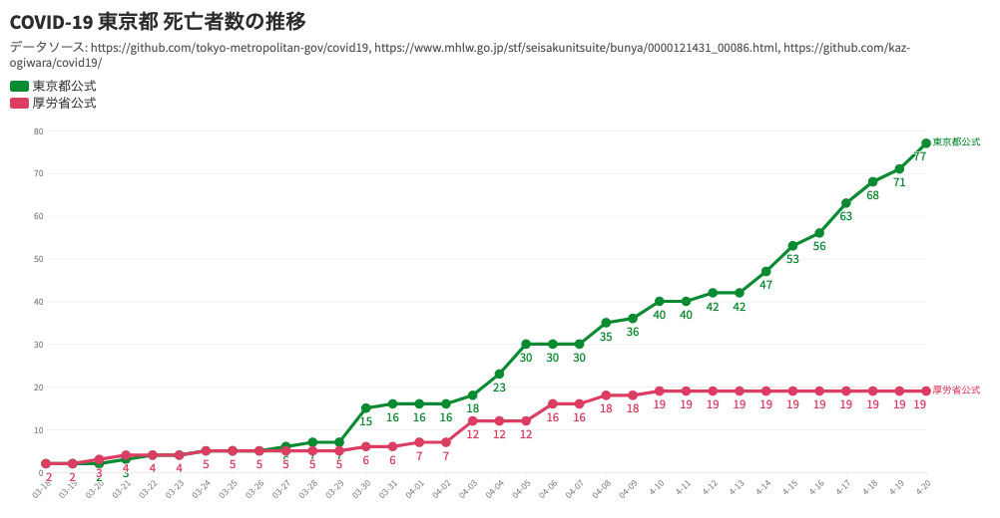

+++
author = "Yuichi Yazaki"
title = "東京都公式と厚労省公式で異なる、東京都での COVID-19 死亡者数"
slug = "covid19tokyo"
date = "2020-04-21"
categories = [
    "dj"
]
tags = [
    "",
]
image = "images/covid19tokyo_200420.png"
+++

このページでは、Yahoo!ニュース個人での記事のフォローアップ記事として、データをアップデートしたチャートを掲載しています。週一度程度で更新していますのであらかじめご承知おきください。

- [東京都公式と厚労省公式で二倍異なる、東京都での COVID-19 死亡者数(矢崎裕一) - 個人 - Yahoo!ニュース](https://news.yahoo.co.jp/byline/yazakiyuichi/20200414-00173323/)

データは4月20日更新です。

