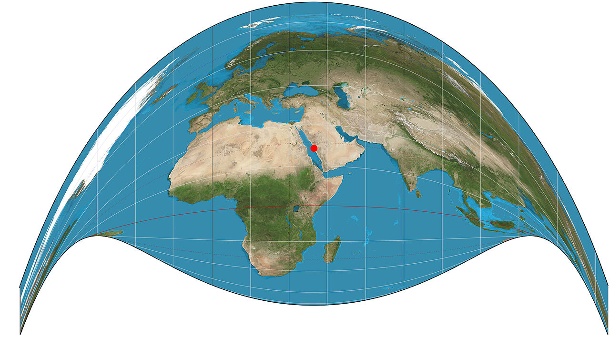

+++
author = "Yuichi Yazaki"
title = "クレイグ図法（Craig projection）とは"
slug = "craig-projectionh"
date = "2025-10-22"
categories = [
    "technology"
]
tags = [
    "",
]
image = "images/craig-projection.png"
+++

クレイグ図法（Craig projection）は、1909年にイギリスの地図製作者ジェームズ・クレイグ（James Ireland Craig）が考案した地図投影法です。

この投影法は「**逆方位図法（retroazimuthal projection）**」という特殊なカテゴリに属し、地図上のどの地点からでも、あらかじめ指定された特定の地点への**方位（方向）を正しく保つ**ことができます。

つまり、地図上の任意の場所から「基準点」へ向かう方向が、実際の地球上の方位と一致するように設計されています。


<!--more-->


## メッカを指す地図 ― クレイグ図法の誕生背景

クレイグは、20世紀初頭にエジプト測地局（Survey Department of Egypt）で地図制作者として働いていました。彼はイスラム教徒が祈りの際に必要とする「メッカの方向（キブラ / qibla）」を正確に知ることを目的として、この投影法を設計しました。

このため、クレイグ図法はしばしば「**メッカ図法（Mecca projection）**」とも呼ばれます。宗教的な実用性から生まれた地図投影法であり、地理学と信仰の結びつきを象徴する図法といえます。



## チャートの見方：どこから・どこへ

クレイグ図法の地図には「どこから（from）」と「どこへ（to）」という二つの視点があります。

- **どこから（from）**：  
  観測者のいる地点です。この地点から基準地点への方位が正確に描かれます。

- **どこへ（to）**：  
  地図上の基準地点です。

たとえば、東京を「どこから」として設定すると、地図上で東京からメッカに向かう方向が真実の地理的方位と一致します。そのため、この地図は「世界中のどの都市からでもメッカの方向を確認できる地図」として利用できます。


## ジェイソン・デイヴィーズ（Jason Davies）のWeb版実装

データビジュアライゼーション研究者 Jason Davies 氏は、D3.jsを用いた「[Craig projection デモページ](https://www.jasondavies.com/maps/craig/)」を公開しています。このページでは **黒い点＝どこへ（to）** が固定された状態で地図が描かれており、Craig投影の形を視覚的に理解できます。ただし、現状のページは「どこから（from）」を動的に変更できるインタラクティブ機能は備えていません。クリックしても中心点は再設定されず、静的な投影例として表示されています。

もしD3.js上で「どこから」を指定したい場合は、次のように `.to()` と `.from()` パラメータを設定します。

```js
const mecca = [39.8262, 21.4225]; // どこへ
const tokyo = [139.6917, 35.6895]; // どこから

const projection = d3.geoCraig()
  .to(mecca)
  .from(tokyo)
  .scale(300)
  .translate([width / 2, height / 2]);
```

このように設定すれば、「東京から見たメッカ方向」が正しい地図が生成されます。つまり、Craig図法は数式的にも「任意の地点から特定の地点への方位を正しく保つ」ように定義された投影法なのです。


## 関連する他の逆方位図法

クレイグ図法の原理は、その後いくつかの派生図法にも応用されました。
代表的な例を下の表に示します。

| 図法名 | 発明者 | 年 | 特徴 |
|--------|--------|----|------|
| クレイグ図法（Craig projection） | James Ireland Craig | 1909 | メッカ方向を保つ。緯線が弧を描く。 |
| ハマー逆方位図法（Hammer retroazimuthal） | Ernst Hammer | 1910 | クレイグを改良し、面積の歪みを軽減。 |
| リトロウ図法（Littrow projection） | Littrow | 1862 | 逆方位図法の初期例。方位保持を目的。 |


## 歴史的意義とデザイン的価値

クレイグ図法は、純粋な地理科学の成果であると同時に、文化的・宗教的文脈からも重要です。地図を「見る者の立場」から再構成し、地球上の一点を中心に再定義する発想は、後の情報デザインやデータ可視化にも通じます。  

また、緯線が優美な弧を描くその形状は、地球の球面性を視覚的に感じさせ、科学的な正確さと美的なデザインが融合した投影法の好例といえます。


## まとめ

クレイグ図法は、単なる地図投影のバリエーションではなく、「地球上のどこからでも、ある一点に向かう方向を正確に示す」という目的で作られた特別な投影法です。

その発想は、宗教的な実用性（メッカの方位）に端を発しながらも、方位・形・面積のバランスを考慮した数学的な美しさをも兼ね備えています。  

今日では、D3.jsなどのツールを通じて簡単に再現でき、「地球上の視点を中心に世界を再構成する」というデータビジュアライゼーション的思考の原点を学ぶ格好の題材となっています。


## 参考・出典

- [Craig retroazimuthal projection - Wikipedia](https://en.wikipedia.org/wiki/Craig_retroazimuthal_projection)
- [Retroazimuthal projection - Wikipedia](https://en.wikipedia.org/wiki/Retroazimuthal_projection)
- [File:Craig projection SW.jpg - Wikimedia Commons](https://commons.wikimedia.org/wiki/File:Craig_projection_SW.jpg)
- [Craig projection – Jason Davies](https://www.jasondavies.com/maps/craig/)
- [Flattening the Earth: Two Thousand Years of Map Projections – John P. Snyder (University of Chicago Press)](https://press.uchicago.edu/ucp/books/book/chicago/F/bo3684034.html)

