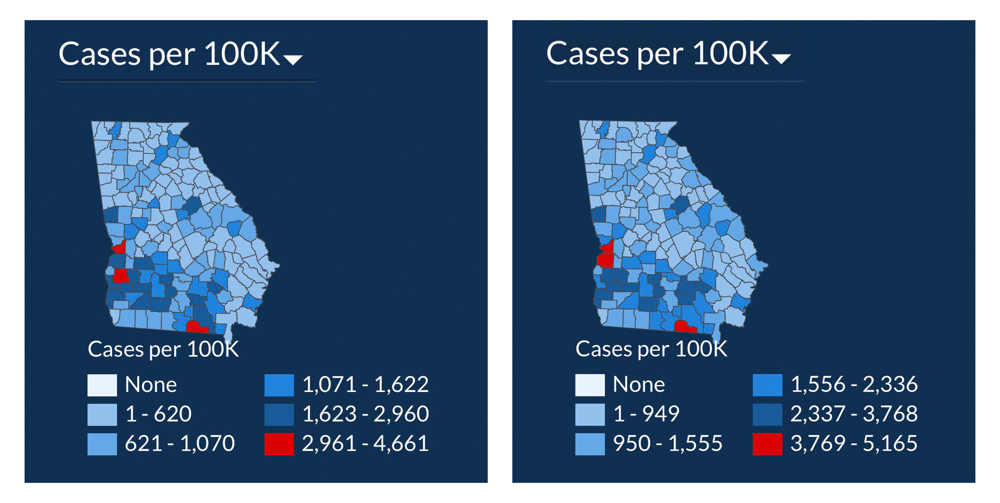
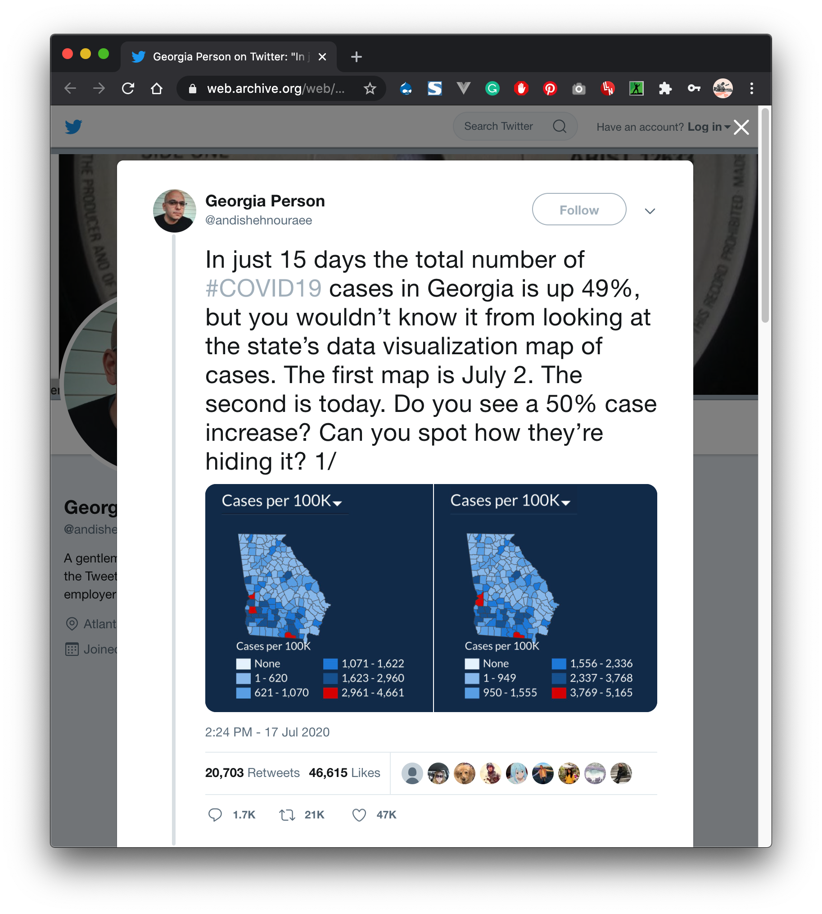

+++
author = "Yuichi Yazaki"
title = "データ可視化への批評への批評への批評"
slug = "critique-of-the-critique"
date = "2020-07-20"
categories = [
    "consume"
]
tags = [
    "covid-19",
]
image = "images/coronavirus_georgia.png"
+++

数日前（2020年7月17日）こんなツイートがバズっていました。アメリカのジョージア州の行政組織が公開している公式COVID-19データ可視化コンテンツについての批評（デザイン上の操作への疑義）です。

「最初（左）のマップは7月2日、二番目（右）は今日（7月17日）です。50％の増加が見えますか？どうやって隠しているか分かりますか？」

<figure>

<figcaption>

[https://web.archive.org/web/20200720003152/https://twitter.com/andishehnouraee/status/1284237474831761408](https://web.archive.org/web/20200720003152/https://twitter.com/andishehnouraee/status/1284237474831761408)  
（現在ツイートは、投稿者により非公開もしくは削除になっており、下記はいわゆる魚拓サイトへのリンクです）

</figcaption>

</figure>

地図画像の下半分にある、データ着色のルール、つまり凡例に注目すると、凡例のルールが7月2日と17日で変わってしまっており、そのことによって、赤で表示される地域を過小評価されることを意図した改変ではないか、ということでした。

こういった、地図におけるデータ値を視覚要素へ変換する際の**数値の幅によるグルーピング**のことを、**階級分類（英語ではClassification）**といいます。ヒストグラムにおけるビン（bin）は、それよりも小さい単位です。1階級に複数のビンが含まれるようなイメージです。

今となっては元ツイートが非表示もしくは削除されてしまっているので、Twitter上でのリプライにどんなものがあったのか、わかりません。

五年前から**[PolicyViz](https://policyviz.com/)**という個人ブログサイトを運営しているJonathan Schwabishが、**[”Critiquing a Data Visualization Critique” （データ可視化批評を批評する）](https://policyviz.com/2020/07/19/critiquing-a-data-visualization-critique/)**と題して、件のツイートを批判する内容の記事を掲載しています。これを読むと、ツイートに対してヒステリックな反応が大量にあったことが伺えます。

彼の論点整理によると、件のツイートの内容を以下の二つに整理しています。

- 1.データの可視化は、ビンが変化している（筆者注：階級分類のこと）ため、州全体でのケースの増加を覆い隠しており、正しくなく、誤解を招くものである。
- 2.可視化を作成した人の意図は、意図的に誤解を招くようなことをした。

これに対して彼自身はこう反論しています。

- 1.データ可視化提供者は地図を並べて表示しておらず、時系列に比較することを意図していない。
- 2.一般的に、私が不適切なデータや誤解を招くようなデータ可視化に出くわした場合、それが間違いか知識不足によるものだと考える。もちろん、明らかに誤解を与えようとしている、あるいは誤解を与えようとしているビジュアルの例は数多くあり、GDPH（Georgia Department of Public Health...件のサイトのこと）も例外ではない。

その上で、階級分類の操作はツールが自動的に行ってしまうことがあり、別な人のツイートを参照し、たとえばTableauでは最小値・最大値にあわせて自動的に階級分類が調整されることが語られています。

https://twitter.com/ugamarkj/status/1284486596235071489

これらを全部読んだ上での私の個人的な意見は、2はほぼ同意見ですが、1については、あまり同意できません。階級分類が動的に変わってしまうのはツールの仕様だとしても、**誤解を招く恐れ**があります。**理由なくコロコロ変更すべきではありません**。Tableauであってもツールの設定、たとえば最小値・最大値を決め打ちの固定値にしてしまえば避けられるはずです（多分）。

またこのデータ可視化提供者が地図の比較を掲載せず、また意図していなかったとしても、閲覧者がキャプチャをとって、**地理的特性と時系列特性を同時に観て把握したいと思うのは自然な欲求**であり、これを否定することは過剰反応であると思います。

元ツイートに対するSNS上での反響を全くみていないのですが、少し感情的になってしまっているようにも思えます。**[PolicyViz](https://policyviz.com/)**は志もって運営している良質なサイトだという印象は今も変わりません。
