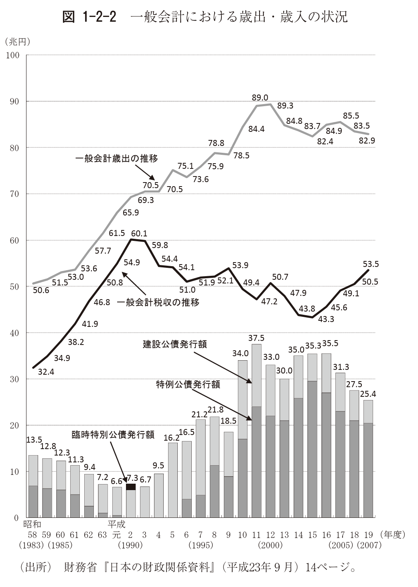

+++
author = "Yuichi Yazaki"
title = "The Crocodile-Mouth Chart: A Japanese Metaphor for Fiscal Imbalance"
slug = "crocodile-chart"
date = "2025-10-12"
categories = [
    "chart"
]
tags = [
    "",
]
image = "images/cover.png"
+++

The "crocodile-mouth chart" is a distinctive line-chart metaphor used in Japan to explain the country's fiscal situation. It shows government expenditure and tax revenue as two lines. As the gap between them widens, the shape resembles a crocodile opening its mouth.

This expression is specific to Japanese media and policy discourse. It is not a standard chart type commonly known in English as a "crocodile chart."

<!--more-->

## How to Read It

The upper line typically represents expenditure, and the lower line represents tax revenue. The widening gap visualizes the fiscal deficit. The metaphor makes the structural imbalance immediately memorable.

## Why It Matters

The chart is a good example of metaphor in data visualization. The underlying graphic is simple, but the metaphor gives the shape political and cultural meaning.

## Design Notes

- Make clear which line is expenditure and which is revenue.
- Avoid letting the metaphor replace numerical explanation.
- Use consistent scales so the gap is not exaggerated.
- Explain the fiscal context behind the visual gap.

## Summary

The crocodile-mouth chart shows how a familiar shape can become a public metaphor for data. It is a line chart, but its communicative force comes from the visual analogy.
