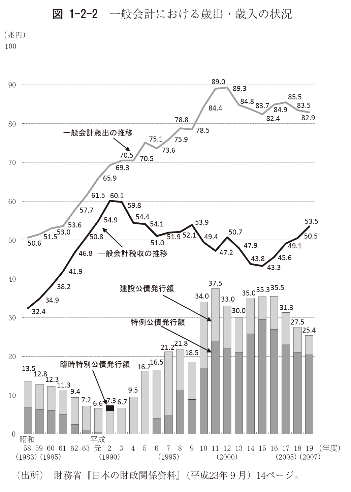

+++
author = "Yuichi Yazaki"
title = "ワニの口チャート ― 日本財政を象徴する独自の比喩的可視化"
slug = "crocodile-chart"
date = "2025-10-12"
categories = [
    "consume"
]
tags = [
    "",
]
image = "images/cover.png"
+++

「ワニの口チャート（わにのくちチャート）」とは、日本の財政状況をわかりやすく示すために用いられる独特の折れ線グラフです。

国の「歳出（支出）」と「税収（収入）」の推移を二本の線で示し、その差が拡大する様子を「ワニが口を開けているようだ」とたとえたものです。

この表現は日本特有のものであり、英語では “crocodile chart” や “fiscal gap chart” として知られているわけではありません。主に日本の報道や政策資料のなかで使われてきました。

<!--more-->

## チャートの見方

グラフの横軸は「年度」、縦軸は「金額（兆円）」を表しています。

上の線が「歳出（国の支出）」、下の線が「税収（国の収入）」です。

1970年代以降、歳出は増加し続け、税収は伸び悩み傾向にあります。その結果、二本の線の間の差が広がり、「ワニの口が開いていく」ように見えるのです。

この“口の開き”が大きいほど、財政赤字が拡大していることを意味します。逆に、口が閉じる方向に動けば、財政健全化の兆しとみなされます。

## 比喩の起源と定着の経緯

「ワニの口」という比喩は **1990年代後半** から財務省や国会の資料に登場しはじめたとされています。  
当時、バブル崩壊後の税収減と高齢化に伴う社会保障費増大が同時進行し、歳出と税収の乖離が急速に拡大しました。これを説明する際、財務省の職員や国会議員の間で「ワニが口を開けているようだ」という表現が使われるようになったとみられます。

財務省の公式資料でも、2000年代前半には「歳出と税収の差をワニの上あご・下あごになぞらえた『ワニの絵』」として図解されており、省内でこの比喩が定着していたことが確認できます。  
その後、新聞やテレビ報道がこの表現を取り上げ、「ワニの口チャート」という通称が一般にも広まりました。

このため、「ワニの口チャート」は特定の人物が発明したものではなく **財務省関係者による比喩表現が自然発生的に定着した** ものと考えられます。

## 背景と意義

「ワニの口チャート」は、単なる折れ線グラフ以上の意味をもちます。それは、日本の財政構造のゆがみや持続可能性への警鐘を、視覚的に強く印象づける“メタファー”でもあります。上昇を続ける社会保障費（上あご）と、横ばいの税収（下あご）――この対比を直感的に理解できるため、政策説明や教育資料で広く使われています。

## 参考・出典

- [参議院調査室『我が国財政の現況と課題』（調査報告書） — PDF](https://www.sangiin.go.jp/japanese/annai/chousa/rippou_chousa/backnumber/2015pdf/20150601061.pdf)
- [財務総合政策研究所「昭和財政史-昭和27～48年度」 — 財務省発行](https://www.mof.go.jp/pri/publication/policy_history/series/27-48.htm)
- [財務省「総説 — 平成財政史シリーズ」 — 平成初期の財政史を概観した章（PDF）](https://www.mof.go.jp/pri/publication/policy_history/series/h1-12/1_1.pdf)
- [財務省「日本の財政の現状と課題」 — 最新版キャラバン資料（2024年版など）](https://lfb.mof.go.jp/kyusyu/content/list/010/caraban_240826.pdf)
- [内閣府ウェブサイト「第1章 第3節 財政の現状と課題」 — 税収・歳出の推移分析など](https://www5.cao.go.jp/j-j/wp/wp-je22/h01-03.html)
- [財務総合政策研究所「昭和財政史-終戦から講和まで」 — 戦後期の制度変遷を扱った資料](https://www.mof.go.jp/pri/publication/policy_history/series/syusenkouwa.htm)
- [経済再生と財政の持続可能性（野村資本市場クォータリー）](https://www.nicmr.com/nicmr/report/repo/2013/2013spr04web.pdf)
- [独立財政機関に関する提言『わが国財政の信頼性・透明性向上へ』](https://www.kankeiren.or.jp/material/220826ikensho.pdf)