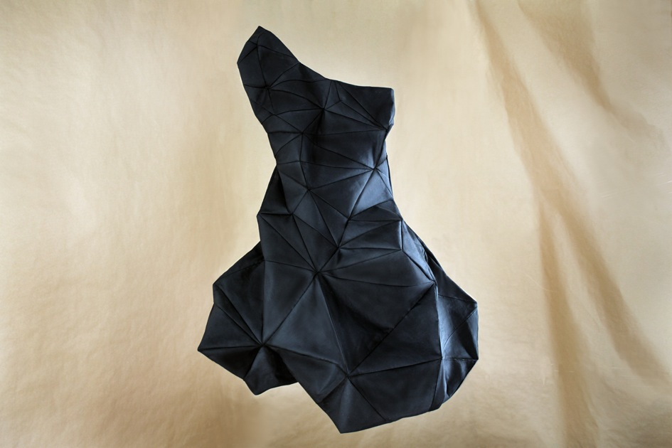
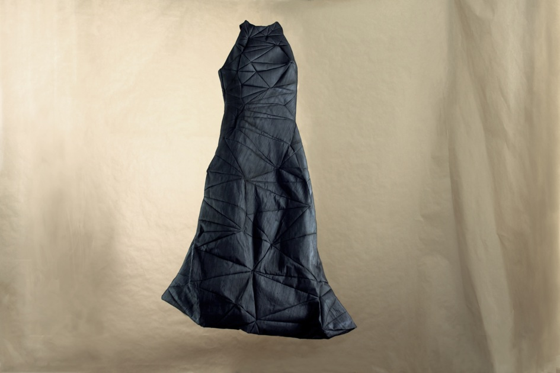

+++
author = "Yuichi Yazaki"
title = "Mary Huang's D.dress (2010): UI, Implementation, and Generative Algorithm"
slug = "d-dress"
date = "2026-01-04"
categories = [
    "consume"
]
tags = [
    "データ物質化",
]
image = "images/cover.png"
+++

D.dress (2010) is a computational fashion work by designer and researcher Mary Huang. Rather than presenting a single finished garment, it presents a process for generating dresses.

Users draw the shape of a dress on screen. An algorithm turns that input into a triangular mesh structure, previews it as a 3D model, and can unfold it into flat pattern pieces for cutting and sewing.

<!--more-->



## Why It Matters

D.dress reframes fashion as a computational structure rather than a fixed object. The garment becomes the result of interaction, algorithm, body, and material constraints.

## Design Lessons

- The interface can be part of the work, not only a tool.
- Generative design connects user input and manufacturable output.
- Digital form and physical fabrication must be considered together.
- Fashion can be treated as a variable system.

## Summary

D.dress is an important example of computational fashion and data/material translation. It shows how algorithmic design can turn a drawn gesture into a wearable physical form.
