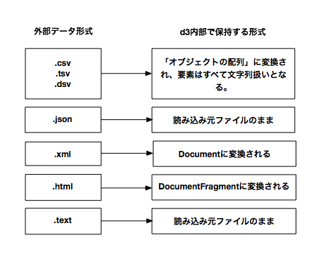

+++
author = "Yuichi Yazaki"
title = "D3: データ形式"
slug = "d3-requests"
date = "2013-09-22"
categories = [
    "technology"
]
tags = [
    "api","d3-js"
]
image = "images/fi_D3DatFormat.png"
+++

D3には、外部ファイルの読み込み用にいくつかヘルパー関数が用意されています。ファイル形式によって、D3に読み込んだ後のデータ保持の形式が異なるので一覧にするとこのような感じです。



[APIリファレンスのd3.csv()項目](https://github.com/mbostock/d3/wiki/CSV)をみると、d3.csv.parse()、d3.csv.parseRows()、d3.csv.format()、d3.csv.formatRows()、などというメソッドも用意されているような印象ですが、これらはd3.csv()が内部的に使用するので、通常はd3.csv()を利用すればよいです。  
csvは上図の通り、読み込まれるとデフォルトではオブジェクトの配列に変換されてしまうのですが、これを配列の配列（二次元配列）として読み込みたい場合には、d3.csv.parseRows()を使うのですが呼び出し方としては、汎用的なd3.text()を利用して

```
d3.text(url, "text/csv", function(text) {
var rows = d3.csv.parseRows(text);
// ...
});
```

とすればよいようです。考え方と実装はtsvもdsvも同様のようです。
