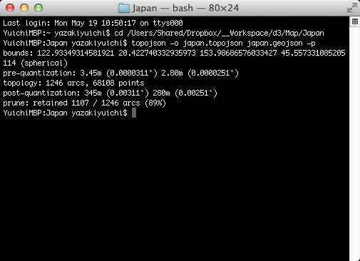
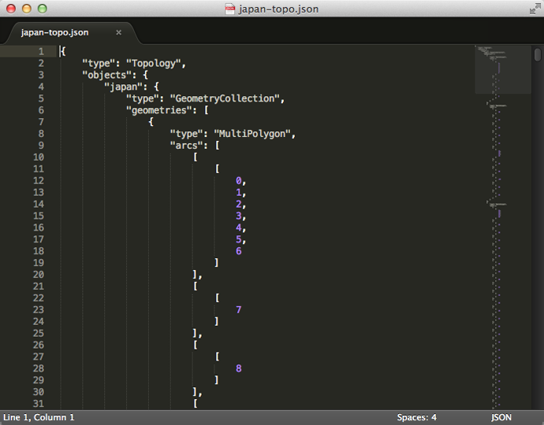
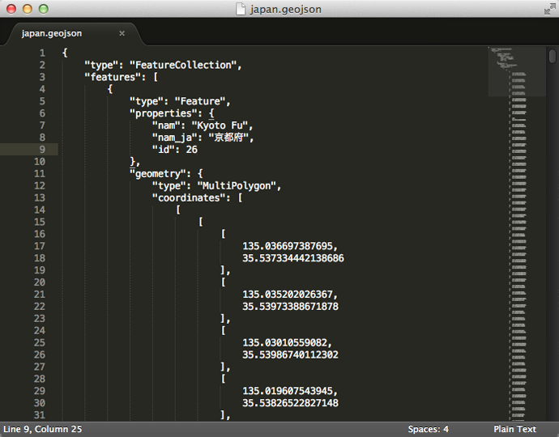

+++
author = "Yuichi Yazaki"
title = "D3: TopoJSON"
slug = "d3-topojson"
date = "2013-09-18"
categories = [
    "technology"
]
tags = [
    "d3-js","地図"
]
image = "images/fi_TopoJson.png"
+++

耳慣れない名称ですがD3の作者Michael BostockがD3で地理データを扱うために独自に策定したGeoJSONの拡張形式です。

- [TopoJSON on Github](https://github.com/mbostock/topojson)
- [TopoJSONについて（日本語訳ページ）](https://github.com/mbostock/topojson/wiki/JP-Home)

### 特徴

データから冗長性を排した結果、効率的にデータの活用ができたり、ファイルサイズをかなり削減できる。

- 国境や州境など複数の国や州が共有する地形データを重複することなく格納できる。
- 一つの TopoJSON ファイルで、ポリゴン（フィル＝塗り用）と境界線（ストローク＝輪郭線用）の両方を、同じarcメッシュを共有する二つのフィーチャーコレクションとして効率的に表現することができる。
- 座標計算に固定精度エンコーディングを用いることで正確性を犠牲にすることなく座標値の精度の丸め処理を省略できる。

とのことでこの結果、ファイルサイズをかなり削減(通常のものでは80%程度)できて、効率的にデータの活用もできるとのことです。

### 手元のPCでGeoJsonをTopoJsonに変換したい場合

コマンドラインで実行します。Node.js、topojsonをインストールしたのち、Macの場合はTerminalで、topojson -o output.json input.json といったコマンドを実行します。

- [Command Line Reference](https://github.com/mbostock/topojson/wiki/Command-Line-Reference)

### API

Server用APIとClient用APIの両方が用意されています。Server用はGeoJSONファイルやESRI ShapefileをTopoJsonに変換する役割があり、Client用はブラウザでレンダリング用にTopoJsonをGeoJsonに戻す役割があります。Server用はコマンドラインツールとして用意されたものと同じで、Node.jsのパッケージとしてローカルサーバで事前的に実行するか、ウェブサーバでリアルタイムに近い形で実行するかの違いです。

#### Server用パッケージのインストール

利用に際しては、Node.jsのパッケージ管理ツールnpmを通じてインストールします。

- [topojson | npm](https://npmjs.org/package/topojson)

#### Server用コマンドラインツールのリファレンス

- [Command Line Reference | topoJson](https://github.com/mbostock/topojson/wiki/Command-Line-Reference)

#### Client用JSファイル

ヴァージョン1.0.0とそれ以前で関数の定義に変更がありますのでご注意ください。  
[Topojson: list of differences between v0 and v1?](http://stackoverflow.com/questions/17404239/topojson-list-of-differences-between-v0-and-v1)

- [https://github.com/mbostock/topojson/blob/master/topojson.js](https://github.com/mbostock/topojson/blob/master/topojson.js)

#### Client用JSファイルで用意されている関数

- bisect(a, x)
- feature(topology, o)
- featureOrCollection(topology, o)
- merge(topology, arcs)
- mesh(topology, o, filter)
- neighbors(objects)
- object(topology, o)
- reverse(array, n)

### topojsonファイルの構造

<figure>

<figcaption>

TopoJSONのファイル構造

</figcaption>

</figure>

<figure>

<figcaption>

GeoJSONのファイル構造

</figcaption>

</figure>

- type=topologyとすることでこのデータがGeoJsonでなくてTopoJsonであることを示す。
- objects、arcs、transformの3つのobjectで構成される。
- objects…標準であるGeoJSON形式で記述されたobjectを名前でインデックス化。
- arcs…objectsに格納されているobject群の座標値を一元的に管理。線のように、点の連続で構成されている。
- transform…デルタ符号化された整数の座標をそれぞれのネイティブな値へ変換するための、変換値を保持（大きさと位置の補正）

行政界データでいうと境の部分はそれを共有する双方の県なり市区町村が同じ形状のものを持ちますがこれを一元化したり、座標は一カ所だけ絶対値でもちそれ以外の座標を相対値で持つことで必要な桁数をグッと減らすことができ、その結果ファイルサイズの軽量化が測れる構成になっているようです。またブラウザで表示用にレンダリングする際にはGeoJsonに戻してからレンダリングしますので、地形データはファイルサイズが大きくなりがちで、デコードするコストをかけても転送速度を軽減した方がよい、という考えのようです。

### 参考リンク

- [GeoJSON仕様（日本語訳）](http://n1n9.jp/d3/geojson/spec/)
- [Difference between GeoJSON and TopoJSON | stack overflow](http://stackoverflow.com/questions/14740705/difference-between-geojson-and-topojson)
- [TopoJSON Basics](http://geeohspatial.blogspot.jp/2013/03/topojson-basics.html)
- [D3.jsとTopoJSONで地図を作る](http://ja.d3js.node.ws/blocks/mike/map/)
