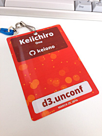
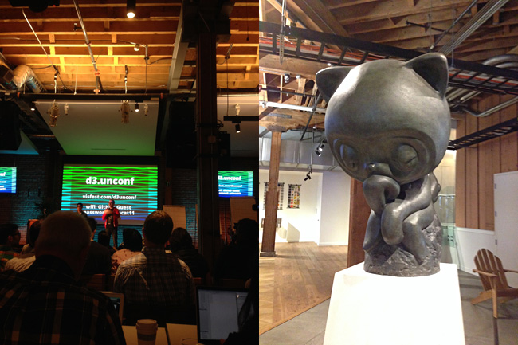
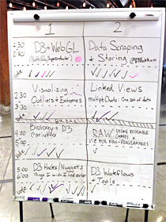
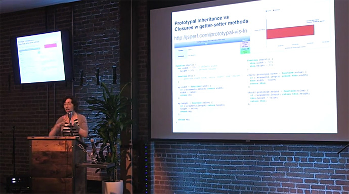

+++
title = "d3.unconfレポート[前篇]"
slug = "d3-unconf-2014-1"
date = "2014-04-11"
categories = [
    "event"
]
tags = [
    "d3-js"
]
image = "images/fi_D3Conf2014-1.png"
+++

Keiichiro Ono UC, San Diego School of Medicine [Cytoscape Consortium](http://www.cytoscape.org/)

## はじめに

まず自己紹介をさせていただきます。私はアメリカ西海岸、カリフォルニア州の最南端に位置するサンディエゴ在住のソフトウェア開発者です。[カリフォルニア大学サンディエゴ校(UCSD)](http://ucsd.edu/)と言う大学の医学部で、生物学者や医師に混じって彼らが研究で必要とする各種ツールを開発しております。分野としてはbioinformaticsと呼ばれるものです。

先週の土曜日(3/29/2014)、サンフランシスコにある[GitHub](https://ja.foursquare.com/v/github-hq-30/50f75cc0e4b07201af25590d)本社にて行われた[d3.unconf](http://visfest.com/d3unconf/)というD3.jsや可視化周辺の実務的な話題を扱う会議がありました。Cesar Chavez Dayで三連休だと言うこともあり[1](#1)、私にとってはちょうどいいタイミングでしたので、久しぶりにサンフランシスコまで足を伸ばしてみました。このカンファレンスがどのようなものだったか一通りレポートしてみます。

## どんなカンファレンスか？

可視化のカンファレンスと言っても、現在は様々な傾向のものがあります。アカデミック寄りな[IEEE系の学会](http://ieeevis.org/)や[分野特化型の学会](http://vizbi.org/)もありますし、もっとカジュアルなコードレベルの話題を主に扱うような[勉強会](http://www.meetup.com/Bay-Area-d3-User-Group/)もあります。昨今、様々な要因が重なり後者に属するカンファレンスがここアメリカでは増えてきたような気がします。ここで言う要因とは、以下のようなものです：

- パーソナルコンピュータ、モバイルデバイスの劇的な価格低下と高性能化
- 第二次ブラウザ戦争の遺産としての非常に高速化されたJavaScriptエンジンとCanvasをはじめとするHTML5関連テクノロジー
- クライアント関連テクノロジーのブラウザへの集約
- 各種デバイスから生み出される凄まじい量のデータ
- それらを扱うためのオープンソースツール群の発展
- そしてそれらを利用したいスタートアップや大手企業の可視化分野への関心

まだ他にも色々とありますが、これらの要因が重なり、可視化のための実際のコードを書くvisualization practitioner(実務家)向けのカンファレンスが増えています。私はオープンソースソフトウェアを書く事が日常の業務ですが、これは自分の関係する分野に限った事ではなく、メジャーなオープンソースプロジェクトは、事実上業務として開発している人々に支えられていると言う面が大きいです。そしてデータ可視化分野でもそのように職業としてオープンソースソフトウェア(OSS)を書いている人々も多く、それが現在の状況に繋がっています。こういった背景もあり、今回のカンファレンスはオープンソースソフトウェアに関わる開発者向けの「実際に手を動かす人々」をメインターゲットに据えています。それを強調する意味もあり、カンファレンスへの登録時にD3.jsを使い自分で作ったサンプルをgistへアップロードして、[bl.ocks](http://bl.ocks.org/)を使い一覧にしてみると言う試みも行われました。

- 参加者が登録時に送ったBL.OCKS一覧: [http://visfest.com/d3unconf/blocks.html](http://visfest.com/d3unconf/blocks.html)

## Unconference

今回のカンファレンスは、d3.unconfと言う名前の通りunconference（アンコンファレンス）形式で行われました。日本ではあまり馴染みの無い言葉かもしれませんが、unconferenceと言うのはテック系のワークショップやカンファレンスでは最近よく使われる手法です。これは当日まで細かいトピックについては決定せず、スピーカーも基本的には決めない形で集まります。そして開催日の朝にその日話し合うトピックを参加者らが出し合い、主催者は各トラックの時間と場所だけを指定して、参加者から提示されたトピックを各トラックに割り当ててその日のスケジュールを決定します。その後ディスカッションが成立しやすいように、数人から数十人程度のグループに分かれて各トピックについて話し合います。余談ですが、Googleがオープンソースプロジェクト開発者向けに毎年本社で開催しているGoogle Summer of Codeの[Mentor Summit](http://google-opensource.blogspot.com/2013/11/google-summer-of-code-mentor-summit-2013.html)もこの形式で行われています。こちらにも何回か参加しましたが、様々な話題にカジュアルに参加できて楽しかったです。

今回はIrene Ross氏によるキーノートで始まりました。彼女は[Bocoup](http://bocoup.com/)と言う会社で各種可視化システムやアプリケーション構築のコンサルティング、オープンソースソフトウェアの開発、関連ツールの教育を行っている方で、Misoプロジェクト[2](#2)と言うD3.jsをより便利に使うためのツール群を作っていらっしゃいます。

 \* The Miso Project: [http://misoproject.com/](http://misoproject.com/)

このMisoにはd3.chartと言うサブプロジェクトが含まれています。これはD3.jsの作者であるMike Bostock氏がTowards Reusable Chartsと言う記事で論じている「チャート生成コードの再利用性」にフォーカスしたツールです。彼女の講演は、この再利用問題をテーマにしたものでした:

- Architecting code with d3: [https://speakerdeck.com/iros/architecting-code-with-d3](https://speakerdeck.com/iros/architecting-code-with-d3)

D3.jsをお使いの方なら分かると思いますが、D3は自由度やカスタマイズ性の高さの代償として、たとえ求めるものがシンプルなバーチャートであっても殆どの要素を一から書かなければならないと言う問題があります。そういったものは、実際のチャート部分、軸、タイトル、レジェンドと言った共通要素に分解する事ができます。このような様々なチャートに共通する概念をコンポーネント化して、他のデータセットに対しても再利用可能にすると言うのがd3.chartの主なゴールです。ここは私も昨年のD3.jsアドベントカレンダーで記事を書かせていただきましたので、興味のある方はこちらもあわせてどうぞ。

- D3.js Advent Calendar 2013 Day 21: [D3.jsと周辺ツールを使ったデータの可視化](https://gist.github.com/keiono/8067196)

また彼女は今月末にボストンで行われる[OpenVis](http://openvisconf.com/)カンファレンスのオーガナイザーでもあるので、そちらの方の宣伝もしていました。私はこちらにも参加しますので、そのレポートもまた後日。

1.カリフォルニア州政府は、この日をアメリカ国民の祝日にしようと連邦政府に働きかけているため、州政府関連施設の職員は休みになります。私はカリフォルニア大学の研究系スタッフなので、州政府職員とみなされます。 2.日本人からすると若干奇妙なネーミングですが、「折り紙」「俳句」など、ある程度英語圏で浸透している日本語は最近よくOSSプロジェクトの名前に使われるようです

（本レポートは後篇に続きます。）
