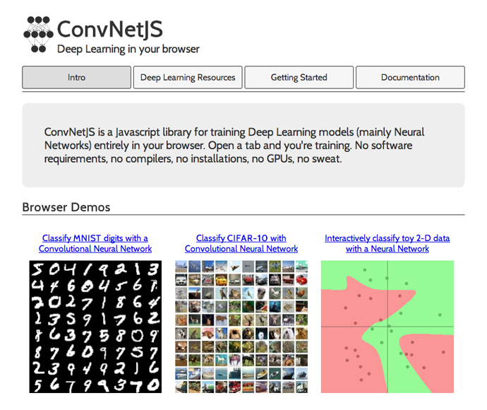

+++
title = "d3.unconfレポート[後篇]"
slug = "d3-unconf-2014-2"
date = "2014-04-20"
categories = [
    "event"
]
tags = [
    "d3-js"
]
image = "images/fi_D3Conf2014-2.png"
+++

参加者がディスカッションの議題を持ち寄りunconferenceがスタートしました。実際のタイムテーブルはこのような感じです。

\* [http://visfest.com/d3unconf/](http://visfest.com/d3unconf/)

せっかくなので私も一つ提案してみました。**Network visualizations; d3 + sigma + Cytoscape etc.**と言うのが私の提案したセッションです。

## 実際のディスカッション

普通のカンファレンスとは異なり当日にテーマを決めるため、誰かがスライドを使って話すと言う事は無く、イーゼルパッドとペン、そしてラップトップを持ち寄り、そのテーマについて皆で話し合います。当然全て英語ですので、日本からも参加してみたいと言う方はここで尻込みしてしまうかもしれませんが、基本的に話を聞くだけのカンファレンスとはまた違った面白さもありますので、機会があればぜひ挑戦してみてください。各トラックは並行して行われますので、全部に参加する事はできません。まずリストを見て興味のあるトピックを選び、そのセクションへ向かいディスカッションに参加します。しかし、あまり内容に興味が持てない場合や、他のセッションの方が面白そうな場合には、自由に移動しても問題ありません。私もとりあえず全体のリストを見て、面白そうだと思ったものにいくつか参加してみました。

### クライアントサイドMV\*とD3.jsの併用

午前はまずクライアントサイドMV_とD3.jsとの連携についてのトラックに参加してみました。参加者には、AngularJSなどをD3.jsと共にかなり使い込んでいる人、MV_との連携に懐疑的な人など混ざっていて、特定のフレームワークとの併用を行う場合の深い議論を行うというよりは、各参加者が使っているものとの連携に関する体験談などを持ち寄る感じでした。きちんと数えてはいませんが、AngularJSとBackbone.jsユーザーが多い印象でした。私は両者ともちょっとだけいじった事があるのですが、Backboneがかなり薄いフレームワークで自分でかなりの部分を作らなければならないのに対し、Angularは様々な機能があらかじめ含まれており、設計思想そのものがかなり異なります。この話題は様々な場所で行われています:

- [Contrasting Backbone and Angular](http://www.infoq.com/articles/backbone-vs-angular)
- [Angular, Ember, And Backbone: Which JavaScript Framework Is Right For You?](http://readwrite.com/2014/02/06/angular-backbone-ember-best-javascript-framework-for-you)

D3.jsを組み合わせるかどうかという以前の部分で好みが別れるため、なかなか深い部分までの議論には至りませんでしたが、実際の連携に関しては、この辺りが参考になると思います:

- [D3 on AngularJS](http://www.ng-newsletter.com/posts/d3-on-angular.html)

なお、AngularJSとD3.jsの連携に関しては、本も出ているようです

 \* [D3 on AngularJS: Create Dynamic Visualizations with AngularJS](https://leanpub.com/d3angularjs)

### ネットワーク可視化

次は自分がディスカッションのリーダーとしてネットワーク(グラフ)可視化のトラックに参加しました。まとめは（英語ですが）こちらにあります。

- [d3unconf session (11:30-12:30) Network Visualization](https://docs.google.com/document/d/186ntZ22Q7hL0JNOy0GfRy8nvuPVno9ZdHgS3FJ6ptHs/edit?usp=sharing)

「再利用可能なチャートモジュールを」と言う目標でd3.chartライブラリが作られているように、ネットワーク（グラフ）可視化分野にも同じような考えが必要だと感じました。D3.jsで作られたよくあるネットワーク図は、こんな感じのものだと思います

 \* [Yeast PPI Network Generated in Cytoscape](http://bl.ocks.org/keiono/9283085)

これだけで確かに取り敢えずグラフの構造を見ることは出来ますが、実際に使えるアプリケーションにするには、

- パン、ズームなどの基本的な操作の追加
- レイアウトオプションの提供
- 基本的なグラフアルゴリズムの実装

等、様々なものが欠如しています。これらは自前で作るよりも、共通で使えるライブラリとして用意されていた方がより効率的です。この辺りの整備がグラフ描画用JavaScriptライブラリには必要でしょう。手前味噌ですが、ある程度の大きさのネットワークをCanvasを用いて描画するならば、cytoscape.jsは良い選択だと思います。基本的なレイアウトアルゴリズムやUI、ネットワーク構造を操作するための高レベルAPIも整備されていて、レンダリング品質も高いです。

また最近は、クライアントのパフォーマンスが非常に高い場合、サーバー側にタスクを投げる必要はあるのかと言う問題もあります。グラフの大きさや構造によりますが、今の計算機のパワーを考えると、最短経路検索や簡単なクラスタリングなどはJavaScriptで書かれたクライアント側での処理とする方が自然です。そうなるとますます自前での実装は効率が悪いので、既存のプロジェクト同士が協力して「車輪の再発明」を避ける方向に動くべきだと感じました。

### WebGL/WebCLを利用した大規模データの可視化

このセッションはLeoさんと言う最近データ解析の会社を立ち上げた方がメインで開発しているSuperconductorと言うフレームワークの話題が中心でした。これは現状で考えられうる最も先端のWeb関連テクノロジーを組み合わせて作られています。

 \* [Superconductor](http://superconductor.github.io/superconductor/)

これは独自のDSLでデータ可視化の方法を記述することにより、GPUプログラミング特有の極めてローレベルな記述を覆い隠すようなフレームワークです。目標としては、OpenGLやGPGPUプログラミングに精通していないデータ解析者やプログラマにもGPUのパワーを活用できる機会を与える、と言うもののようです。ウェブブラウザ上で大規模なグラフィックスを描画したいときは、WebGLを使うというのが徐々に一般的になってきています。ゲーム業界などでも盛んに使われ始めていますので、WebGLは実際のプロジェクトに使うのに十分成熟してきたと感じます。一方、WebCLに関してはまだまだ使える環境が極端に限られるため、これからの技術ですが、数十倍・数百倍のオーダーで並列可能なアルゴリズムを高速化したい場合、現実的にはこれしか選択肢はないと思われますので、これから普及に入っていくと思われます。データ可視化の分野だと、レイアウトの計算やエッジバンドリングなど、非常に重い計算をしなければならな部分が幾つか存在するので、そういった部分もGPUを使って並列化することにより、WebGLとの組み合わせで、ほぼリアルタイムでインタラクティブな解析ができるようになると思います。

更に、PathGLと言うこの辺りのGPU活用ノウハウをD3.jsと組み合わせたフレームワークも紹介されました。

 \* [PathGL](http://pathgl.com/documentation/start.html)

#### バックエンドかフロントエンドか？

ここまでクライアントが高性能になると、何をバックエンドに任せ、何をフロントエンドで処理するかと言う問題も出てきます。現在は移行期に当たり、ハイパフォーマンスなクライアント（ハイエンドデスクトップマシンなど）が利用できる場合、かなりの部分をフロントエンドで行っても問題がない一方、タブレット等で走るブラウザではまだまだ使いものにならないアプリケーションも数多く存在します。もしユーザ（ここでは科学技術系の複雑な可視化ソフトウェアのユーザ）がそういったデバイスでの作業を求めた時、クライアントの種類によってサーバから配布するソフトウェアを切り替える必要があるかもしれません。

以下はこのセッションで触れられた最近のブラウザを使って実装されたアプリケーションの例です

\* [GLSL Sandbox](http://glsl.heroku.com/)

 \* [Welcome to the stellar neighborhood.](http://workshop.chromeexperiments.com/stars/)

学術的な内容になりますが、このあたりの大規模データのインタラクティブな解析、と言うテーマについて論じられたペーパーも紹介されました:

- [Z. L. Liu, B. Jiang, and J. Heer. imMens: Real-time visual querying of big data. Computer Graphics Forum (Proc. EuroVis), 2013.](http://vis.stanford.edu/files/2013-imMens-EuroVis.pdf)

（ちなみに、ラストオーサーの方はD3.js作者のMike Bostock氏の院生時代のアドバイザーです。）

### ニューラルネットワークの可視化

バズワードと言っていいくらい、最近はメディアでも「機械学習」や「ディープラーニング」と言った言葉を耳にするようになってきました。このセッションは、機械学習の手法でも歴史の古いニューラルネットワークの学習過程等を可視化してみようというもので、計算機科学の博士課程の学生さんがリードしていました。よく入力、出力の各ユニット、その間の隠れ層を接続したネットワークを可視化したものはよく見かけると思います。教師あり学習の場合、トレーニングセットを食わせている時にどのようにネットワークがデータを学習しているのかをリアルタイムで見えるように、ブラウザで動くクライアントを作ろう、と言う感じです。このセッションで紹介された以下のライブラリは可視化そのものがゴールではないですが、ブラウザひとつで実際に学習プロセスを走らせてしまおうというもので、教材としても面白いのではないかと思いました。

 \* [ConvNetJS](http://cs.stanford.edu/people/karpathy/convnetjs/)

私も学生時代にパーセプトロンから始まり、バックプロパゲーション法やら何やら単純なものはやって、おもちゃのような顔認識モジュールを実装したりはしましたが、知識が古いままなので色々とアップデートしなくては...と言う思いを新たにしました。実は自分が関わっている分野でも、label propagation等の機械学習の手法は最近盛んに用いられ、応用分野はどんどん広がっています。研究に直接関わらない人でも、プログラマーが「リテラシーとしての機械学習への理解」を求められる時代は確実に来ると思われます。

参考: \* [HotNet](http://compbio.cs.brown.edu/projects/hotnet/)

### 生物学と可視化

これも意外だったのですが、なぜか生物学関連のセッションがありましたので参加してみました。果たしてそのディスカッションのリーダーは、私の業務プロジェクトのコラボレーターの方でした。トピックは生化学的パスウェイの可視化についてでしたが、現実的にはそれをブラウザ上で行うと言う事は、ブラウザ上にHTML5関連技術を使ってVisioやOmniGraphのようなソフトウェアを構築する事に等しいので、他分野の方にこういう分野がある事を紹介し、協力者を募ると言う感じでした。私も便乗して、自分のプロジェクトを紹介してみました(下図を参照)。データの内容にはそれほど深く立ち入りませんでしたが、取り敢えず複雑な可視化を求められる問題のドメインが存在して、そういう方面で才能のあるプログラマを求めているよ、と言う思いは伝わったと思います。

- [NeXO](http://nexontology.org/)

### リアルタイムデータ

さて最後のセッションにもなると、皆各自でコードを書いていたり酒を飲んでいたりとグダグダになりつつあったのですが、まあそれもこの形式のいいところということで。最後に覗いてみたこのセッションでは、Leap Motionを使い、そこから得られるデータをリアルタイムのデータストリームとみなし、それをD3.jsを使ったJavaScriptのコードで可視化する、と言った感じでした。まあお遊びといえばそれまでですが、ジェスチャー入力はまだまだ色んなポテンシャルがあると思うので、こういう遊びの中から色々と面白いものが生まれて行けばいいと思います。

## まとめ

 カンファレンスの名前こそd3.unconfでしたが、扱った話題はD3.jsに限らず「データ可視化の実際」「可視化の現場」全般に渡るものでした。そしてそこに参加している人々も多岐に渡り、ソフトウェア開発者、データ解析者、データ解析サービス系スタートアップの創業者、計算機科学の大学院生、デザイナー、そしてGitHub本社に勤めてるエンジニアの方等も参加していました。こういうところで知り合い、Linkedinで繋がって行くと言うのが最近のアメリカの人脈開拓法なんだな、と実感しました。意外だったのは、アカデミア方面からの参加者がけっこう居たことで、データ解析や可視化といった話題に真剣に取り組むには、やはりそれなりの学術的バックグラウンドがないと厳しいということも感じました。そして今回このカンファレンスをホストしてくれたGitHubは、典型的な最近のテック系企業という感じで、エントランスホール付近には様々なオブジェやDJブース、実際にお酒も飲めるバーまで設置されていて、優秀な人材の奪い合いへの対応に余念がない感じでした（笑）。
