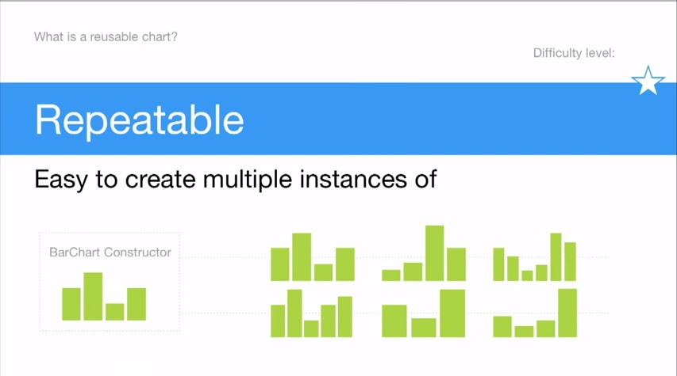
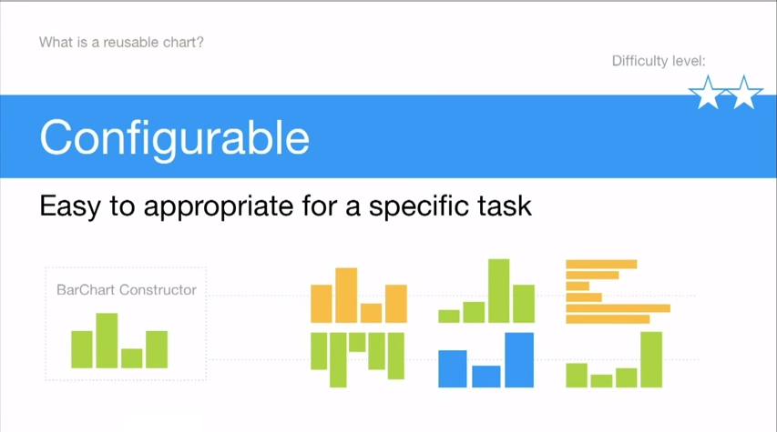
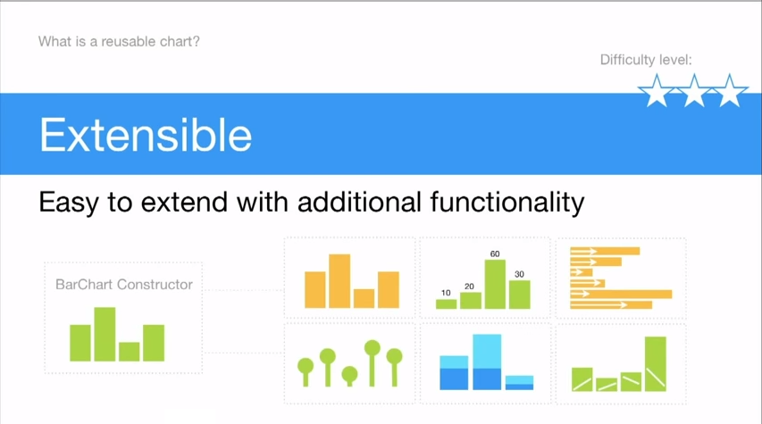
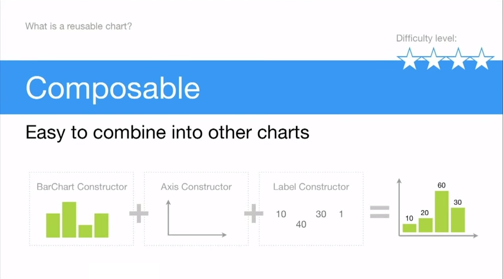

+++
author = "Yuichi Yazaki"
title = "D3.jsを使ったreusableな実装"
slug = "d3js-reusable"
date = "2014-12-18"
categories = [
    "technology"
]
tags = [
    "d3-js","ライブラリー"
]
image = "images/thumb_ph_vizjp.png"
+++

D3.jsを使って、チャートを一つウェブに表示することはexampleを利用すればできますが、たとえば以下のような場合にはどうしたらいいでしょうか。

・データが異なるバーチャートをいくつか掲載したい  
・カラースキーム（色の指定ルール）が異なるバーチャートをいくつか掲載したい  
・バーチャートとパイチャートに同じデータを適用したい

これらのような場合に、一つひとつexampleのような書き方をすると冗長ですし、整合性をヒューリスティックに確かめなければなりません。D3.jsのメインコントリビューターであるMike Bostockが使った‘reusable’=再利用可能、というキーワードがここで登場します。

- [Towards Reusable Charts](http://bost.ocks.org/mike/chart/ "Towards Reusable Charts")
- [再利用可能なチャートに向けて](https://gist.github.com/makoto/8092152 "再利用可能なチャートに向けて")

ただ、再利用可能なチャートのためのフレームワークはD3.jsには含まれていず、個々人で用意するか、既存のD3.jsをラッピングしたライブラリを使う必要があります。他のプログラム言語だとクラス化するところですが、JavaScriptはクラスの仕組みがないのと、D3.jsの実装にも特徴があるので、それに沿った実現の仕方が必要です。カプセル化しクロージャの仕組みを利用する、というのが定番になっているようです。

ボストンのデベロッパー会社bocoupでは再利用可能なことについての記事と、その考えを適用したライブラリ（d3.Chart）をリリースしています。

- [http://misoproject.com/d3-chart/](http://misoproject.com/d3-chart/ "d3.chart")
- [http://bocoup.com/weblog/reusability-with-d3/](http://bocoup.com/weblog/reusability-with-d3/ "Exploring Reusability with D3.js")

また、D3.jsのグーグルグループ参加者の有志でreusableな実装の仕方についてまとめた本が出ています。

- [Developing a D3.js Edge](http://bleedingedgepress.com/our-books/developing-a-d3-js-edge/ "Developing a D3.js Edge")

bocoupのメンバーが提案している再利用可能であることの特徴として以下のような定義をしています。  
(bocoup Irene Rosの講演、[Fluent 2013: Irene Ros, "The ABC of Data Visualization"](https://www.youtube.com/watch?v=TYgSc_S0lCw "Fluent 2013: Irene Ros, 'The ABC of Data Visualization'")からの引用)

### Repeatable - かんたんにいくつも作り出せること

### Configurable - 特定のタスクのための適切な変更がかんたんに行えること

### Extensible - 機能の拡張がかんたんなこと

### Composable - 他のチャートとの組み合わせがかんたんなこと

世の中にあるD3.jsを活用したライブラリというのはあまねく、D3.jsを包み込んだ上で、APIを簡略化したり、機能を足したもの（そのどちらかか両方）である、ということができます。

これらのリソースを参考に、ぼくも自分で使う用にライブラリの整備を進めています。

・データやDOMと、チャート描画メソッドを分離しておける。  
・getter/setterメソッドを用意することで、ライブラリ外部から指定が可能な変数を指定できる。  
・d3.dispatchというメソッドを利用することで、カスタムイベントを定義し、ライブラリから外部へイベントを発火させることができる。

あたりの性質を活かしているもので、サンプルコード（今回はトグルナビゲーション）を以下に掲載しました。

- [Toggle Navigation(reusable way)](http://bl.ocks.org/n1n9-jp/6238c6e48bff9cd8da12 "Toggle Navigation(reusable way)")
