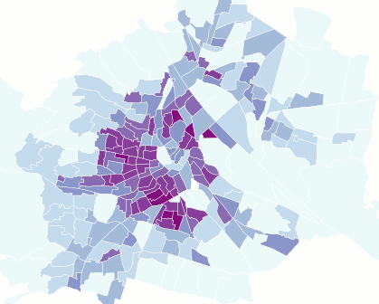
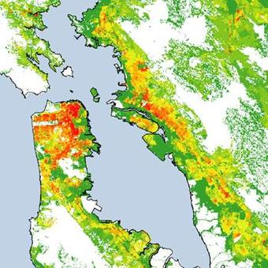

+++
author = "Yuichi Yazaki"
title = "ディシメトリック・マップ（Dasymetric Map）の事例"
slug = "dasymetric-map-example"
date = "2020-08-11"
description = ""
categories = [
    "chart"
]
tags = [
    "地図",
]
image = "images/dasymetric-map-2048x1448.png"
+++

ディシメトリック・マップ（Dasymetric Map）の事例を紹介します。

<!--more-->

## リスボンの人口密度。コロプレス（左）とディシメトリック（右）。

https://www.arcgis.com/apps/Cascade/index.html?appid=fde9d5cc2716490faf1e861d171a6fdd

## ウィーン市の人口密度。コロプレス（前者）とディシメトリック（後者）。

GIFアニメーションで切り替わるように処理されている画像

https://anitagraser.com/2012/11/18/improving-population-density-maps-using-dasymetric-mapping/

## ベオグラード市のデータを対象にした研究

(PDF) Dasymetric modelling of population dynamics in urban areas

## フロリダ州タンパにおけるコロプレス・マップ（左）とディシメトリック・マップ（右）の比較

https://www.epa.gov/enviroatlas/dasymetric-toolbox

## 2011年 ロンドンの人口密度

Dasymetric map of London’s population density, 2011 – James Gleeson

## 人口密度のマッピング。国勢調査データと土地被覆の統合

http://sites.tufts.edu/gis/files/2013/02/Nelson_Jason.pdf

## サンフランシスコ・ベイエリアの地図

https://www.usgs.gov/centers/wgsc/science/dasymetric-mapping?qt-science_center_objects=0#qt-science_center_objects

## 以前の似た作例
Henry Drury Harness (1838)

https://digital.ucd.ie/view-media/ivrla:45724/bookView#40a90816-2189-4a97-8c09-bb6c3ebf5c2b http://www.complexcity.info/files/2011/06/harness-1837-flowmap.pdf

