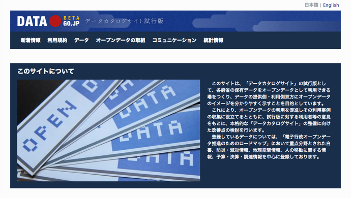

+++
author = "Yuichi Yazaki"
title = "data.go.jp開設"
slug = "data-go-jp"
date = "2013-12-30"
categories = [
    "article"
]
tags = [
    "オープンデータ",
]
image = "images/fi_DataGoJp.png"
+++

2013年12月20日、「データカタログサイト試行版」として、data.go.jpが開設されました。  
「各府省の保有データをオープンデータとして利用できる場をつくり、データの提供側・利用側双方にオープンデータのイメージを分かりやすく示すことを目的としています。」とのことで、「日本のオープンデータ憲章アクションプラン」に基づいたものです。

SNSを検索すると「マシンリーダブルなデータじゃない」や「同種のサイトが多すぎる」という指摘がいくつか見られ、同感ではあるのですが、以下の二つのことが画期的だと考えています。

[CC-BYライセンスが付与されていること（利用規約 第１条）](http://www.data.go.jp/)

[省庁横断でデータが集められていること](http://www.data.go.jp/data/organization)

まずは場作りと様子見であるようなので、ここで「まだできてない」じゃなくて「二歩進んだ」進んだと捉えて今後の動きにも注視していきたいところです。

さて、どんなデータが集められているのでしょうか？このサイトはnet commonsとCKANが使われているようで、CKANはデータカタログサイトを立ち上げる際によく利用されるもので、これにはAPIが用意されています。これを利用することで登録されているデータのメタデータについて、クロス集計的に、立体的に捉えることができるようになるのですが、これが現時点で公開されてなく残念です。

集められているデータの大枠が掴めるように、メタデータやタグを手動で拾って並べてみました。経年で記録していけばそれ自体も一つのデータになるかと思います。

[meta data of data.go.jp](https://visualizing.jp/files/data-go-jp/)

些末なところだと、タグやキーワードの与え方にいくつか課題がありそうです。

システム的な観点では、

- csvやtsvなど区切りに使用される文字はタグやキーワードに含めない
- %がパースできていない [2020年30％](http://www.data.go.jp/data/dataset?tags=2020%E5%B9%B430-)

IA的的な観点では、

・半角、全角を名寄せすべき [Ｇ８](http://www.data.go.jp/data/dataset?tags=%EF%BC%A7%EF%BC%98)と[G8](http://www.data.go.jp/data/dataset?tags=G8)

- 半角、全角を名寄せすべき [Ｇ８](http://www.data.go.jp/data/dataset?tags=%EF%BC%A7%EF%BC%98)と[G8](http://www.data.go.jp/data/dataset?tags=G8)
- 一つのキーワードに二つ以上の項目を含めてしまっているのは避けるべき [予算\_平成22年度](http://www.data.go.jp/data/dataset?tags=%E4%BA%88%E7%AE%97_%E5%B9%B3%E6%88%9022%E5%B9%B4%E5%BA%A6)

ともあれ、色んなことが発見できそうなので、じっくりみていきたいところですね。

- [オープンデータ推進へ約１万種を公開　内閣官房 - 朝日新聞](http://www.asahi.com/articles/ASF0TKY201312230112.html)
- [CKANについて – data.go.jp](http://fumi.me/2013/12/22/ckan/)
