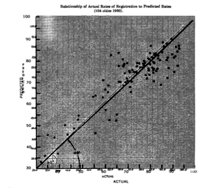
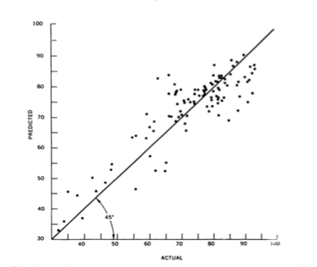
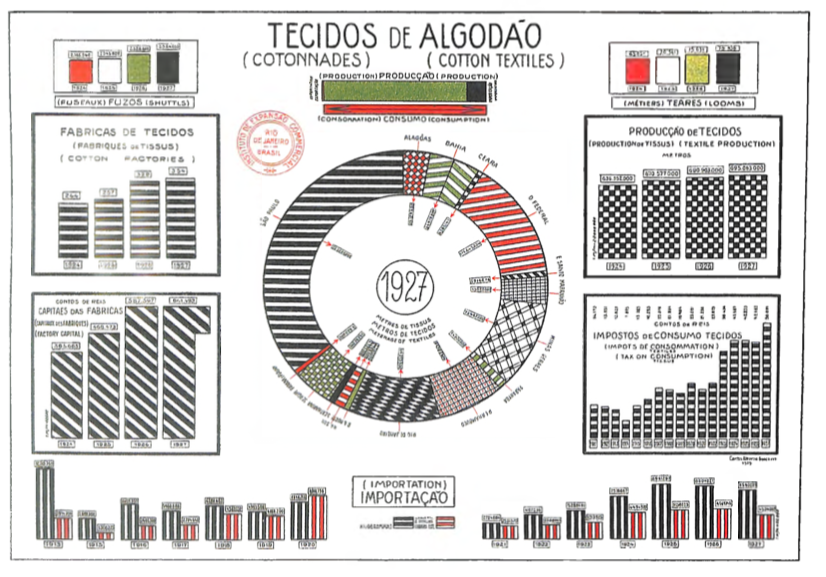
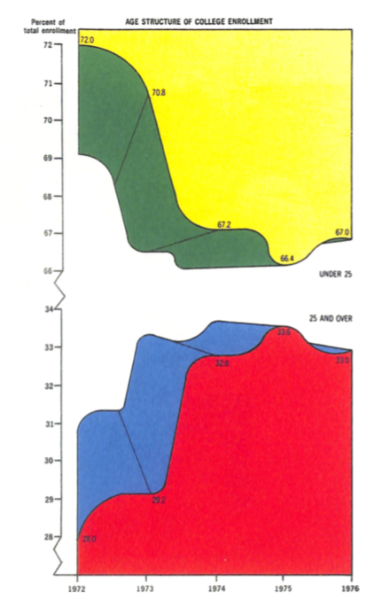
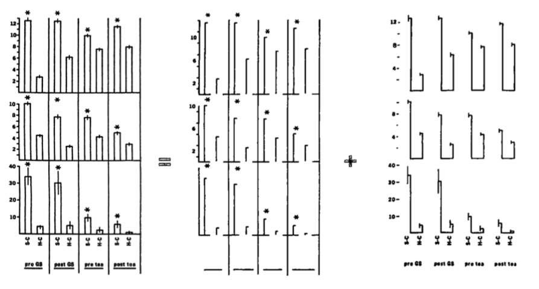
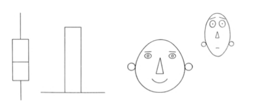
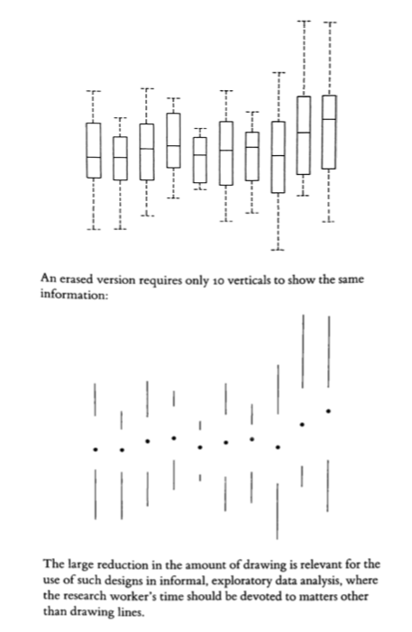
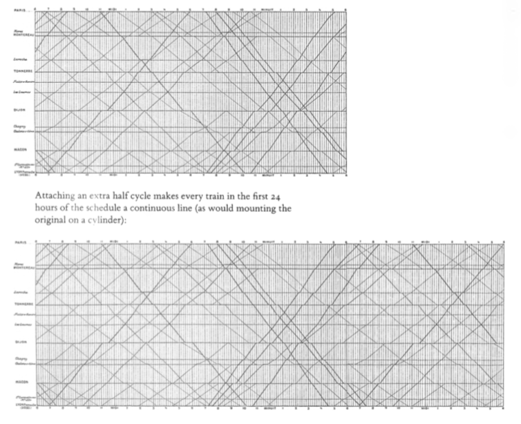
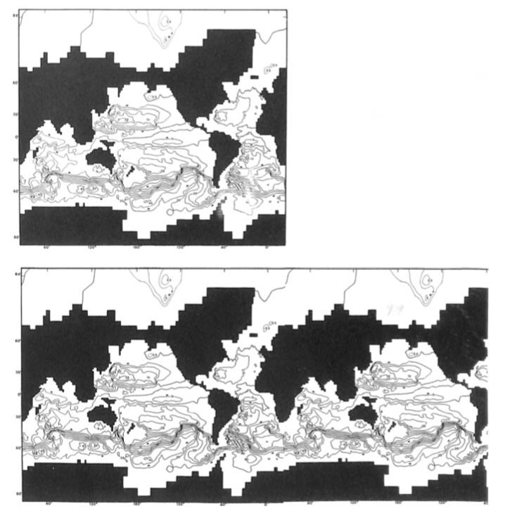

+++
author = "Yuichi Yazaki"
title = "データ-インク比"
slug = "data-ink-ratio"
date = "2020-03-09"
description = ""
categories = [
    "consume"
]
tags = [
    "tufte"
]
image = "images/DataInkRatio_Playfair_generated.png"
+++

データ-インク比という言葉があります。エドワード・タフテがこのように定義しています。

> - Data-ink ratio = Data-ink ÷ total ink used to print the graphic
> - データ-インク比 = データ-インク ÷ グラフィックの印刷に使用される全インク

<!--more-->

紙に印刷されたグラフィックを想像していただいて、データインクとは、データ（測定された量）を伝えるためにインクの滴をさします。そして、グラフィック全体の印刷にかかったインク量のうち、データ（測定された量）を伝えるために用いられたインク量の比率を、データ-インク比と定義しています。

そして、この比率ができるだけ1.0に近い状態を「良いグラフィック」として定義しています。タフテの著書、The Visual Display of Quantitative Informationからご紹介していきます。

### グリッドや軸の表現を軽減させる

エドワード・タフテ／The Visual Display of Quantitative Informationより引用

エドワード・タフテ／The Visual Display of Quantitative Informationより引用

### モアレ効果を多用しない

光学技術を元に多用なテクスチャの生成が可能になりましたが、モアレ効果を生み出し、ノイズが情報の流れを曇らせます。

エドワード・タフテ／The Visual Display of Quantitative Informationより引用

### 自己装飾が目的になってしまっている

エドワード・タフテ／The Visual Display of Quantitative Informationより引用

### 左右対象な図形

高さを示す棒グラフは、高さを示す要素以外を極限まで減らす。

エドワード・タフテ／The Visual Display of Quantitative Informationより引用

ボックスプロット、棒グラフの棒、チャーノフの顔のように、シンメトリー（左右対称性）なチャートについては、左右対称であるがゆえに、半分は冗長であるとします。

エドワード・タフテ／The Visual Display of Quantitative Informationより引用

### 一見、幾何図形のみで成立しているチャートであっても、極限まで無駄を省いてみる。

通常の箱ひげ図も、この観点に立つと、極限までデータ-インク比を上げられます。

エドワード・タフテ／The Visual Display of Quantitative Informationより引用

### 適切な繰り返しは許容する

無意味な左右対称形は否定していますが、逆に、列車の時刻表や世界地図などは、スムーズな情報取得のため、意図的に繰り返す方が優れている、としています。

エドワード・タフテ／The Visual Display of Quantitative Informationより引用

エドワード・タフテ／The Visual Display of Quantitative Informationより引用

### 現代において、どこまで有効な考えか？

左右対称な図形や幾何図形を極限まで削る様は、やや過剰に潔癖すぎるきらいもなくはないです。エドワード・タフテ本人も「統計グラフィックスの設計には、効率だけでなく、複雑さ、構造、密度、さらには美しさまで、他の多くの考慮事項が残っています。」（翻訳は筆者）と述べています。

データ-インクの部分、非データ-インクの部分、それぞれにおいて、データを元に表現したいことのうち、データが根拠になっていない表現、データを曲解しかねない表現については極力避けなければならないことは言うまでもありません。