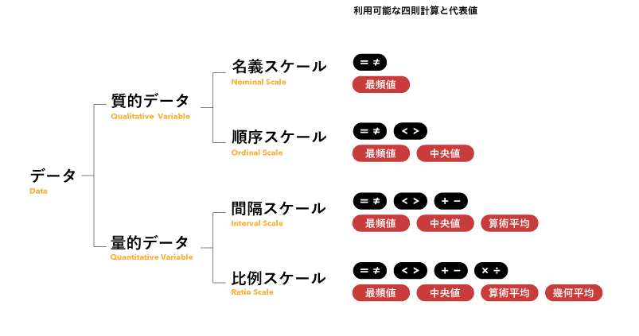
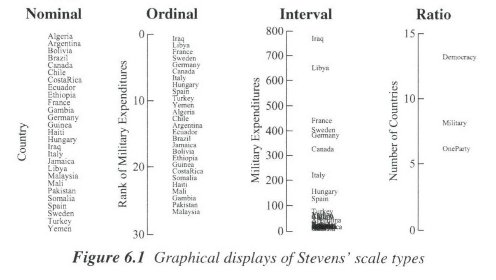

+++
author = "Yuichi Yazaki"
title = "データスケール（Data Scale）"
slug = "data-scale"
date = "2020-03-07"
categories = [
    "technology"
]
tags = [
    ""
]
image = "images/1_aHohRnwe6dmiqzsiRYEpug.png"
+++

データの分類方法は色々あります。

そのうち、四則計算や代表値を求める計算のうち、適用可能範囲で分類する考え方があります。  
スタンレー・S・スティーブンスが1946年の論文で提案し、参照されることが多い分類方法です。

質的データが文字データ、量的データが数値データを、それぞれ指します。それぞれが2種類づつに分類されます。呼び方にスケールを付けずにデータと付け、名義データ、順序データなどと呼ぶ場合もあります。

図の上から下へ、名義スケールが情報量が一番少なく、比例スケールが情報量が一番多いです。大は小を兼ね、情報量が少なくなる方向でのスケールの変換が可能ですが、逆は出来ません（例：順序スケールは名義スケールに変換可能ですが、名義スケールは順序スケールに変換することはできません）。

### 名義スケール（Nominal Scale）

- 単に区別するためだけに用いられる。
- 五十音順、アルファベット順でソートすることは可能だが、大小関係ではない。
- データの個数を数えることはできる。
- グループ化することができ、その結果、最頻値を得られる。ただし、中央値、平均値は得られない。

**具体例：**  
性別、職種、血液型、 出身地、電話番号、 型番、 スポーツ選手の背番号、バスの系統番号など

### 順序スケール（Ordinal Scale）

- 順序や大小関係に意味がある。
- 任意の2つのデータの間隔(距離)の等しさは保証されていない。
- 二分法、非二分法のそれぞれに該当するデータがある（二分法とは物事をAと非Aの二つに分けることを指す）。
- 心理学や社会科学の測定値の大部分は順序スケールで行われている。
- データ値が数字であってもそれは序数であり、平均や標準偏差を算出することはできない。

**具体例（二分法）：  
**健康と病気、有罪と無罪など。

**具体例（非二分法）：**  
五段階評価の成績、 金銀銅などの順位、松竹梅などの階級、 おみくじ(大吉〜大凶)、 星の明るさ(等級)、職位、満足度など。

### 間隔スケール（Interval Scale）

- 任意の2つの隣接値または間隔の距離が等しい。
- 原点(ゼロ点)は便宜的に存在するが、特別な意味を持たない。
- 時間的な期間を測定することができる。
- 掛け算、割り算はできない（20℃は10℃の「2倍の熱」とは言えない）。

**具体例：**  
気温、偏差値、相対的な標高、知能指数、西暦、カレンダーの日付など。

### 比例スケール（Ratio Scale）

- 意味のある均一な間隔を持つ。
- 順序に意味がある。
- 値の差と比率に意味があるため、四則計算(加算、減算、乗算、除算)ができる。
- 任意ではない固有の原点(ゼロ点)を持つ。値がゼロの場合、そのものが存在しないことを表すことが多い。

**具体例：**  
身長、体重、年収、金額、絶対温度、金利、(ある時点からの)経過日数、年齢、収入など

<figure>

<figcaption>

The Grammer of Graphicsより

</figcaption>

</figure>

## 使い道

データの性質を把握するのに利用し、データを視覚的に表現する際に考慮します。名義・順序・量的データと分類する考え方はわかりやすく、色の選定やビジュアル変数を分類する際に用いられます。具体的には、面積や色で表現する際に、この分類にあわせて、表現ルールを設定します。その際、間隔スケールと比例スケールを区別しないで、量的データ（定量スケール）一つとして扱う人もいます。

別なスケールへデータを変換することもできます。ただし、四則計算や代表値を求める計算が少なくなる方向へのみ変換が可能です。

また「データがスケールの選択にほとんど役に立たず、間違った選択は発見を妨げる可能性がある」とするVelleman and Wilkinson（1994）や、 スティーブンスのものを含む多数の測定理論を比較したD. J. HAND(1996)などの研究があります。
