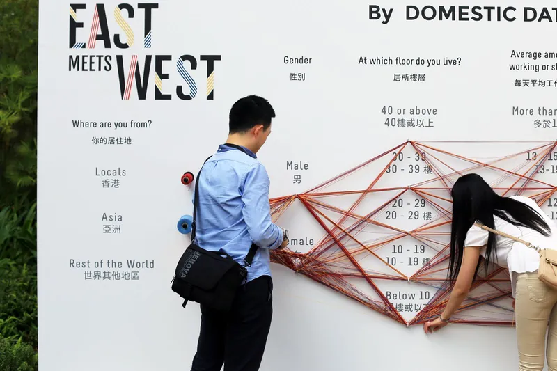
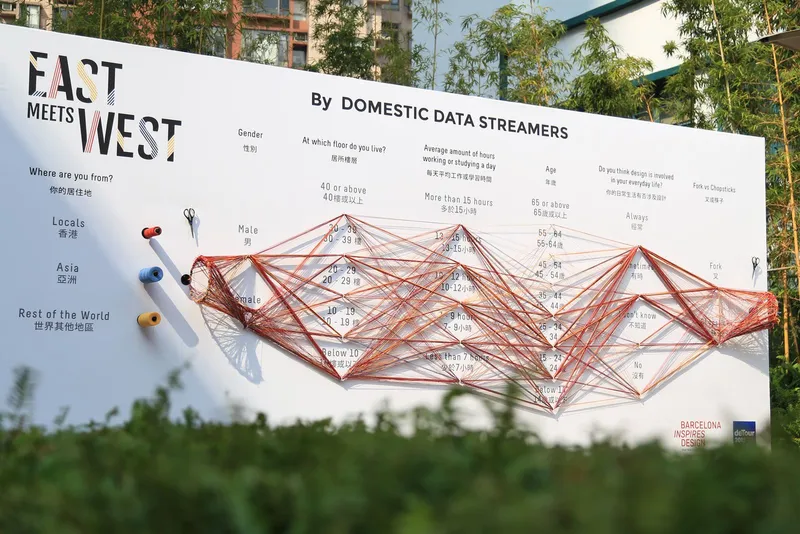

+++
author = "Yuichi Yazaki"
title = "Participatory Parallel Coordinates Visualized with String"
slug = "data-strings"
date = "2026-01-02"
categories = [
    "consume"
]
tags = [
    "データ物質化",
]
image = "images/Domesticstreamers_19.jpg"
+++

This participatory installation visualizes collective answers as bundles of physical string. Visitors answer questions by threading string through options. As responses accumulate, the installation forms a physical visualization of collective thought and facts, while each participant can compare their own path with the bigger picture.

<!--more-->

The wall panel shown in the photographs begins with a question such as "SPOON VS. FORK" and continues through attributes such as place of origin, gender, age, employment status, height, handedness, and weight. Each piece of string becomes one respondent's path.

## How to Read It

Read one string as one person's response and the thickness or density of strings as the number of people choosing a path. The clearest insight often comes from finding the thick flows first, then following how they split across later questions.

## Why It Matters

Data Strings turns survey participation into both input and display. Participants do not merely fill out a form; they physically build the visualization.

## Summary

Data Strings is a strong example of data physicalization and participatory visualization. It makes survey data tangible, social, and immediately visible.
