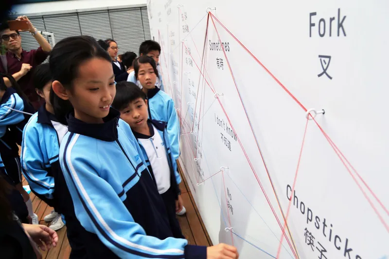
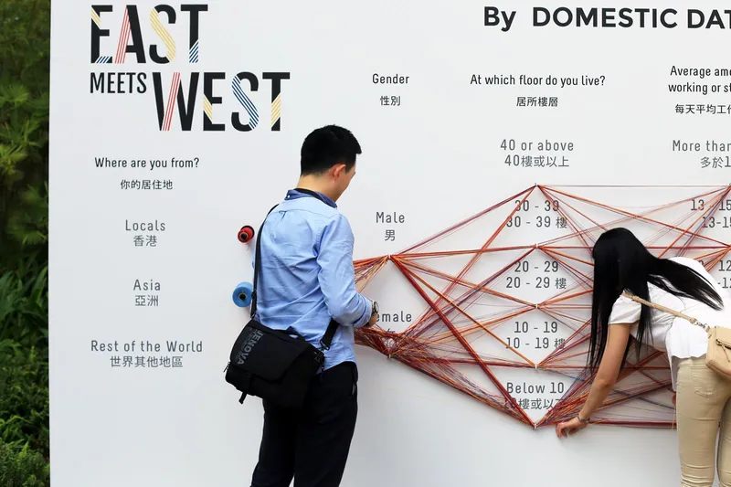
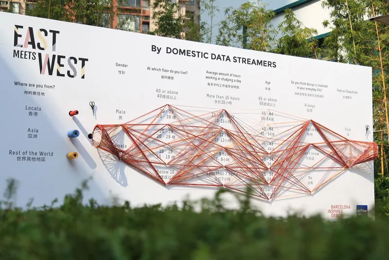

+++
author = "Yuichi Yazaki"
title = "糸で可視化する参加型パラレル・コーディネイト」"
slug = "data-strings"
date = "2026-01-02"
categories = [
    "consume"
]
tags = [
    "",
]
image = "images/Domesticstreamers_19.jpg"
+++

この作品は、来場者が質問に答えながら「糸（ストリング）」を選択肢に沿って渡していくことで、集団の回答傾向を“物理的な線の束”として可視化する参加型インスタレーションです。Domestic Data Streamers の公式説明では、参加者は複数の質問に対して選択肢の周りに糸を編むように通し、その積み重なりによって「集合的な思考や事実の可視化」が生成され、個人は自分の答えを全体像（bigger picture）と比較できる、とされています。

<!--more-->

写真に写っている壁面は、その仕組みを巨大なパネルとして展示した例で、見出しにある「SPOON VS. FORK（スプーン派かフォーク派か）」が起点の問いになっています。以降、属性（出身地・性別・年齢・就業状況など）や身体特性（身長・利き手・体重など）の軸へと、一本の糸が“回答の経路”としてつながっていきます。

## 作品の見方

この作品の読み方は、「一本の糸＝一人の回答」と「糸の密度＝人数」の2つを先に押さえると、急にわかりやすくなります。難しく考えず、まずは“線の太い流れ”を探してください。

### 1) まず「出発点」を探す
写真では、パネル上部に大きく「SPOON VS. FORK」とあります。ここが出発点です。
- スプーンを選ぶ人は、スプーン側の起点から糸を通します。
- フォークを選ぶ人は、フォーク側の起点から糸を通します。
（色が使われている場合、色が二択そのものを表すこともあります。）

ここで重要なのは「どちらが多数派か」を当てることではなく、**最初の束がどれくらい早く分かれ、どれくらい太くなるか**を見ることです。束が太いほど、その選択をした人が多いことを意味します。

### 2) 次に「軸（質問項目）」を“駅”のように読む
この作品では、複数の質問項目が横方向に並びます。各項目には、複数の選択肢（カテゴリー）があり、糸は自分に該当する場所を通過して次へ進みます。
見方としては、各質問項目を「駅」、選択肢を「駅のホーム」だと思ってください。一本の糸は、駅から駅へ乗り換えていくように進みます。

### 3) 「束の太さ」で分布を見る
各軸で糸が集中している場所（束が太い場所）は、その場の参加者が多いカテゴリです。
たとえば「年齢」軸で特定の範囲に糸が密集していれば、その展示に参加している来場者層の偏りが見えます。これは“この場に集まった人たち”の分布の可視化として読みます。

### 4) 「束の割れ方」で関係の手がかりを見る
次に面白いのは、束が次の軸でどう割れるかです。
- スプーン派の束が、次の軸で特定のカテゴリに寄る
- フォーク派の束が、別のカテゴリに散る
といった違いが見えると、二択（嗜好）と属性（プロフィール）の関係が“それっぽく”見えてきます。

ただし、ここで断定は禁物です。この作品は「その場の参加者が作った可視化」であり、統計的に一般化するための厳密なサンプリングを前提としていません。したがって、読みとしては次の言い方が安全です。
- 「この展示の参加者に限れば、こういう傾向が見える」
- 「この場では、こういう流れが目立つ」

### 5) 最後に「一本の糸」を追って「自分の線」として読む
束（集団）を眺めたあとに、一本の糸を端から端まで追ってみてください。すると、この作品が“可視化”であると同時に「参加の記録」でもあることが実感できます。
- 自分の線がどこを通っているか
- 自分と似た線（近い経路）がどれくらいあるか
- 自分だけが通っている分岐はあるか
こうした観察が、作品鑑賞を「比較」へ変えてくれます。

## 関連する背景知識
この作品は、データをスクリーン上ではなく物理素材で表す「データ・フィジカライゼーション（Data Physicalization）」の代表例として理解できます。糸は、線の重なり・影・距離・視点移動によって見え方が変わるため、デジタル画面では得にくい“身体的な読み”を誘発します。

構造としては、多変量データを複数の軸に並べ、各データ行を折れ線でつなぐ「パラレル・コーディネイト（Parallel Coordinates）」と同型です。データ収集と可視化生成が同じ行為に統合されています。

## 目的

この作品の目的は、精密な分析結果を提示することよりも「人々の答えが集まると、どんなパターンが立ち上がるか」を直感的に体験させることにあります。公式説明でも、参加者の情報によって社会的パターンが現れ、個人が自分の答えを全体像と比較できる点が強調されています。

また、起点の問いが「スプーンかフォークか」という軽い二択であることは、参加の心理的ハードルを下げる装置として機能します。気軽に参加させ、そのままプロフィール軸へ自然につなげる導入になっています。

## まとめ

SPOON VS. FORK は、参加者の回答を糸で「編む」ことで、多変量の回答パターンを物理空間に立ち上げる参加型の可視化作品です。

読みの要点は、一本の糸（個人）と束の太さ（集団）を往復しながら、分布と分岐を観察することにあります。最終的に、自分の線を見つけて全体と比較できたとき、この作品が「可視化」であると同時に「参加の記録」でもあることが腑に落ちます。

## 参考・出典

- [Data Strings | Domestic Data Streamers](https://www.domesticstreamers.com/work/data-strings/)
- [Spoon vs Fork Data Visualizer | Behance](https://www.behance.net/gallery/11492915/Spoon-vs-Fork-Data-Visualizer)
- [Data Strings: Physical Parallel Coordinates | Dataphys](https://dataphys.org/list/data-strings-physical-parallel-coordinates/)
