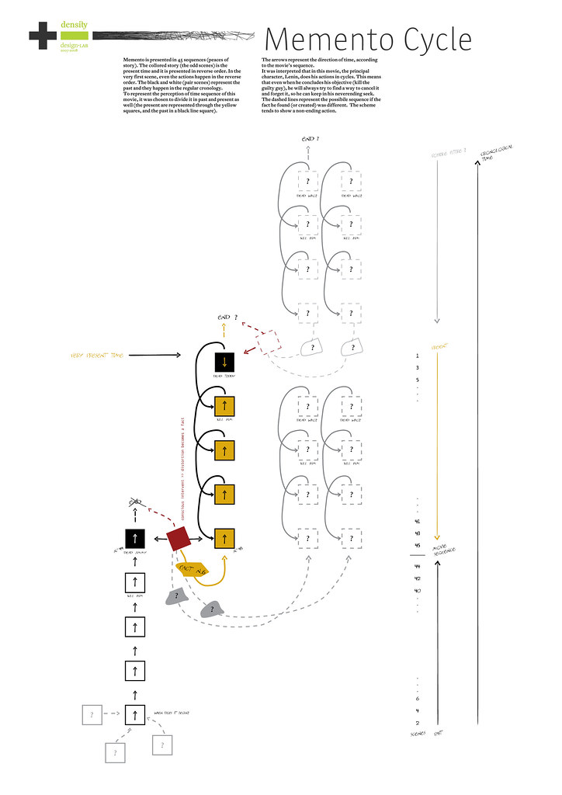
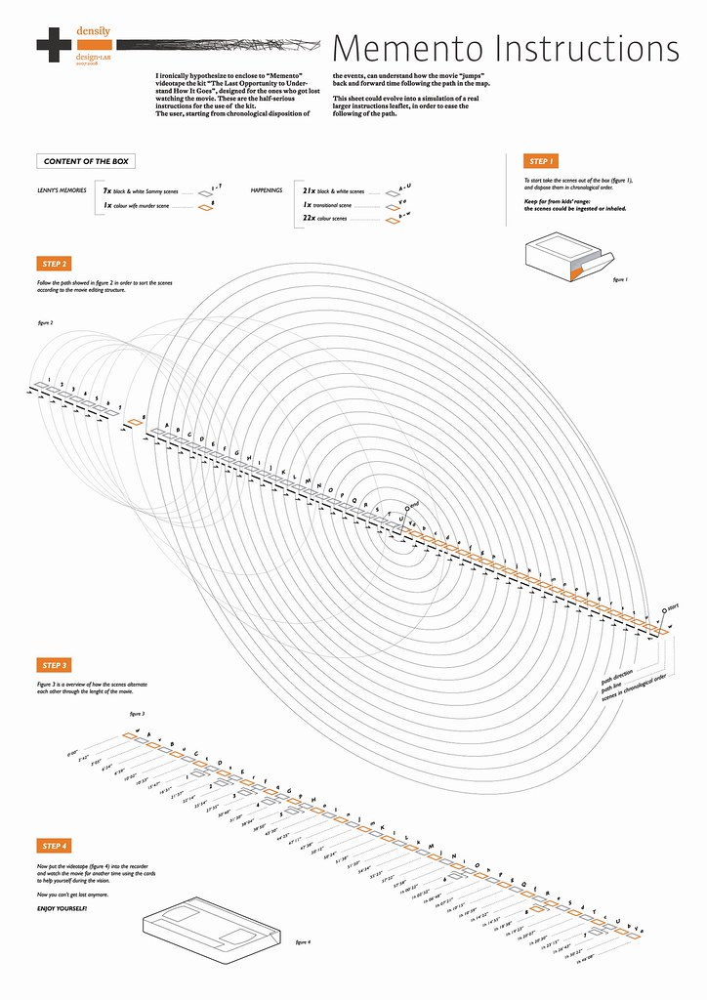
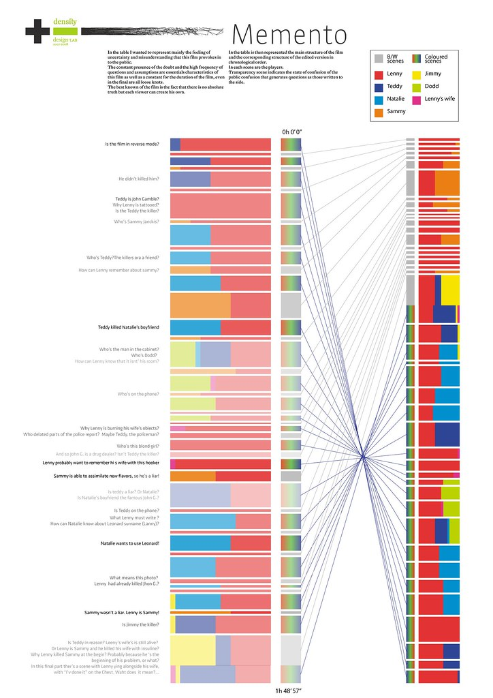
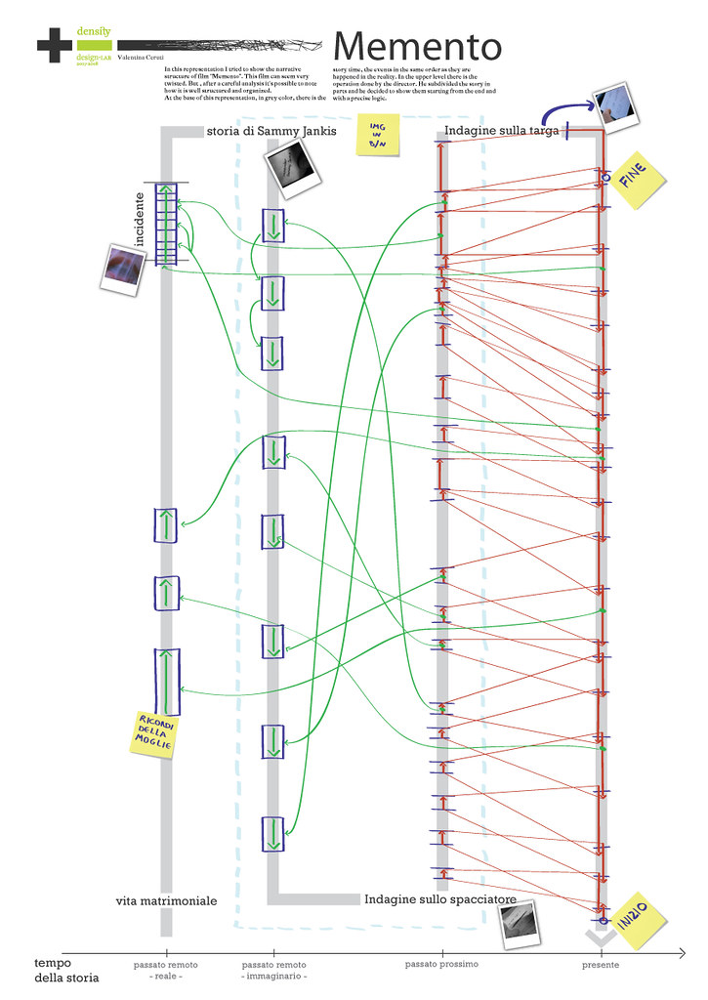

+++
author = "Yuichi Yazaki"
title = "映画『メメント』を可視化する ― DensityDesign Lab「Memento」課題"
slug = "densitydesign-lab-memento"
date = "2024-10-04"
description = ""
categories = [
    "education"
]
tags = [
    "デザイン教育",
]
image = "images/cover.jpg"
+++

「Memento」課題は、ミラノ工科大学 Politecnico di Milano の DensityDesign Lab による2007–2008年度の教育課題です。テーマはクリストファー・ノーラン監督の映画『メメント』（2000年）。この映画は、記憶障害を持つ主人公が妻の死の真相を追う物語で、シーンの時系列が逆行や断片的構成で進むという極めて複雑なストーリーテリングを特徴としています。

課題の目的は、この映画の時間構造や物語の複雑さを「情報デザインの手法」によって可視化すること。学生たちは、物語をシーン単位に分解し、時間の流れ・登場人物の関係・記憶の断片化を図解として再構築しました。

<!--more-->

## 図解の特徴と見方

学生が制作したビジュアルは、映画の独自の構造を「読む」のではなく「見る」ための試みとして設計されています。

- **時間軸の再編成** 『メメント』特有の「逆行する白黒シーン」と「順行するカラーシーン」を整理し、どこで交差するかを図として明示。
- **断片化された記憶の表現** 主人公の失われた記憶を「途切れた線」「分岐したノード」などで表現し、観客の混乱を再現。
- **人物関係の可視化** 各登場人物との関わりや、情報の信頼度を色や線種で区別し、プロットの複雑さを構造的に示す。

これらの図解は、物語分析の補助であると同時に「時間」や「記憶」といった抽象的概念をどのようにデザインで表せるかを探る実践になっています。

## 学生の作例

Flickr 上では、以下のような学生作品が確認できます。

[Memento | Eloisa Fontana Memento | DensityDesign Lab | Flickr](https://www.flickr.com/photos/densitydesign/2198257632/in/album-72157603732273519)

[Memento | Simone Trotti Memento | DensityDesign Lab | Flickr](https://www.flickr.com/photos/densitydesign/2197472887/in/album-72157603732273519)

[Memento | Mauro Napoli Memento | DensityDesign Lab | Flickr](https://www.flickr.com/photos/densitydesign/2197465859/in/album-72157603732273519)

[Memento | Valentina Ceruti Memento | DensityDesign Lab | Flickr](https://www.flickr.com/photos/densitydesign/2197456027/in/album-72157603732273519)

## 教育的意義

この課題は、社会データを扱う「Poverty」課題とは異なり、物語や時間構造といった抽象的な対象をデザインで理解する訓練です。教育的意義は以下にあります。

- **分析力の強化** 複雑な物語を分解し、要素間の関係を明示するスキルを育成。
- **表現力の拡張** 時間や記憶といった非数値的データを可視化する方法を模索し、抽象的な対象を表現する柔軟性を培う。
- **批判的理解** 単なる映画鑑賞にとどまらず、「構造をどう表現すれば他者が理解できるか」を考えさせる。

教育現場において、こうした「映画をデータ化・図解化する課題」は、データジャーナリズム的な訓練とは異なる角度から、情報デザインの可能性を拡張する機会になっています。

## まとめ

- 「Memento」課題は、映画『メメント』の時間構造・記憶・人物関係を可視化する演習。
- 学生は抽象的な物語要素を情報デザインで再構築することで、分析力・表現力・批判的理解 を鍛えた。
- データだけでなく「物語」や「記憶」といった非数値的テーマも教育的対象になり得ることを示した事例である。

## 参考・出典

- [DensityDesign – Memento (課題文ページ)](https://densitydesign.org/2008/01/memento/)

