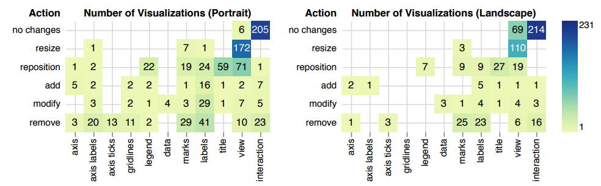
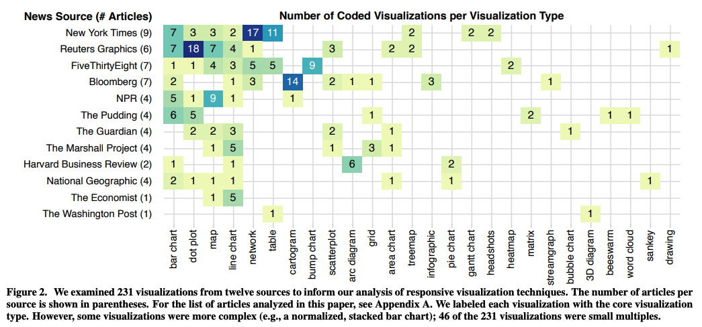

+++
author = "Yuichi Yazaki"
title = "デスクトップ版からモバイル版を作成する際に、どこを変更する？"
slug = "desktop2mobile"
date = "2020-03-13"
categories = [
    "technology"
]
tags = [
    "",
]
image = "images/Techniques-for-Flexible-Responsive.png"
+++

ワシントン大学の可視化の研究室とAdobe Reseachで共同研究した論文で、インタラクティブなチャートを利用していて、かつレスポンシブ対応（デバイスの解像度に自動的にフィットするような対応）している記事コンテンツを調査し、実際のところ、チャートのどの部分をどのように変更しているのか？代表的な12メディアの231コンテンツを調べたものがありましたので、引用しご紹介します。

[Techniques for Flexible Responsive Visualization Design](https://idl.cs.washington.edu/papers/responsive-vis/)

左がポートレイト（縦長表示）で、右がランドスケープ（横長表示）時の、対応状況をカウントしたものです。ここからわかる傾向を筆者がまとめました。

#### ポートレイト（縦長表示）

- 軸のラベル、軸の目盛り、グリッド線は非表示化。
- タイトルと凡例は配置位置を最適化。
- 幾何図形は非表示か、配置の最適化。
- データラベルが一番対応がマチマチで、配置最適化、調整、非表示のいずれか。
- 全体表示はリサイズか配置の最適化。
- インタラクションは変更なし。

#### ランドスケープ（横長表示）

- タイトルは配置位置を最適化。
- 幾何図形は非表示。
- データラベルは非表示。
- 全体表示が一番対応がマチマチで、リサイズか変更なし。
- インタラクションは変更なし。

### 調査対象のメディア

代表的な12メディアが選ばれています。2020年の論文で、その1〜数年前の調査のはずです。NYTがネットワーク図や表が多く、ロイターはドットプロットが多く、ブルームバーグはカートグラムが多い、といった傾向も伺えます。
