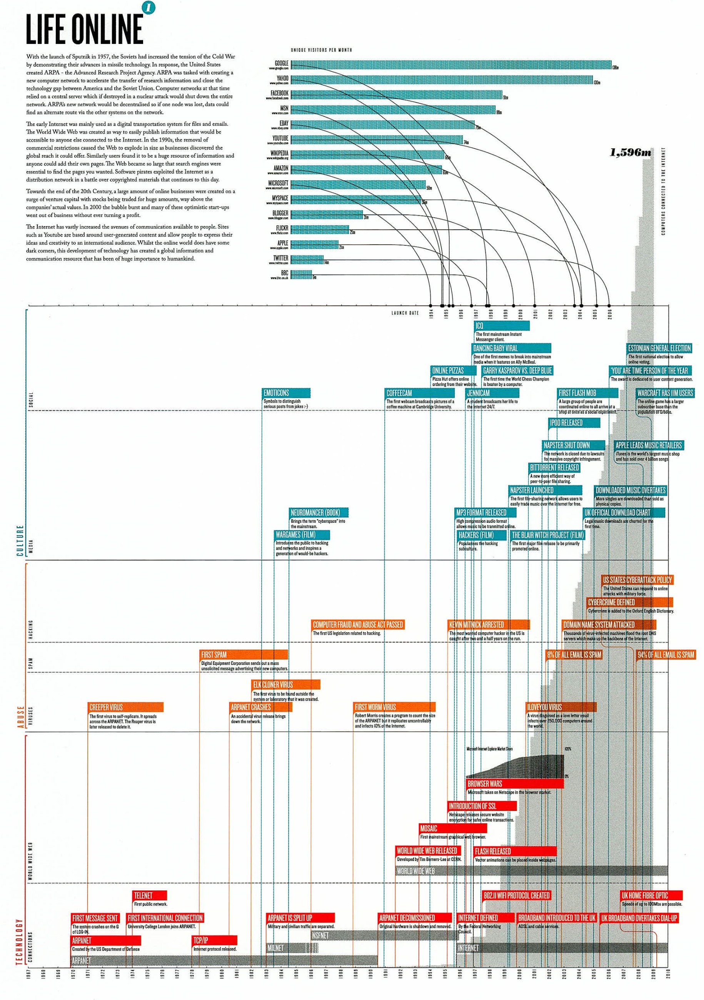

+++
author = "Yuichi Yazaki"
title = "Digital Nostalgia: Visualizing Internet History in Life Online"
slug = "digital-nostalgia"
date = "2025-10-02"
description = ""
categories = [
    "consume"
]
tags = [
    "複数チャートの組み合わせ"
]
image = "images/cover-LifeOnline.jpeg"
+++

Graphic designer **Paul Butt** created the *Digital Nostalgia* series to look back at the rapid evolution of digital technology and the social effects left in its wake. The poster **Life Online** visualizes the development of the internet from its origins through the early 2000s.

<!--more-->

## Series Context

The series covers four themes:

- the internet
- audio and video formats
- computer storage media
- mobile communication

Each is presented as a timeline poster. The goal is not merely to list technologies, but to show how quickly digital tools become obsolete and how each wave leaves cultural traces.

## Life Online

### Top: Major Web Services

The upper section uses bar charts to show monthly unique visitors for services such as Google, Yahoo, Facebook, MSN, YouTube, eBay, and Twitter. It lets viewers see when each service appeared and how quickly it gained users.

### Center: Culture, Abuse, and Technology

The central timeline places events from the 1970s through the 2000s across categories:

- **Culture**: online culture, films, memes, and iconic internet moments
- **Abuse**: spam, viruses, attacks, and cybersecurity policy
- **Technology**: ARPANET, the Web, Flash, MP3, broadband, and related infrastructure

This structure shows that innovation, culture, and risk developed together.

### Background: Connected Computers

The gray background bars show the number of computers connected to the internet. From a small ARPANET network, the count grows toward the scale of billions, making the physical expansion of the internet visible behind the foreground events.

## Why Nostalgia?

The title points to more than historical data. Early internet phenomena such as Dancing Baby, Napster, Flash, and the browser wars now carry a strong sense of cultural memory. Looking at the poster invites viewers to remember when and how they first experienced the internet.

## Summary

The *Digital Nostalgia* series reconstructs digital history through memory as well as data. In **Life Online**, technical infrastructure, cultural events, abuses, and platform growth are layered into one view of the internet's early social history.
