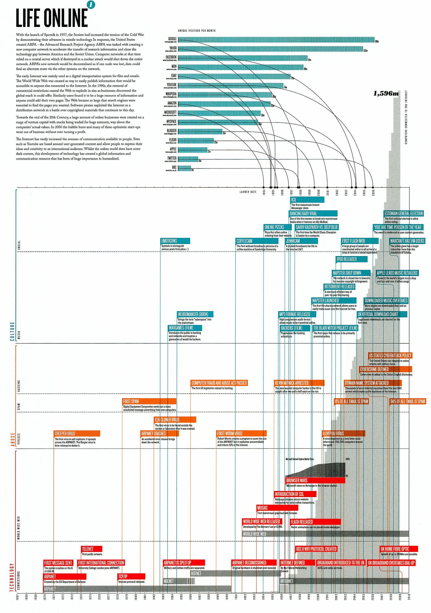

+++
author = "Yuichi Yazaki"
title = "デジタル・ノスタルジア：「Life Online」に見るインターネット史の可視化"
slug = "digital-nostalgia"
date = "2025-10-02"
description = ""
categories = [
    "consume"
]
tags = [
    "",
]
image = "images/cover-LifeOnline.jpeg"
+++

グラフィックデザイナー Paul Butt による Digital Nostalgia シリーズは、近年のデジタル技術の急速な進化を振り返り、その背後にある社会的影響や「ノスタルジー（懐旧感）」を浮かび上がらせることを目的としています。今回紹介するポスター 「Life Online」 は、インターネットの誕生から2000年代初頭までの展開を俯瞰するインフォグラフィックです。

<!--more-->

## シリーズの背景

シリーズは以下の4テーマで構成されています。
- インターネット
- 音声・映像フォーマット
- コンピュータ記憶媒体
- モバイル通信

それぞれタイムライン形式のポスターで表現され、単なる技術史の年表ではなく「古い技術がいかに急速に陳腐化していったか」「その過程で生まれた文化的・社会的な波紋」を浮かび上がらせています。

## 「Life Online」の概要

今回紹介する「Life Online」 は、インターネットの誕生から2000年代初頭までの展開を俯瞰する作品です。

### 上部：主要サービスの利用者数

- Google、Yahoo、Facebook、MSN、YouTube、eBay、Twitter など主要Webサービスの月間ユニークビジター数を棒グラフで可視化。
- 各サービスがどの年に登場し、どのような速度でユーザーを獲得していったのかを一望できます。
- 例えば、GoogleやYouTubeの急成長、Facebookの爆発的普及など、インターネット時代を象徴する動きが数字として明示されています。

### 中央：文化・事件・技術のタイムライン

横軸に時間（1970年代〜2000年代）、縦軸に「カテゴリー（Culture / Abuse / Technology）」を配置し、重要な出来事を色分けしたボックスで表現しています。

- **Culture（文化）** ネット文化の象徴（Dancing Baby、オンライン投票）、映画作品（『Hackers』『The Blair Witch Project』『WarGames』）など。
- **Abuse（悪用・事件）** 初期スパム、Creeper ウイルス、ILOVEYOU ウイルス、ドメイン攻撃、米国のサイバーセキュリティ政策など。
- **Technology（技術）** ARPANETの誕生、WWW公開、FlashやMP3の普及、ブロードバンドの急速拡大など。

こうしたイベント群は「技術革新」「文化現象」「リスクの拡大」が同時並行で進行してきたことを直感的に伝えています。

### 背景：インターネット接続数の推移

図全体の背景にあるグレイの棒グラフは「インターネットに接続されたコンピュータ台数（Computers Connected To The Internet）」 を示しています。

- 右上に最大値 1,596m（約15億9600万台）と明記。
- 1970年代のARPANET黎明期（数台〜数百台規模）から、2000年代にかけて指数関数的に増加。
- 前景の出来事やサービスの普及と重なり「物理的な基盤の爆発的拡大」と「それがもたらした文化的・社会的展開」を二層構造で理解できるようになっています。

## 図の読み解き方

この図は、以下の3つの視点を重ね合わせて読むと理解が深まります。

- **1.技術の軌跡（下段 Technology）** インフラやソフトウェアの進化を追う。ARPANETからWWW、Flash、ブロードバンドまで。
- **2.社会の影響（中央 Culture / Abuse）** 技術がカルチャーに取り込まれる瞬間や、犯罪・攻撃に利用される側面を同じ年表上で確認。
- **3.物理的な規模の拡大（背景棒グラフ + 上段サービス利用者数）** 接続台数とサービス利用者数が爆発的に増加していくスピード感を可視化。

この3つの層を同時に視覚化することで、「インターネットの歴史」が単なる進歩の列挙ではなく、社会全体を揺るがす大規模なうねりとして描かれています。

## なぜ「ノスタルジー」なのか

タイトルの「デジタル・ノスタルジア（Digital Nostalgia）」は、このポスターが単なるデータ可視化ではなく、すでに過去となったデジタル文化への郷愁を込めている点を指しています。

- **初期インターネット文化** ：Dancing BabyやNapsterのような出来事は、今や「懐かしいインターネットの象徴」として語られます。
- **失われた技術** ：Flashや初期ブラウザ戦争は、当時のインターネット体験を強く特徴づけましたが、すでに廃れてしまいました。
- **黎明期の熱狂** ：ARPANETから始まるインターネット拡張の軌跡は、技術者やユーザーにとって強い思い出と結びついています。

この図を見ること自体が、閲覧者に「自分がいつ、どのようにインターネットを経験したか」を思い出させ、個人の記憶と社会史が交錯するノスタルジー体験を呼び起こすのです。

## まとめ

Paul Butt の Digital Nostalgia シリーズは、デジタル技術の進化を「ノスタルジー」という視点で再構築したユニークな作品群です。

特に「Life Online」は、インターネット黎明期から2000年代初頭までの劇的な発展を、

- 技術革新（Technology）
- 文化的な出来事（Culture）
- リスクや犯罪（Abuse）
- インフラ規模の増加（背景棒グラフ）
- サービス普及数（上段棒グラフ）

を重ね合わせることで多層的に描き出しています。

単なる「進歩の歴史」ではなく、すでに懐かしさを帯び始めているインターネット文化そのものを記録する、このシリーズの狙いがよく表れていると言えるでしょう。
