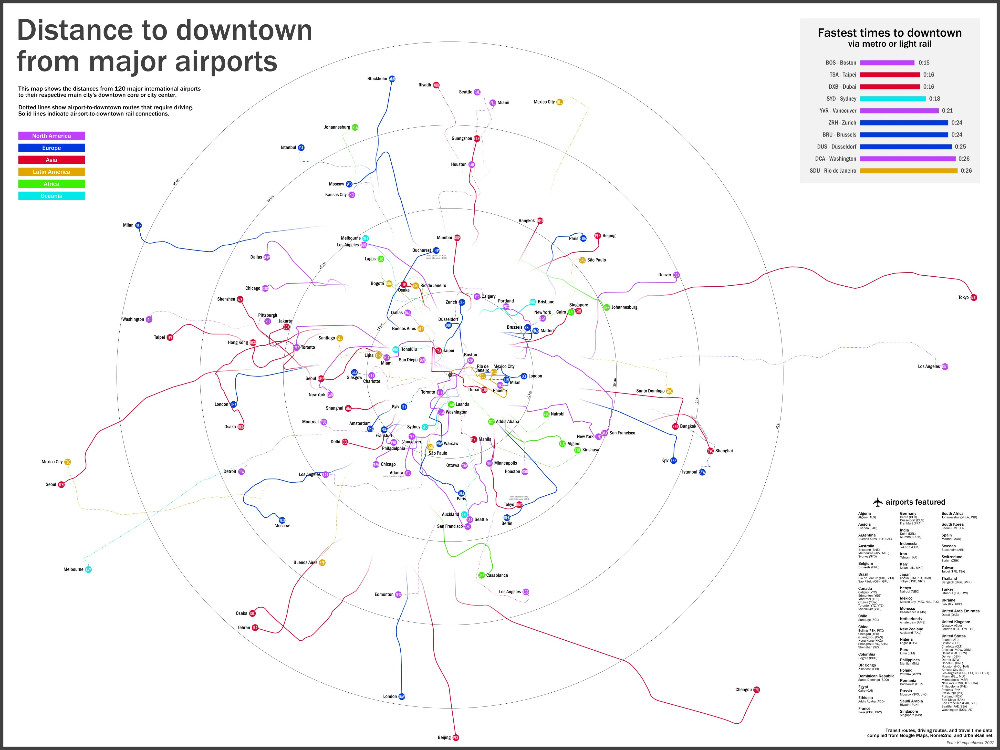
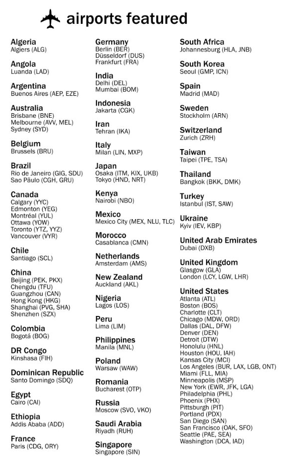

+++
author = "Yuichi Yazaki"
title = "Distances from Major Airports to City Centers"
slug = "distance-to-downtown-from-airports"
date = "2025-10-24"
categories = [
    "consume"
]
tags = [
    "",
]
image = "images/cover.png"
+++

This visualization compares the distance and access options between major airports around the world and their corresponding city centers. It was created by Peter Klumpenhouwer in 2022.

Transportation routes, driving routes, and travel-time data were collected from Google Maps, Rome2Rio, and UrbanRail.net to support an international comparison of airport access.

<!--more-->

## How to Read It

The diagram uses a radial map format with each city center as the reference point.

Distances and transport modes are arranged so that readers can compare how far an airport sits from the urban core and what kind of access is available.

## Why It Matters

Airport convenience is not only about flight volume. Distance, transit connection, and travel time shape how travelers experience a city. This visualization makes those differences comparable across cities.

## Summary

The airport-to-downtown distance map is a compact comparison of global airport access. It combines geography, transportation, and travel experience into a single visual framework.
