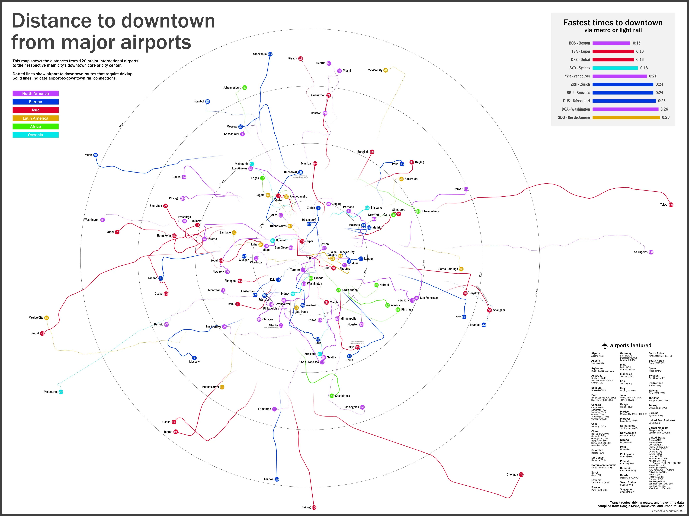
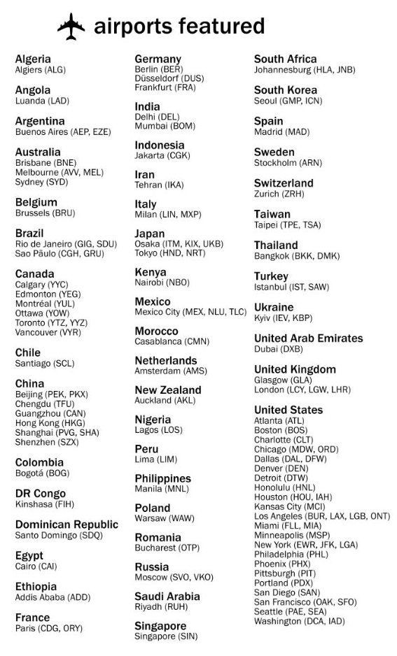
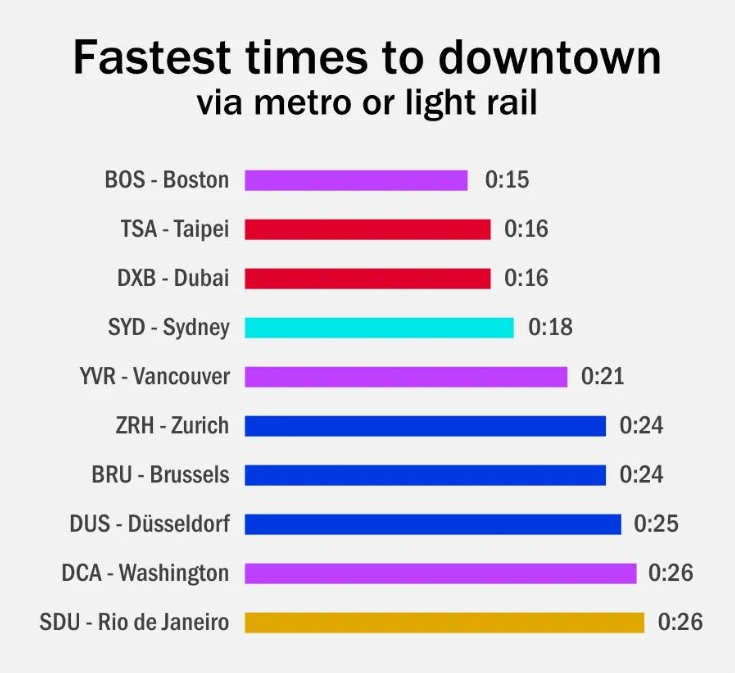

+++
author = "Yuichi Yazaki"
title = "世界の主要空港から市街地までの距離マップ"
slug = "distance-to-downtown-from-airports"
date = "2025-10-24"
categories = [
    "consume"
]
tags = [
    "",
]
image = "images/cover.png"
+++

この図は、世界各地の主要空港からそれぞれの都市中心部までの距離とアクセス手段を比較したビジュアライゼーションです。作者は **Peter Klumpenhouwer（2022年）**。

交通ルート・運転経路・所要時間データは **Google Maps、Rome2Rio、UrbanRail.net** から収集されたもので、空港アクセスの国際比較を目的としています。

<!--more-->

## チャートの見方

この図は、各都市の中心部を基点にした「放射図（radial map）」形式で構成されています。

- **中心**：各都市のダウンタウン（中心部）。
- **外側の点**：その都市に対応する国際空港。中心からの距離が市街地までの移動距離を示します。
- **実線**：空港から中心部まで鉄道・ライトレールが直結している経路。
- **点線**：主に車両（タクシー・バス等）でアクセスする場合を示します。
- **色分け**：大陸別で、凡例に示された通り、青＝北米、紫＝ヨーロッパ、赤＝アジア、緑＝ラテンアメリカ、黄＝アフリカ、水色＝オセアニアです。

右上には、鉄道またはライトレール経由で最も早く市街地に到達できる空港ランキングが表示されており、ボストン（15分）、台北（16分）、ドバイ（16分）などが上位に挙げられています。

## 背景知識と補足

都市によって空港の立地とアクセス手段は大きく異なります。ヨーロッパやアジアの主要都市では、鉄道接続が進んでおり短時間で中心部に到達できます。一方、北米やオセアニアでは空港が郊外に位置し、車での移動時間が長い傾向があります。

本マップは、単なる地理的距離ではなく「**時間的距離**」を軸に空港アクセスを比較する点が特徴的です。これにより、都市計画・観光・モビリティの観点から、都市インフラの成熟度を視覚的に理解できるようになっています。

データ出典として記載されている **UrbanRail.net** は世界の都市鉄道網を体系的にまとめた資料サイトであり、**Rome2Rio** は複合交通モードを検索する国際サービスです。これらに **Google Maps** のルート情報を統合することで、精緻な比較が可能になっています。

## まとめ

Peter Klumpenhouwer 氏によるこの可視化は、空港アクセスの利便性を世界的に比較できる貴重な資料です。  
交通時間を中心に再構成された地図として、旅行者のみならず、都市設計・交通政策の観点からも興味深いインサイトを提供しています。

## 参考・出典

- [What You Need To Know About Taking The Silver Line To Dulles | DCist (2022)](https://dcist.com/story/22/11/02/what-you-need-to-know-about-taking-the-silver-line-to-dulles/)
- [UrbanRail.net — 世界の都市鉄道アトラス（公式）](https://www.urbanrail.net/)
- [Rome2Rio — 複合交通検索（公式）](https://www.rome2rio.com/)
- [Google Maps — 経路と移動時間の参照（公式）](https://www.google.com/maps)

