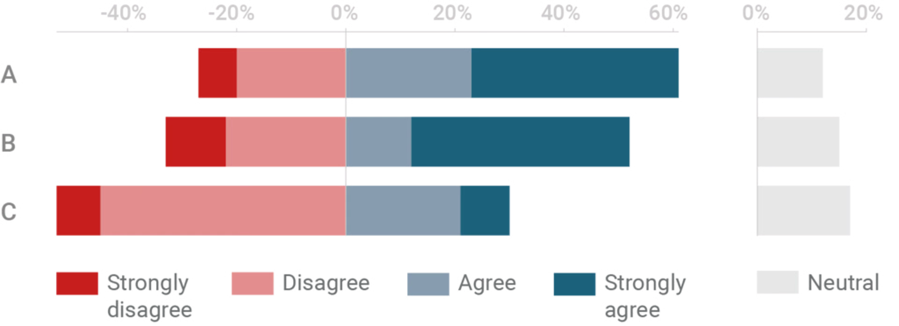

+++
author = "Yuichi Yazaki"
title = "Diverging Stacked Bar Chart"
slug = "diverging-stacked-bar-chart"
date = "2025-10-11"
categories = [
    "chart"
]
tags = [
    "",
]
image = "images/cover.png"
+++

A diverging stacked bar chart compares opposing response categories around a central baseline. It is commonly used for Likert-scale survey results, where agreement and disagreement are placed on opposite sides of zero.

<!--more-->

## Purpose

The purpose is to show the balance between positive and negative responses while preserving category composition.

## Design Notes

- Place neutral responses carefully, either centered or separated.
- Use consistent colors for negative and positive categories.
- Sort items by net agreement or another meaningful metric.
- Avoid too many response levels.

## Summary

Diverging stacked bar charts are strong for survey and sentiment data because they make polarity visible. They require careful treatment of neutral categories and color order.
