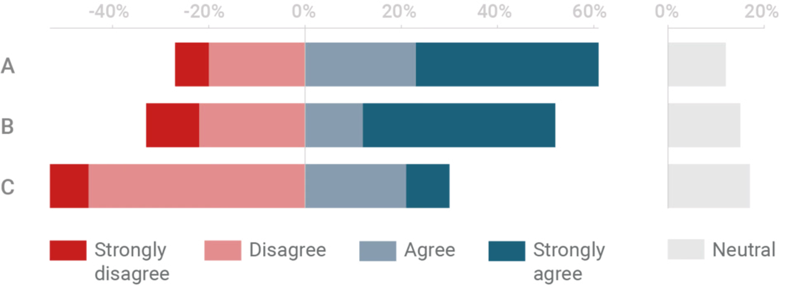

+++
author = "Yuichi Yazaki"
title = "分岐的積み重ね棒グラフ (Diverging Stacked Bar Chart)"
slug = "diverging-stacked-bar-chart"
date = "2025-10-11"
categories = [
    "chart"
]
tags = [
    "",
]
image = "images/cover.png"
+++

分岐的積み重ね棒グラフ（Diverging Stacked Bar Chart）は **肯定・否定や賛成・反対など、相反するカテゴリーの分布を左右対称に比較する可視化手法** です。一般的な積み重ね棒グラフの一種ですが、中心線（ゼロ点）を基準に、値がプラスとマイナスの方向に分岐して表示される点が特徴です。主に**世論調査、顧客満足度調査、アンケート結果の可視化**などで用いられます。

例えば「非常に満足」「やや満足」「どちらでもない」「やや不満」「非常に不満」といった回答がある場合、「どちらでもない」を中心に、満足側を右、不満側を左に配置することで **全体のバランスと傾向** を一目で確認できます。

<!--more-->

## チャートの見方

| 要素 | 内容 |
|------|------|
| **中央軸（ゼロライン）** | 意見の分岐点。左右対称の基準線として設計される。 |
| **左側バー** | ネガティブまたは反対の値を表す。通常は赤系などで表示。 |
| **右側バー** | ポジティブまたは賛成の値を表す。通常は青系または緑系で表示。 |
| **セグメントの長さ** | 各カテゴリーの比率や人数を示す。棒の長さは割合に比例。 |
| **ラベルまたは凡例** | 各回答選択肢やスケールを示す。一般に、棒の内部または外部に配置される。 |

このように、左右の長さのバランスを比較することで、特定の項目に対して回答が偏っているかどうかが視覚的に理解できます。

## 利点と用途

- **バランス比較が容易**：全体に対する肯定・否定の傾向を一目で把握可能。
- **空間効率が良い**：多数の質問項目を縦方向に並べて比較できる。
- **定性評価の定量化**：Likertスケール（5段階評価など）を直感的に可視化できる。

特に社会調査や企業の顧客満足度調査、政治的支持・反対意識の可視化などにおいて、多くの研究者・デザイナーが採用しています。

## 背景と派生

この手法は、20世紀後半の **社会調査統計グラフィックス** の文脈で発展しました。Likertスケールを扱う際、単純な棒グラフでは中立意見を挟む対称性が表現しづらいため **左右対称型の積み重ね構造** が考案されました。現在では、Excel、Tableau、Power BI、ggplot2（R）、Plotly、Vega-Liteなど、多くの可視化ツールで容易に実装可能です。

## 代表的な作例・ツール

| ツール／ライブラリ | 実装例・特徴 |
|------------------|-------------|
| **Tableau** | 「Diverging Bar Chart」テンプレートを利用可。中心をゼロに揃える設定が可能。 |
| **Power BI** | 「積み重ね棒グラフ」で軸の最小値・最大値を調整することで実現。 |
| **ggplot2（R）** | `geom_bar(position="stack")` と `scale_x_continuous(limits=c(-100,100))` で構築。 |
| **Vega-Lite / D3.js** | 軸を中央に設定し、正負値のデータを分岐表示。ウェブ実装に適す。 |

## まとめ

分岐的積み重ね棒グラフは、データの中心性と対称性を視覚的に表現するための強力な手法です。単なる比率の提示に留まらず、**人々の意識の偏りや分極化の度合いを直感的に示す**ことができるため、社会的・心理的調査データの分析において極めて有効です。

## 参考・出典

- [Barplot for Likert type items — R Graph Gallery](https://r-graph-gallery.com/202-barplot-for-likert-type-items.html)
- [Diverging Barplot with R and ggplot2 — R Graph Gallery](https://r-graph-gallery.com/web-diverging-bar-plot-recreated-from-nytimes.html)
- [Rethinking the divergent stacked bar chart — Data Revelations](https://www.datarevelations.com/rethinkingdivergent/)
- [Two ways of creating diverging stacked bar charts in R — Medium (VisUMD)](https://medium.com/visumd/two-ways-of-creating-diverging-stacked-bar-charts-in-r-6d505e5180d2)
- [Diverging Stacked Bar — Depict Data Studio](https://depictdatastudio.com/charts/diverging-stacked-bar/)
- [The case against diverging stacked bars | Datawrapper Blog](https://www.datawrapper.de/blog/divergingbars)