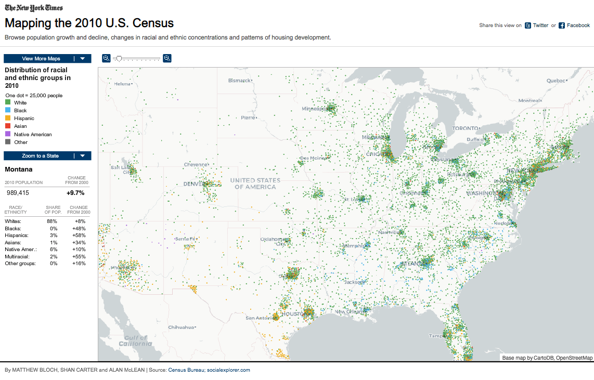
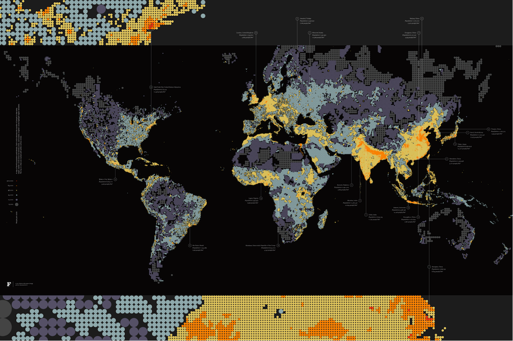
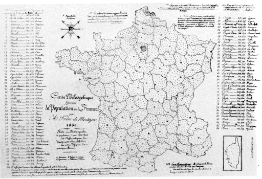

+++
author = "Yuichi Yazaki"
title = "ドット密度マップ（Dot Density Map）の事例"
slug = "dot-density-map-example"
date = "2020-08-04"
description = ""
categories = [
    "chart"
]
tags = [
    "地図",
]
image = "images/dencity_ben_fry.png"
+++

ドット密度マップ（Dot Density Map）の事例です。

<!--more-->

## 作例

### 2010年 アメリカでの国勢調査 – ニューヨーク・タイムズ

Flashによる作成のため、現在閲覧することができません。2010年の国勢調査の結果を用いて、アメリカの人種と民族の分布を描いています。1ドット=25,000人です。前回2000年からの変化もわかります。

[Mapping the 2010 U.S. Census — New York Times](http://www.nytimes.com/projects/census/2010/map.html)

### Dencity — Ben Fry

[Dencity — Ben Fry](https://fathom.info/notebook/1981/)

### The map by Frère de Montizon, 1830

フランスの人口を行政区割によって表しています。

The map by Frère de Montizon, 1830

## 参考文献
- Isabel Meirelle — Design For Information
- 谷村 晋 (著), 金 明哲 (編集) — 地理空間データ分析 (Rで学ぶデータサイエンス 7)