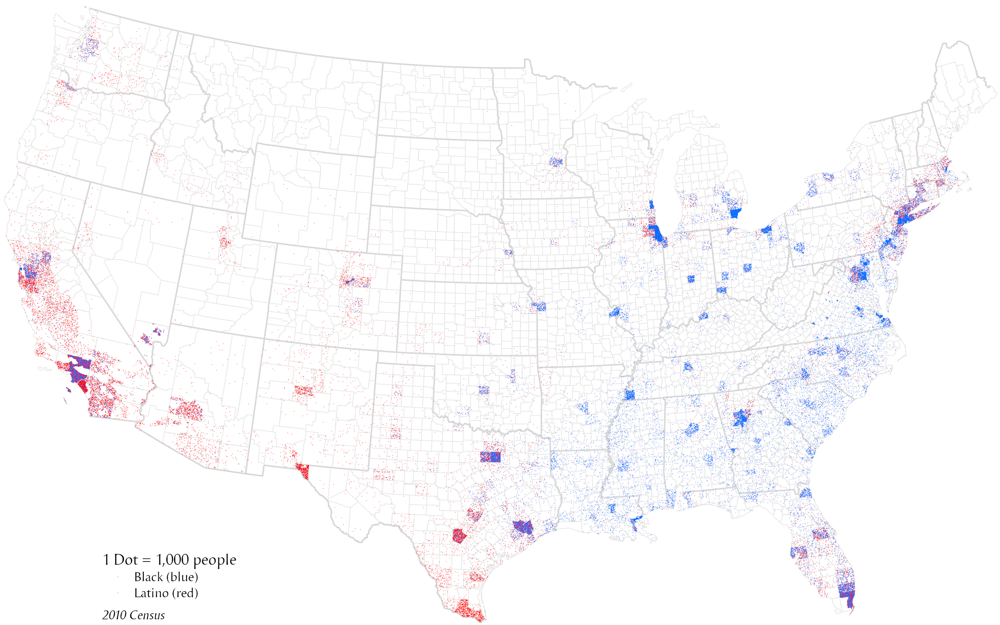

+++
author = "Yuichi Yazaki"
title = "ドット密度マップ"
slug = "dot-density-map"
date = "2025-10-11"
categories = [
    "chart"
]
tags = [
    "",
]
image = "images/cover.png"
+++

ドット密度マップ（Dot Density Map）は、地理的な分布を点（ドット）で表す地図表現です。各ドットは一定の数量（例：1ドット＝100人、1ドット＝1戸など）を意味し、ドットの密度によって地域ごとの値の大小を視覚的に把握することができます。主に人口分布、産業活動、農業生産などの地域的パターンを示す際に用いられます。

データは、実際の発生位置ではありません。そのため、地図上のどこに配置するのかについて、メソッドや考え方が様々存在します。統計単位に該当する地物の重心や、地形や都市にとって意味のある地理情報に関連付けることが多い印象です。

この手法は、エリア（行政区、国、都道府県など）の境界内にランダムまたは均等に配置された点を使って、総量を表現します。ドットの密集具合によって直感的に「多い・少ない」を伝える点が特徴です。

見た目が似たドット分布マップは、集計値ではなく観測値をそのまま表し、表示位置が実際の発生位置を表しますので、その点で明確に異なるデータ地図といえます。
<!--more-->

## 図解の見方

| 要素 | 説明 |
|------|------|
| ドット（点） | 特定の数量を表す最小単位。例：「1ドット＝100人」。 |
| エリア（ポリゴン） | 行政区や地域の境界線を示す。点はその中に分布する。 |
| ドットの密集度 | 値の多い地域では点が密集し、少ない地域では疎になる。 |
| 色の使い分け | 複数カテゴリ（例：人種、産業、作物）を区別する場合に色で示す。 |
| 配置方法 | 点をランダムまたは格子状に分布させるが、重なりすぎないように調整する。 |

たとえば「アメリカの人種別人口ドットマップ」では、各人種を異なる色のドットで表し、地図上に人口1人＝1ドットをプロットすることで、都市部での多様な構成や郊外での偏りなどが一目でわかるように設計されています。

## 背景と活用例

ドット密度マップは、19世紀の地図作成技術に起源をもち、Charles Dupin（シャルル・デュパン）やHenry Drury Harnessなどが社会統計を地図化する試みの中で発展しました。現在では、ArcGIS、QGIS、Mapbox、D3.jsなどのツールを使って容易に生成できます。

特に **「密度ヒートマップ」** や **「カーネル密度推定（KDE）」** と異なり、ドット密度マップは「数量の実在性」を強調しやすく、統計値を直接的に可視化する教育・行政用途にも適しています。

代表的な応用例には以下のものがあります。

- 国勢調査データの可視化（人口・人種・所得など）
- 農業統計（作付面積・収穫量など）
- 都市部の居住パターン・空き家分布
- 犯罪発生地点・災害被害件数の表示

## まとめ

ドット密度マップは、色による面積的な表現ではなく「点の数と分布」で数量を伝える地図表現です。数値の大小や地域的な偏りを直感的に把握でき、視覚的インパクトも強い一方で、点の重なりや縮尺によって解釈が変わる点には注意が必要です。適切なスケール設定とドット値の選定が、効果的な表現の鍵となります。

## 参考・出典

- [Dot density — ArcGIS Pro ドキュメント](https://pro.arcgis.com/en/pro-app/latest/help/mapping/layer-properties/dot-density.htm)  
- [Dot density map の定義 — GIS Dictionary（Esri サポート）](https://support.esri.com/en-us/gis-dictionary/dot-density-map)  
- [Dot distribution map（英語版ウィキペディア）](https://en.wikipedia.org/wiki/Dot_distribution_map)  
- [Experiments with dot density — ArcGIS Blog（Part One）](https://www.esri.com/arcgis-blog/products/arcgis-pro/mapping/experiments-with-dot-density-part-one)  
- [World Population Density](https://luminocity3d.org/WorldPopDen/#5/26.902/106.040)