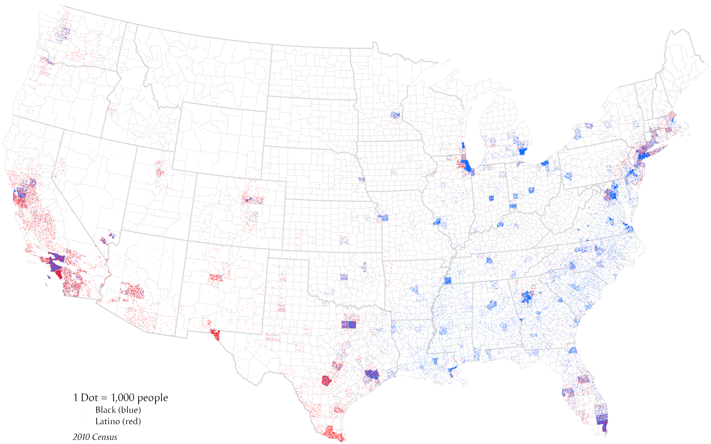

+++
author = "Yuichi Yazaki"
title = "ドット密度マップ（Dot Density Map）"
slug = "dot-density-map"
date = "2025-10-11"
categories = [
    "chart"
]
tags = [
    "地図",
]
image = "images/cover.png"
+++

ドット密度マップ（Dot Density Map）は、**統計データの地理的な分布をドット（点）の密度で表現する地図手法**です。各ドットは一定の数量（例：1ドット＝100人、1ドット＝1戸など）を意味し、行政区などのエリア内にドットを配置することで、地域ごとの値の大小を視覚的に把握することができます。主に人口分布、産業活動、農業生産などの地域的パターンを示す際に用いられます。

<!--more-->



## 歴史的経緯

ドット密度マップは、19世紀の地図作成技術に起源を持ちます。フランスの数学者・経済学者であるCharles Dupin（シャルル・デュパン）や、アイルランドの技術者Henry Drury Harnessらが、社会統計を地図化する試みの中で発展させました。特にHarnessは1837年にアイルランドの人口分布を示すドット・マップを作成しており、これが初期の重要な事例とされています。現在では、ArcGIS、QGIS、Mapbox、D3.jsなどのツールにより容易に生成できるようになっています。

## データ構造

| 項目 | 内容 |
|------|------|
| エリア識別子 | 行政区や地域の名称・コード（例：都道府県コード、郡名） |
| 数量値 | 各エリアに対応する統計値（例：人口、世帯数、作付面積） |
| カテゴリ（任意） | 複数の属性を色分けする場合の分類項目（例：人種、産業、作物の種類） |
| ドット値 | 1つのドットが表す数量の単位（例：1ドット＝100人） |

エリア（ポリゴン）の境界内にドットを配置して統計値を表現するため、個別の位置座標は必要ありません。

## 目的

ドット密度マップの主な目的は、地域ごとの数量の大小や密度の違いを、ドットの集まり具合によって直感的に伝えることです。色の面塗りではなく点の分布で数量を表現するため、コロプレスマップで起こりがちな「面積の大きい地域が過度に目立つ」という問題を軽減できます。

## ユースケース

- 国勢調査データの可視化（人口・人種・所得分布など）
- 農業統計の地図化（作付面積・収穫量など）
- 都市部の居住パターンや空き家分布の表示
- 産業・商業活動の地域的分布の把握
- 選挙結果の地理的な投票分布の表現

## 特徴

- ドットの密集具合によって「多い・少ない」を直感的に伝えることができます
- 1ドットが表す数量（ドット値）を設定し、統計データを擬似的に面内に分布させます
- ドットの配置位置は実際の発生位置を示すものではなく、エリア内にランダムまたは均等に配置されます
- 複数カテゴリを色で区別することで、構成比の空間的な違いも表現できます
- 見た目が似ているドット・マップ（Dot Map）は、個別の観測値の実際の位置を表すため、データの性質が明確に異なります

## チャートの見方

| 要素 | 説明 |
|------|------|
| ドット（点） | 特定の数量を表す最小単位です。例：「1ドット＝100人」 |
| エリア（ポリゴン） | 行政区や地域の境界線を示します。点はその中に分布します |
| ドットの密集度 | 値の多い地域では点が密集し、少ない地域では疎になります |
| 色の使い分け | 複数カテゴリ（例：人種、産業、作物）を区別する場合に色で示します |

たとえば「アメリカの人種別人口ドットマップ」では、各人種を異なる色のドットで表し、地図上に人口1人＝1ドットをプロットすることで、都市部での多様な構成や郊外での偏りなどが一目でわかるように設計されています。

## デザイン上の注意点

- ドット値（1ドットあたりの数量）の設定が重要です。値が小さすぎるとドットが重なりすぎ、大きすぎると分布のパターンが見えなくなります
- 地図の縮尺に応じてドット値を調整することで、適切な密度表現を維持する必要があります
- ドットの配置がランダムであることを読者に伝え、個別の位置データではないことを明示するのが望ましいです
- ベースマップはシンプルに保ち、ドットの視認性を確保することが重要です
- 凡例にはドット値（1ドット＝何単位）を必ず記載します

## 応用例

- アメリカの人種別人口分布ドットマップ：各人種を色分けしたドットで全人口をプロットし、都市ごとの多様性や居住分離を可視化した代表的な事例です
- ニュージーランドの羊分布マップ：農業統計をドット密度で表現し、地域ごとの畜産業の集中度を示しています
- 世界人口密度の可視化：Global Human Settlement Layer（GHSL）データを用いて、居住地域の密度を点の分布で表現する事例があります

## 代替例

- **コロプレスマップ（Choropleth Map）**：地域ごとの統計値を色の濃淡で表現する手法です。面積の大きい地域が目立ちやすいという特性があります
- **ドット・マップ（Dot Map）**：個別の観測値の実際の位置をプロットする手法です。統計的な集計値ではなく、位置情報そのものを表現します
- **ヒートマップ（Heat Map）**：カーネル密度推定などにより連続的なグラデーションで密度を表現します
- **カルトグラム（Cartogram）**：地域の面積をデータ値に応じて変形させることで数量を表現します

## まとめ

ドット密度マップは、色による面積的な表現ではなく「点の数と分布」で数量を伝える地図表現です。数値の大小や地域的な偏りを直感的に把握でき、視覚的インパクトも強い手法です。一方で、ドットの重なりや縮尺によって解釈が変わる点には注意が必要です。適切なドット値の設定とスケール調整が、効果的な表現の鍵となります。

## 参考・出典

```
- [Dot density - ArcGIS Pro Documentation](https://pro.arcgis.com/en/pro-app/latest/help/mapping/layer-properties/dot-density.htm)
- [Dot distribution map - Wikipedia](https://en.wikipedia.org/wiki/Dot_distribution_map)
- [Dot Density - Axis Maps Guide](https://www.axismaps.com/guide/dot-density)
- [World Population Density - Luminocity3D](https://luminocity3d.org/WorldPopDen/#5/26.902/106.040)
```
