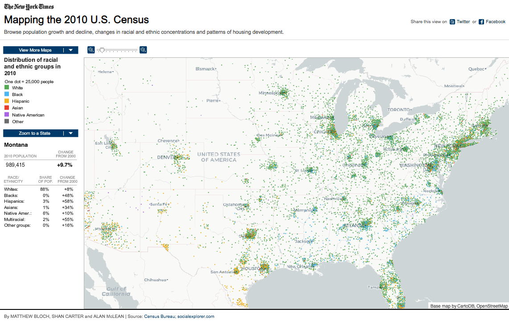
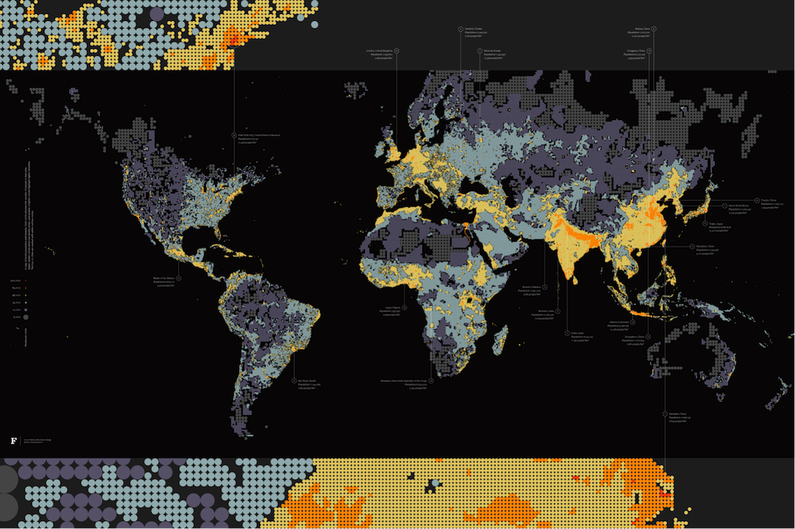

+++
author = "Yuichi Yazaki"
title = "ドット密度マップ（Dot Density Map）"
date = "2020-08-04"
description = ""
categories = [
    "chart"
]
tags = [
    "map",
]
image = "dencity_ben_fry.png"
+++

1つのドットが複数の観測値の集計値を表します。集計値の単位は地図の作り手により調整され、例えば1000人を1つのドットで表すなどとします。凡例にそのことを示します。

データは、実際の発生位置ではありません。そのため、地図上のどこに配置するのかについて、メソッドや考え方が様々存在します。統計単位に該当する地物の重心や、地形や都市にとって意味のある地理情報に関連付けることが多い印象です。

何らかの質的特徴を確認するために、着色することもあります。

見た目が似たドット分布マップは、集計値ではなく観測値をそのまま表し、表示位置が実際の発生位置を表しますので、その点で明確に異なるデータ地図といえます。

<!--more-->

## 作例

### 2010年 アメリカでの国勢調査 – ニューヨーク・タイムズ

Flashによる作成のため、現在閲覧することができません。2010年の国勢調査の結果を用いて、アメリカの人種と民族の分布を描いています。1ドット=25,000人です。前回2000年からの変化もわかります。

[Mapping the 2010 U.S. Census — New York Times](http://www.nytimes.com/projects/census/2010/map.html)

### Dencity — Ben Fry

[Dencity — Ben Fry](https://fathom.info/notebook/1981/)

### The map by Frère de Montizon, 1830

フランスの人口を行政区割によって表しています。

The map by Frère de Montizon, 1830

## 参考文献
- Isabel Meirelle — Design For Information
- 谷村 晋 (著), 金 明哲 (編集) — 地理空間データ分析 (Rで学ぶデータサイエンス 7)