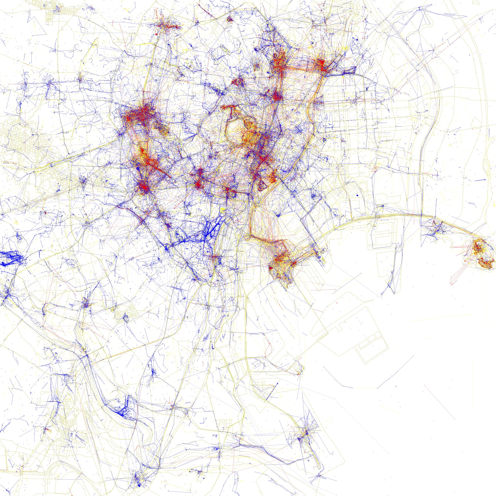
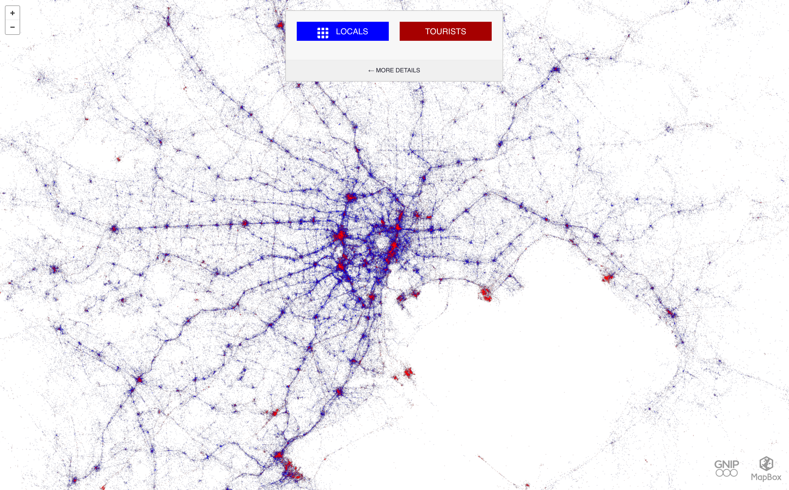
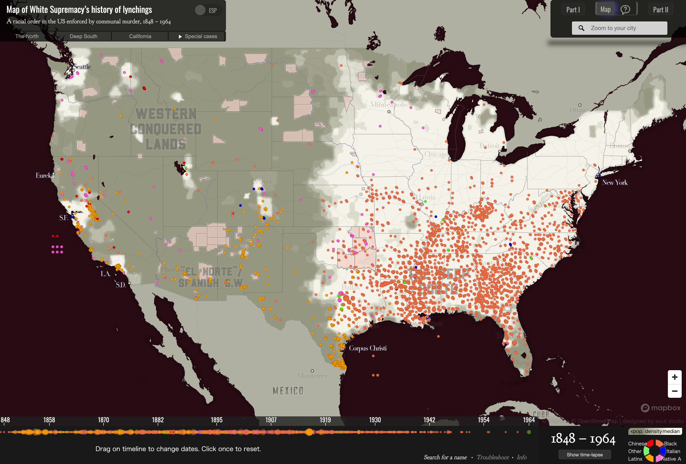
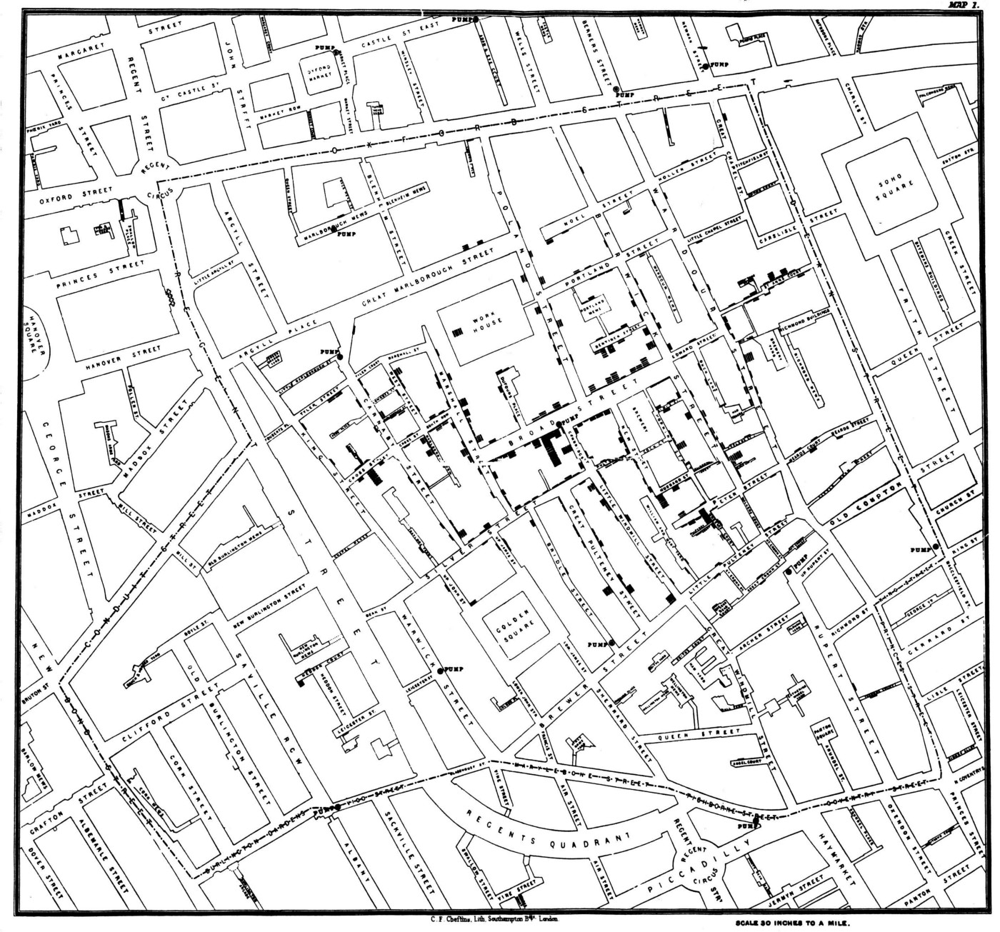

+++
author = "Yuichi Yazaki"
title = "ドット・マップ（Dot Map）の事例"
slug = "dot-map-example"
date = "2020-08-04"
description = ""
categories = [
    "chart"
]
tags = [
    "地図"
]
image = "images/racialdotmap.png"
+++

ドット・マップ（Dot Map）の事例を紹介します。

<!--more-->

## 作例

### 地元民と観光客 写真撮影場所の違い（東京編）

Flickrにアップロードされた写真を分析し、フォトグラファーを以下のように3つのグループに分類し、撮影地点をそれぞれ異なる色の点で示しています。

- 地元民（青い点）：同じ都市で1ヶ月以上撮影した人の写真
- 観光客（赤い点）：観光客は2つの基準によって定義されます。この都市で1ヶ月未満で写真を撮った人で、かつ別の都市の写真の枚数からそこの都市が地元であると推測される人の写真
- 未定義（黄色い点）：地元民か観光客かを判断することができなかった人の写真

[Locals and Tourists #5 (GTWA #20): Tokyo](https://www.flickr.com/photos/walkingsf/albums/72157624209158632/with/4671542165/)

### 地元民と観光客 ツイート場所の違い（東京編）

[Locals & Tourists – Tokyo](https://labs.mapbox.com/labs/twitter-gnip/locals/#)

### Racial Dot Mapプロジェクト

[Racial Dot Map Project](http://racialdotmap.demographics.coopercenter.org/)

### 白人至上主義のリンチの歴史の地図

[Map of White Supremacy’s history of lynchings](https://plaintalkhistory.com/monroeandflorencework/explore/map1/#3/38/-97.5)

### John Snow’s map of cholera outbreaks

ロンドン南部の1854年のコレラ流行を描いています。
コレラが、当時信じられていたように、空気感染の病気ではなく、水で感染する病気であると主張するための地図です。円で表されているのが水源で、個々の死亡者数はバーで表されています。ドット分布マップと比例シンボル・マップの手法の組み合わさったものといえそうです。

[John Snow’s map of cholera outbreaks](https://www.theguardian.com/news/datablog/2013/mar/15/john-snow-cholera-map)

## 問題点

同一の緯度経度を持つデータポイントが複数ある場合、注意が必要です。使用するツールによっては、同一の緯度経度であっても、重ならないように表示するアルゴリズムを採用しているものがあります。

同一の緯度経度を持つデータポイントが複数あって上手く処理できなかったり、あるエリアに固まってまともに描画できない、などの場合、点のデータを面（サーフェイス）に変換する方法を使います。その場合、長方形や菱形、六角形などのグリッド化や、行政区割のデータを用いたりします。