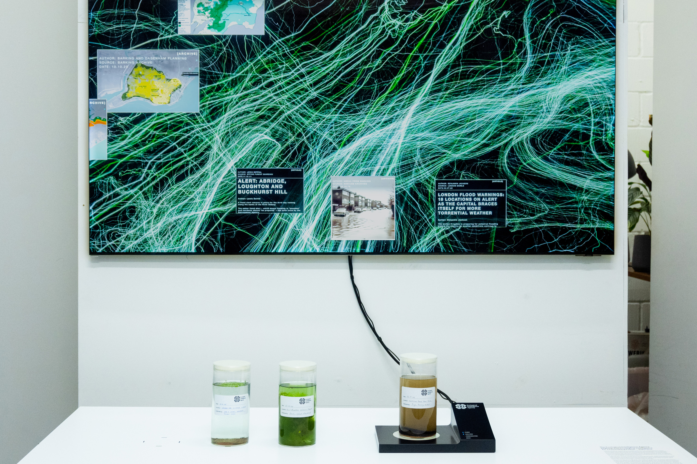
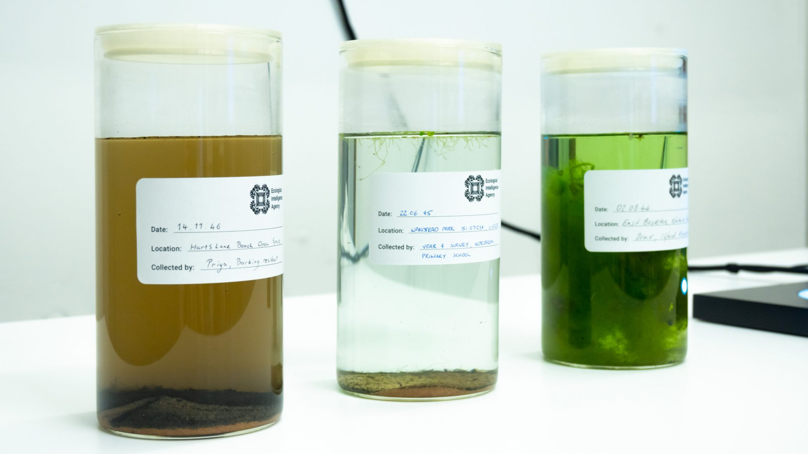
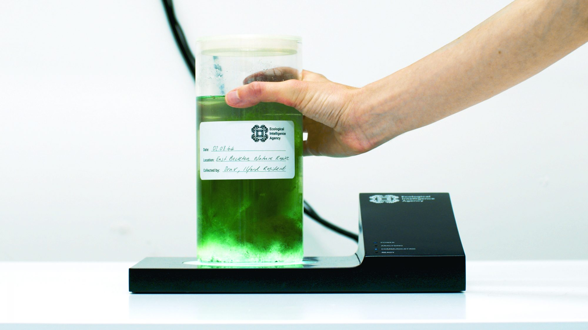
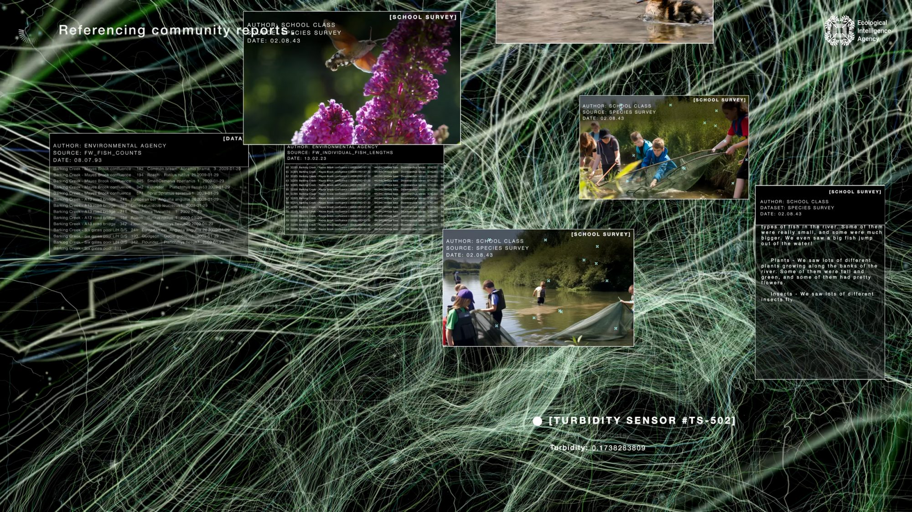
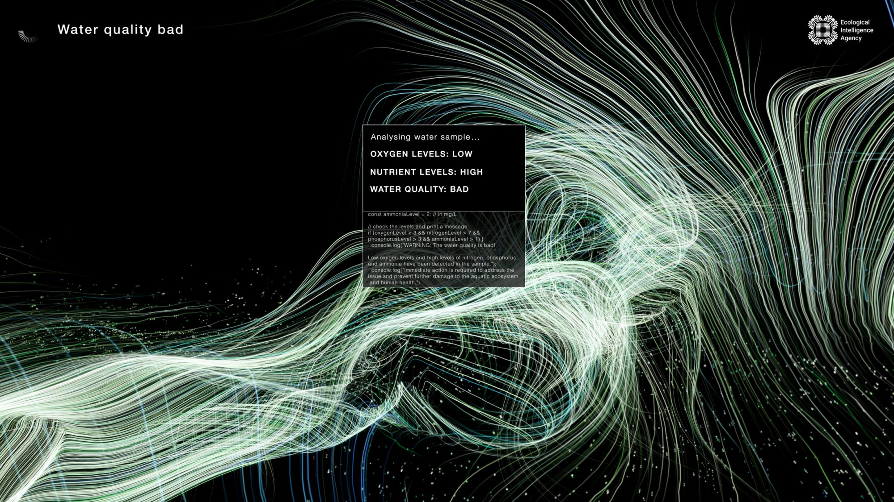
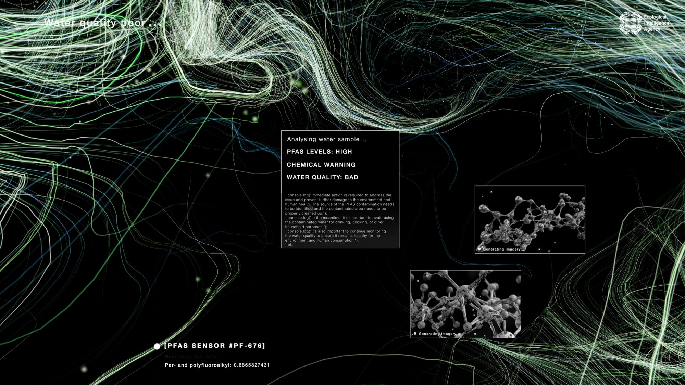
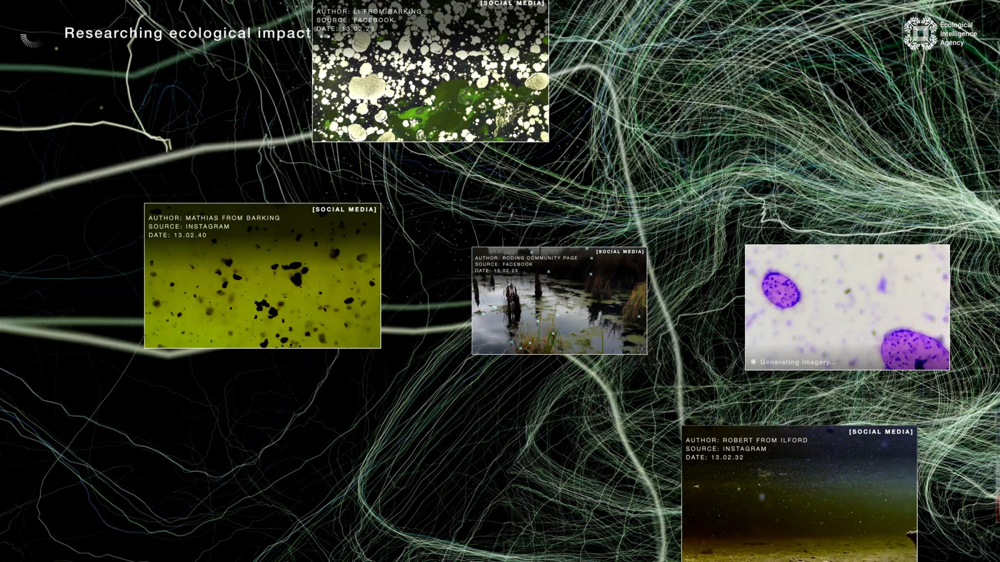
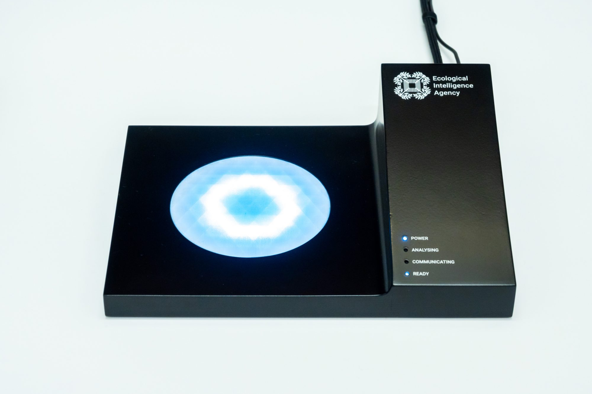

+++
author = "Yuichi Yazaki"
title = "川の健康を、感覚可能にする——Superflux『The Ecological Intelligence Agency』"
slug = "ecological-intelligence-agency"
date = "2026-08-16"
description = "ロンドンのローディング川を題材に、生態データを詩へ翻訳する Superflux の speculative agency を、データ可視化とスペキュラティブ・デザインの交差から読む。"
categories = [
    "consume"
]
tags = [
    "オリジナルのビジュアル変換",
]
image = "images/cover.jpg"
+++

Superflux の『The Ecological Intelligence Agency』（2023）は、英国政府の Policy Lab と Defra Futures の委託で作られた、架空の省庁横断機関です。題材はロンドン東部を流れるローディング川（River Roding）。問いは「淡水系を、2043年以降どう変えるか」。答えはダッシュボードではなく、**川が語る詩**と、水の入った瓶を読む装置です。

ここで重要なのは、本作が河川データの不足を埋める可視化ではない点です。共同創業者の Jon Ardern は、のちにこう述べています。「汚染がどれほど悪いかを示す生データはたくさんある。だが、それは変化につながらない」。データ可視化とスペキュラティブ・デザインが交差するのは、この自己診断においてです。数字を足すのではなく、数字では動かなかった感覚を設計し直す。

<!--more-->

作品の一次資料は [Superflux の作品頁](https://superflux.in/index.php/work/the-ecological-intelligence-agency/) です。三本の短編——Pollution / Sewage / Flooding——は [Superflux の Vimeo](https://vimeo.com/superflux/videos) で公開されています。頁末には、これが政府の政策や意図を代表しない、という但し書きがあります。読む対象は政策案ではなく、政策を考えるための装置です。

## 委託の条件

2023年6月、Policy Lab と Defra Futures が Catchment Based Approach（CaBA）と共催したフォーラム兼展示 *Changing Course* が、Somerset House で開かれました。問いは Superflux が引用するとおりです。「How can we transform what the freshwater system looks like, 20 years from now and beyond?」招待したのは Policy Lab の Neha Sharma と Defra Futures の Phil Tovey です。

Policy Lab が 2024年2月に公開した公式記録は、この仕事の位置をはっきりさせています。目的は未来の予測ではなく、会話を起こし、思考を挑発すること。使った方法は三つです。集合知（Pol.is）、more-than-human の道徳的想像（Moral Imaginations による英国政府初の Interspecies Council）、そしてスペキュラティブ・デザイン。EIA は第三の柱として委嘱された設置作品です。同展には Policy Lab 自身の二つの speculation——Ben Peppiatt の「national civic service」、Nina Cutler の市民科学と芸術の祝祭——も並びました。来場は二日間で約80名。政策担当、研究者、NGO、規制当局です。

つまり本作の第一観客は、一般のウェブ閲覧者ではなく、淡水の意思決定に関わる実務者です。可視化の成功条件も、チャートの読みやすさより、**その場の議論がどれだけ縺れたか**に置かれています。

## 架空の機関が、何をしていることになっているか

EIA は、自律した省庁横断の政府機関という設定です。中身は一つの巨大基盤モデルではなく、**局所的な AI モデルの集合**です。地域の steward の知恵と共に開発され、部門・コミュニティ・セクターをまたいで使う。目指すのは全体像ではなく、Superflux が括弧つきで書く *(partial) picture*——世界との絡まりの、部分的な絵です。

スタジオが数年かけて育ててきた「Ecological AI」の一反復でもあります。問いは「AI に何ができるか」の前に、「AI をどうやるか」。労働・気候・データ正義を、抽出ではなく共有地として結び、生態の健康の代弁者になりうるか。

ここで Superflux が明示的に拒否しているのは、次の三つです。

- 知識体系への無制限なアクセスを自称すること
- 世界の理解の仕方は一つだと仮定すること
- 支配的な抽出のパラダイムを再生産すること

対案は、追跡不能な単一の権威ある声ではありません。複数の視点を代弁し、聞こえてこなかったコミュニティと、十分に諮られてこなかった more-than-human の同伴者に声と認知を与える。知識の隙間に出会ったら、答えを埋めるのではなく、**誰をさらに諮るべきかを指す**。LLM の出力が作成者にも追跡できないことへの、制度的な反論として書かれています。

副題は *Aligning with Ecological Intelligence for a Flourishing Planet* です。川の健康を *sense-able* にし、政策を「より広い文脈の生態系」の中へ置き直す。可視化の仕事は、ここでも図表ではなく、感覚の条件を変えることです。

## 設置の構成

公式スティルが示す設置は、壁面の大画面と、その前の白いテーブルです。テーブルには採水のガラス瓶が並び、右端の瓶は黒いセンサ台に載ります。台から画面へケーブルが伸び、サンプルを「読む」仕草になっています。

瓶のラベルは EIA のロゴつきで、日付・地点・採集者が手書きです。公式写真に見える例は、2040年代半ば、Hart's Lane、Wanstead Park（緯度経度つき）、East Beckton Nature Reserve。採集者は Barking の住民、小学校4年の調査、Ilford の住民です。濁った茶、浮草のある澄水、藻で埋まった緑。同じ規格の瓶が、水質の差を物体として並べます。

センサ台の側面には、POWER / ANALYSING / COMMUNICATING / READY の四灯があります。瓶を置く行為が、入力です。空の台には、円形の発光ディスプレイが幾何学模様を描きます。機関の器物として、画面より先に手の動作があります。

## 画面の読み方

画面の地は、暗い場に走る緑と白のフィラメントです。流れ、網、神経、菌糸のどれにも読める線で、チャートの軸はありません。その上に、アーカイブの窓が重なります。

一つの状態は **Referencing community archive** です。Barking and Dagenham Planning や Epping Forest Agency の地図、Abridge / Loughton / Buckhurst Hill の洪水警報、冠水した街路の写真。公式の計画図と、被害の画像が同じ面に載ります。

別の状態は **Referencing community reports** です。Environment Agency の魚類カウント（1993）と個体長（2023）の表の横に、2043年の [SCHOOL SURVEY] が並びます。子どもが川辺で網を使う写真、昆虫の接写、児童の観察文。定量の行政記録と、学校調査の質的な声が、同じオペレーティングシステムに入ります。右下には濁度センサのライブ値。

警告の窓は、もう一段むき出しです。**Analysing water sample...** の下に、OXYGEN LEVELS: LOW、NUTRIENT LEVELS: HIGH、WATER QUALITY: BAD。その下に、酸素・窒素・リン・アンモニアの閾値を `if` で書く、console.log 風のコード。PFAS の画面では CHEMICAL WARNING と分子モデル、「Generating imagery...」、[PFAS SENSOR] のライブ値が同時に出ます。モデルの判断は、黒箱の結論ではなく、条件分岐として見せる設計です。

ソーシャルは、別レイヤのセンサです。**Researching ecological impact...** の画面では、Facebook / Instagram の投稿が [SOCIAL MEDIA] として並び、著者は Barking や Ilford の個人、Roding Community Page。日付は 2023 と 2030年代が混在します。別画面では Community Portal のライブ報告、#POLLUTEDRODING の画像グリッド、Twitter 風の投稿、pH メータと黄色いセンサ艇の写真が、同じフィラメントの上に載ります。

つまり画面は、一つの真実の地図ではありません。行政データ、学校調査、SNS、ライブセンサ、生成中のイメージが、機関の文具として同居します。Superflux が文章で書く「生態データからコミュニティの投稿までを辿る」は、この重ね方のことです。

## データの扱い方：詩は翻訳層である

制作の一次情報は、かなり具体です。生成モデルは、すべての視覚出力と、ローディング川の声に使われました。LLM に川として語らせる。プロンプトの参照先は、英国ロマン派のバラッド、自由詩の曲がりくねった抒情、ロンドンのスポークンワードの土地の舌です。永遠化学物質が静かに落ちていく嘆きから、調和した未来の想像まで。入力は生態データだけではありません。コミュニティのソーシャルメディア投稿も混ぜ、接続を立て、詩的出力へ畳みます。音のミックスは David Vélez です。

チームは Jon Ardern、Camille Dunlop、Anab Jain、Matthew Edgson、Ed Lewis、Isabelle Bucklow。年は 2023。

ローディング川の環境リスクとアメニティリスクの調査から、シナリオは三つに分かれます。

| 短編（Vimeo） | 長さ | Superflux が書く焦点 |
|---|---|---|
| Pollution | 5:34 | 永遠化学物質が食物連鎖などのカスケードを通じて生態系へ与える影響 |
| Sewage | 5:40 | 大規模インフラと下水、藻類のブルームなど川への波及 |
| Flooding | 5:44 | 洪水リスクの増加と、自然な水の流れと共に暮らす想像 |

画面の PFAS 警告は第一シナリオ、藻の瓶と酸素不足の判定は第二、洪水アーカイブは第三に対応します。LSN Global は、この三本を「AI が汚染・下水・洪水を *solve* する短編」と要約しました。一次情報の語彙は *solve* ではありません。影響を見る、含意を見る、共に暮らす仕方を speculate する。可視化の種類としても、予測図や最適化のデモではなく、**条件つきのシナリオ**です。

Anab Jain の公開文（2023-09-04）は、EIA を open-source の機関としても紹介しています。作品頁本体にはリポジトリの所在は書かれていません。宣言のトーンと、検証可能な公開物とは、分けて読む必要があります。検証可能な公開物は、三本の短編と、瓶・センサ台・画面という設置、フォーラムに出たという記録です。

## データ可視化 × スペキュラティブ・デザイン

スペキュラティブ・デザインは、完成解を提示するより、「もし〜だったら」を器物と物語にして、いま見えていない現実を議論可能にします。Policy Lab 自身も、speculation は望ましい／望ましくない未来のビジョンを共有するプローブであり、予測でも解決策でもない、と書いています。EIA が自分を「意図的なアプローチ」と呼ぶとき、機関のロゴや詩は装飾ではなく方法です。

**データを、感覚の誘因へ翻訳する。** Superflux は数学者ホワイトヘッドを引きます。命題はそれ自体で真でも偽でもなく、世界の感じ方を変える *lure for feeling* であり、効力は何を感じ・考えることを可能にするかで決まる、と。これは情報デザインの古典的な「正確さ」の指標を、意図してずらしています。Ardern が言う「データはあるが変化しない」は、可視化の失敗モードの指摘です。量を足しても、川をサービスと見る枠が残れば、政策は被害の上限を管理するだけになる。parCitypatory の取材で彼は、現行法の多くが「搾取を制御された形で続けるための損傷制限」だと述べています。詩と瓶は、その枠をずらすためのインターフェイスです。

**対象のデータは、対象ではない。** Defra Futures の Phil Tovey は、Superflux 頁にこう残しています。Tim Morton（カントの例）を借りて、雨粒のデータ——跳ねる、濡れる、不快、快い、この大きさ、この速さ——のどれも雨粒そのものではない、と。more-than-human の未来には、新しいデータ視点が要る。これは可視化への賛辞であると同時に、警告です。川の代理音声は、川の忠実な表現ではありえない。Tovey 自身が問うているのも、「非人間の忠実な表象の閾はどこか」です。EIA が *(partial)* と書くのは、この閾を認めた表記です。画面のフィラメントは川の写しではなく、接続の修辞です。

**単一の声を、複数の経路にばらす。** 典型的な河川ダッシュボードは、水質・流量・放流回数を一枚に圧縮します。EIA は圧縮の代わりに、科学データ、学校調査、SNS、詩の伝統、スポークンワードを並列し、出力を「神話＝詩の合唱」と呼びます。隙間を隠さず、諮るべき相手を指す。可視化の倫理としては、欠損を誤差ではなく、手続きの一部にすることです。警告窓がコードを見せるのも、その手続き化です。ただし制作手段は、スタジオが批判する生成モデルそのものです。批判対象を道具に使う緊張は、作品の外側の瑕疵ではなく、中の設計です。

**未来を、予測図ではなく制度のフィクションとして置く。** 2043年以降という地平は、Policy Lab が Voros の Futures Cone と Overton Window で説明した「いまの合意から外へ出る」ための時間です。EIA という省庁の形は、その外へ出たあとの、ありうる意思決定の器物です。瓶を置く手、READY の灯、児童の調査文。川の健康を政策文書の付録ではなく、会議の相手にする。フォーラム参加者の反応として Superflux が書くのも、非人間中心の AI への興奮、関係性を暴く役割、more-than-human に声を与えることが理解と慈悲を助けうる、という三点です。「rich and knotty」——豊かで縺れた議論——が、成功の指標として選ばれています。

## 第三者による評価・評判

公開直後の専用レビューは厚くありません。受容の主戦場は、委託側の実務記録と、トレンド／フューチャリストの紹介、二年後の美術館展示です。

- **Policy Lab**（2024-02-07、公式ブログ）は、EIA を「未来の政策決定における AI の役割を体験させる設置」と位置づけ、スペキュラティブ・デザインを三実験の一つとして公文書化しています。Phil Tovey は、分析的フォーサイトだけでは届かない場所へ、未来を「触れる現在」にした、と評しています。予測の精度ではなく、可能性空間を組織が持てる形にした点が、委託側の評価軸です。
- **Policy Lab UK** の LinkedIn（2025年、Design Museum 会期末）は、成果物を *mysterious, poetic, and powerful* と呼びます。2023年の第一観客は政策担当者で、のちに *More than Human* 展へ移った、という来歴も公式に語られています。
- **LSN Global**（2023-09-29）は *ground-breaking* としつつ、三本の短編を「AI が問題を解く」楽観として読み、企業が水不足や下水の代替策を見つける信号だ、とビジネス機会へ畳みます。スタジオが先に置いた抽出的 AI への疑義は、ここでは薄くなります。トレンド誌がスペキュラティブな可視化を吸収するときの、典型的なずれです。
- **Nikolas Badminton**（2023-09-04）は Design Fiction として紹介し、本文の大半は Superflux／Jain の告知文の再掲です。独立した批評というより、フューチャリスト回路での流通記録として読むのが正確です。
- **Laura Puttkamer / parCitypatory**（2025-08-01）は、Design Museum のプレス内覧を起点に Ardern へ取材しています。EIA を「川に声を与える AI モデル」と要約し、Environment Agency の治水事業や River Roding Trust（Paul Powlesland）の権利運動と並べます。評の中心は再現精度ではなく、データに感情を足すことで住民を守護者へ変えうるか、です。Ardern 自身も、影響の定量は難しいが、何年たっても「考え方が変わった」と連絡が来る、政策担当がワークショップで川の声を採用した例もある、と応じています。遅い仕事だ、と。
- **STIR World**（Asmita Singh、2025-08-13）は展覧会全体を評し、Superflux については後継作『Nobody Told Me Rivers Dream』（2025）を挙げます。非人間の代弁と同意の不可能性、という緊張を、Shimabuku のタコのための彫刻と並べて書いています。EIA への直接評ではありませんが、同じスタジオが川の声を設計することの倫理的な問いとして、本作の延長線上にあります。
- **Critical Playground**（2025-10-22）も後継作の評です。AI を抽出ではなく聴取へ向け直す、と読み、劇場的な可視化を避けた静けさを評価しています。EIA が政策の会議室向けだったのに対し、後継は知覚の現場へ移った、という Superflux 自身の整理と整合します。
- **Design Museum** の展覧会紹介は EIA を名指ししません。引用する外部評——*The London Standard* の「共感的なアプローチ」、*The Guardian* の「他種が繁るよう能動的に設計せよ」——は展示全体のトーンです。EIA 単体の新聞評として使うべきではありません。

評価の中心は、「川を正しく描いたか」より、「政策の場で、人間以外を会議の相手にできたか」です。その意味で本作は、論文の可視化でも啓発キャンペーンでもなく、意思決定のリハーサル装置です。LSN がビジネス解に読んだことと、Tovey が雨粒のデータを雨粒ではないと言ったことは、同じ作品の二つの運命です。前者は道具化、後者は認識のずれの自覚です。スペキュラティブな可視化は、常に両方へ開きます。

## その後：会議室から、知覚へ

2025年7月11日〜10月5日、ロンドン Design Museum の *More than Human: Making with the Living World* に、EIA は再展示されます。Superflux は同時に、進化作として『Nobody Told Me Rivers Dream』を発表しました。焦点は政策形成から、人間の直接経験へ。テムズ川沿いに置く手仕事のセンサが鳥の声・潮・空を拾い、科学データだけでなく民間伝承や先住民的な生態の知恵で訓練したモデルが、人間を促す。関係は反転します。人間が AI に尋ねるのではなく、環境が AI を促し、AI が人間を促す。

これは EIA の否定ではありません。2023年の仕事が「誰が政策のテーブルに座るか」を器物にしたのに対し、2025年の仕事は「何を知覚の言語にするか」へ移した、という続きです。データ可視化の問題設定も、ダッシュボードの改善から、**誰の感覚がデータになるか**へ移っています。

## まとめ

『The Ecological Intelligence Agency』は、淡水の未来を予測する機関ではなく、**川の健康を感覚可能にするための架空の制度**です。入力は生態データと地域の声、そして瓶に入った水。出力は図表ではなく、フィラメントの画面と川の詩。三つのシナリオは、永遠化学物質、下水とインフラ、洪水との共生です。欠けている知識は、埋めずに、諮るべき相手として残されます。

データ可視化として読むなら、精度の競争作ではありません。データはあるのに行為が起きない、という vis の失敗に対して、命題を *lure for feeling* として設計し直した仕事です。雨粒のデータは雨粒ではない、という Tovey の注意は、いまも作品の一番正確な読み方です。代理の声は部分的であり、LLM を批判しながら LLM で作る矛盾も、隠されていません。

第三者評は、その部分性を「詩的で強力」と取るか、「AI が解く楽観」と取るかで割れます。委託側は縺れた議論を成果と見なし、トレンド誌は解決の信号と見なす。スペキュラティブな可視化の公共的な運命は、たいていこの分岐です。

## 参考・出典

**一次情報**

- [The Ecological Intelligence Agency — Superflux](https://superflux.in/index.php/work/the-ecological-intelligence-agency/)
- Superflux, [The Ecological Intelligence Agency — Pollution / Sewage / Flooding](https://vimeo.com/superflux/videos)（Vimeo）
- Policy Lab, [Using experimental methods to reimagine decision-making for the freshwater system, post 2043](https://openpolicy.blog.gov.uk/2024/02/07/using-experimental-methods-to-reimagine-decision-making-for-the-freshwater-system-post-2043/)（2024-02-07）
- Anab Jain, [The Ecological Intelligence Agency 告知](https://www.linkedin.com/posts/anabjain_the-ecological-intelligence-agency-superflux-activity-7104434016883232768-lNR1)（LinkedIn、2023-09-04）
- [Nobody Told Me Rivers Dream — Superflux](https://superflux.in/index.php/work/nobody-told-me-rivers-dream/)（2025、本作の進化）
- Superflux, [A More Than Human Manifesto](https://superflux.in/index.php/a-more-than-human-manifesto/)（2021-12-17、スタジオの語彙の背景）
- Superflux, [Calling for a More-Than-Human Politics](https://superflux.in/index.php/calling-for-a-more-than-human-politics/)（2020-03-23）

**第三者**

- LSN Global, [Superflux unveils the Ecological Intelligence Agency](https://www.lsnglobal.com/daily-signals/article/29965/superflux-unveils-the-ecological-intelligence-agency)（2023-09-29）
- Nikolas Badminton, [Super Flux – The Ecological Intelligence Agency](https://futurist.com/2023/09/04/super-flux-the-ecological-intelligence-agency/)（2023-09-04）
- Laura Puttkamer, [If A River Could Speak…](https://parcitypatory.org/2025/08/01/if-a-river-could-speak/)（parCitypatory、2025-08-01）
- Policy Lab UK, [Design Museum 会期末の投稿](https://www.linkedin.com/posts/policy-lab-uk_policyinnovation-futures-design-activity-7379071090377252864--tAx)（2025）
- Design Museum, [More than Human](https://designmuseum.org/exhibitions/more-than-human)（2025-07-11〜10-05）
- Asmita Singh, [More than Human at the Design Museum shapes a vocabulary for ecological design](https://www.stirworld.com/see-features-more-than-human-at-the-design-museum-shapes-a-vocabulary-for-ecological-design)（STIR World、2025-08-13）
- Critical Playground, [Nobody Told Me Rivers Dream by Superflux](https://criticalplayground.org/nobody-told-me-rivers-dream/)（2025-10-22）
