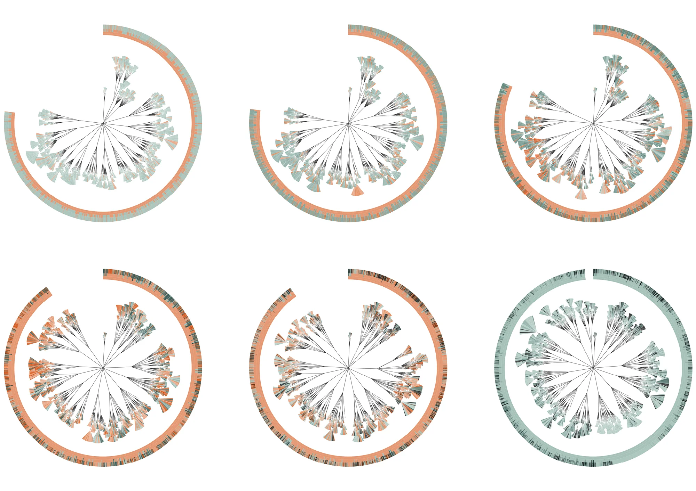
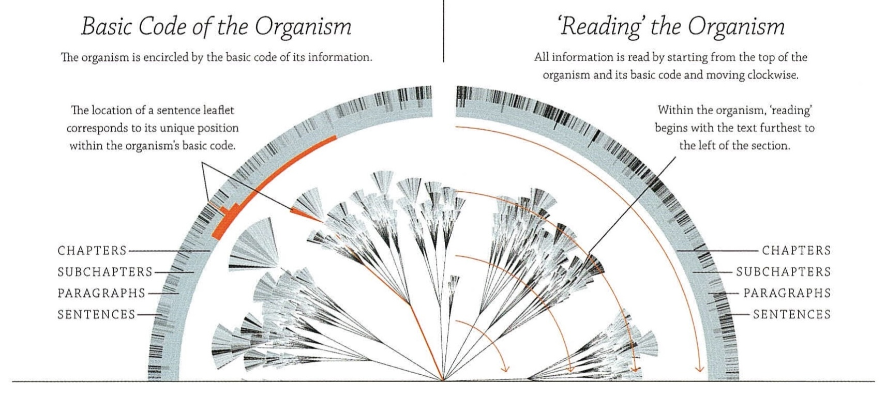
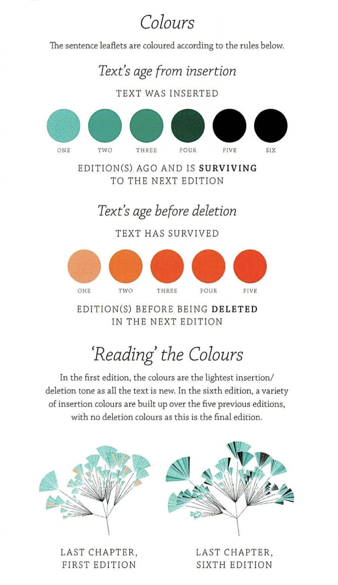
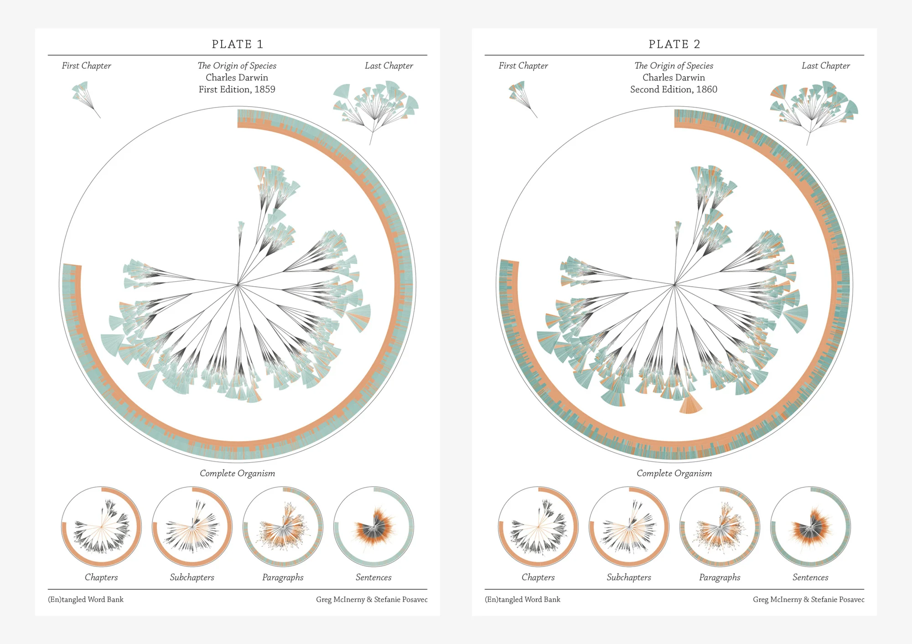
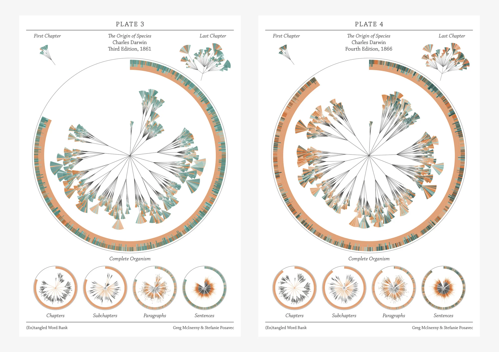
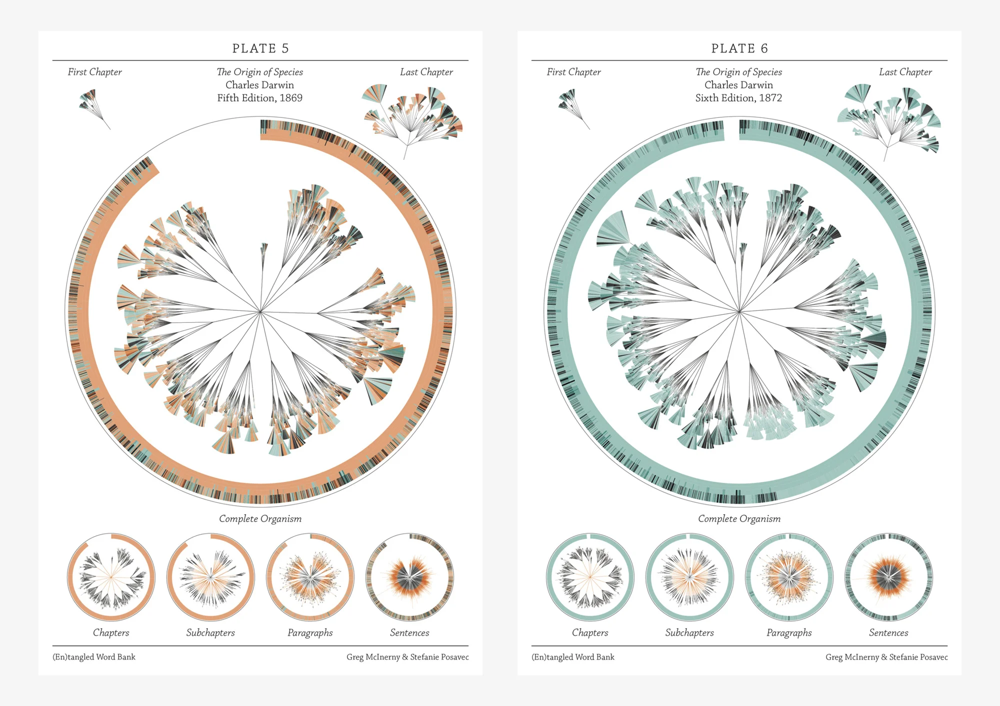

+++
author = "Yuichi Yazaki"
title = "(En)tangled Word Bank: Visualizing the Evolution of Darwin's Origin of Species"
slug = "entangled-word-bank"
date = "2025-10-02"
description = ""
categories = [
    "consume"
]
tags = [
    "",
]
image = "images/cover-entangled-word-bank.jpeg"
+++

**(En)tangled Word Bank** visualizes how Charles Darwin's *On the Origin of Species* changed from the first edition in 1859 to the sixth edition in 1872. It was created by designer **Stefanie Posavec** and researcher **Greg McInerny**, then at Microsoft Research.

The project was displayed as large banners at the University of Cambridge's Darwin anniversary festival and was also included in MoMA's exhibition **Talk to Me**.

<!--more-->

## Structure as a Literary Organism

The visualization treats the book as a **literary organism**. From the center outward, the text branches like a plant:

- **Center**: chapter
- **First layer**: subchapter
- **Second layer**: paragraph
- **Leaves**: sentence

The book's textual hierarchy becomes a biological form of trunk, branch, and leaf.

### The Basic Code Ring

The outer ring is a fine-grained index that records each sentence's position within the chapter, subchapter, paragraph, and sentence hierarchy. It connects the organic inner structure with the exact location of the sentence in the text.

### Reading the Organism

The diagram is read clockwise from the top. The outer ring acts like an index or growth ring, while the inner branches show the body of the text.

## Color and Textual Lifespan

Color represents the life of each sentence across editions.

### Teal to Black: Surviving Text

Light teal indicates newly added text. If the sentence survives through later editions, it becomes darker. Text that remains from the first through the sixth edition approaches black.

### Orange: Deleted Text

Orange indicates text that was eventually removed. Pale orange marks a short-lived sentence; darker orange indicates text that survived for several editions before deletion.

The logic is simple: a sentence appears, survives, darkens, and may eventually disappear.

## Editions

The six editions are arranged clockwise. The first edition is entirely new text; the sixth edition shows the final surviving form.

## Design and Data

The visual language evokes botanical plates, connecting Darwin's theory of evolution with the evolution of his own text. Data came from the Darwin Online archive, and the work used C++, R, Processing, and Illustrator.

## Summary

"(En)tangled Word Bank" turns editorial revision into a living system. Darwin's book about evolution is itself shown as something that evolves, with sentences born, surviving, changing, and dying across editions.

## References

- [Stefanie Posavec: (En)tangled Word Bank](https://www.stefanieposavec.com/archive/entangled-word-bank)
- [MoMA: Talk to Me — (En)tangled Word Bank](https://www.moma.org/interactives/exhibitions/2011/talktome/objects/145525/)
